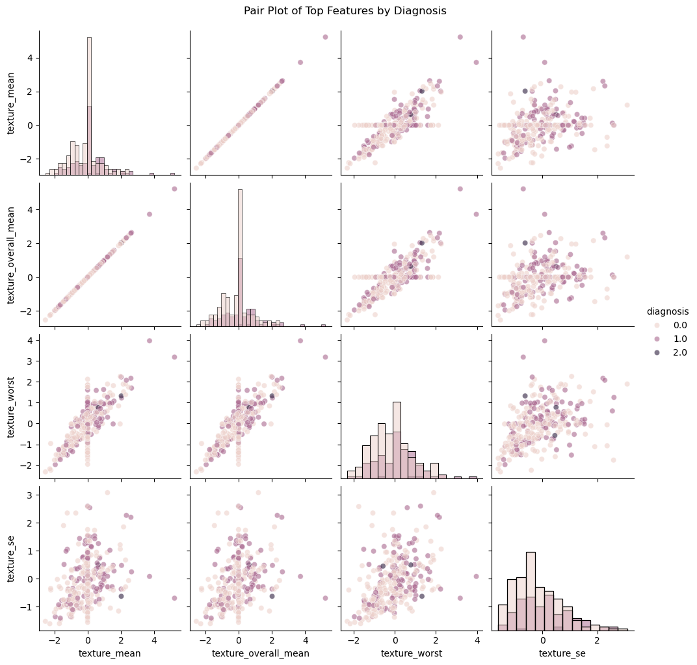
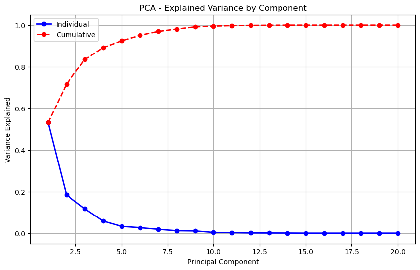
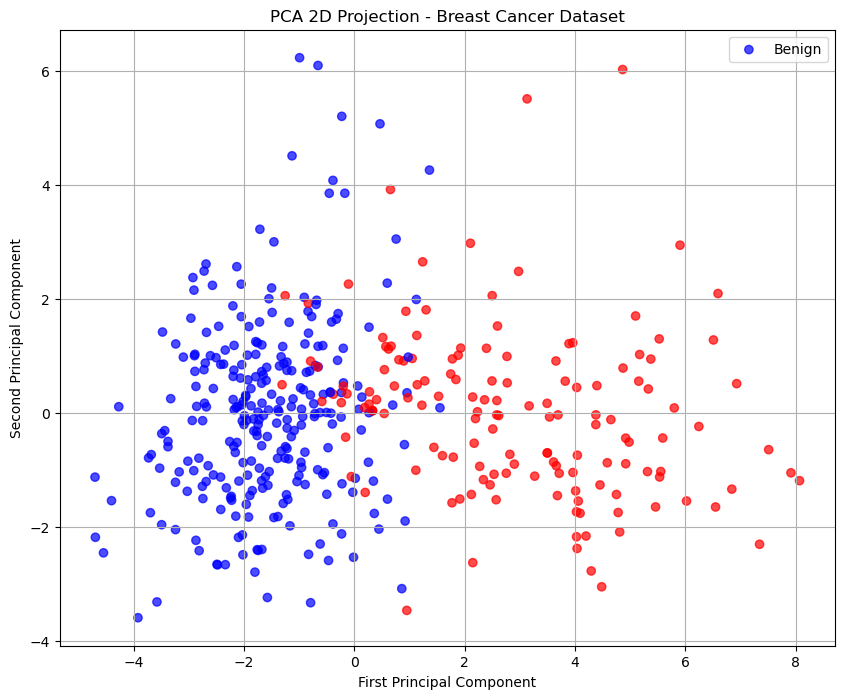
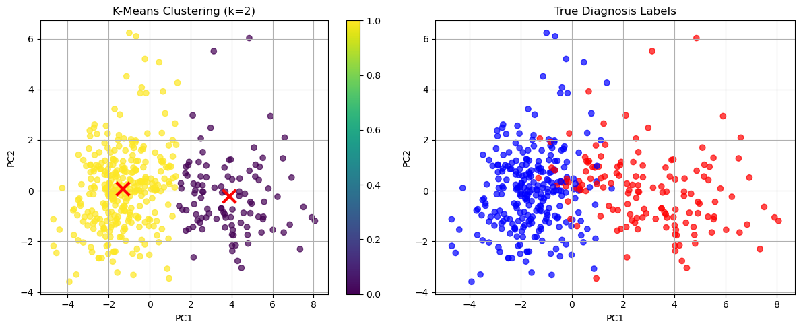
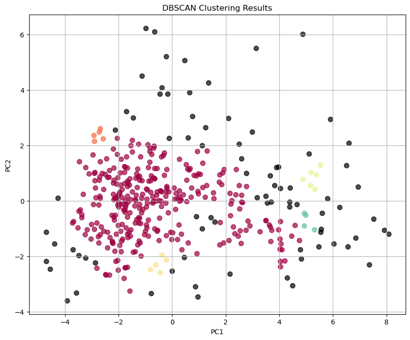

# 🧬 Breast Cancer Diagnosis: Machine Learning & Statistical Analysis


> An end-to-end machine learning project analysing breast cancer
> diagnostic data through data preprocessing, exploratory analysis,
> feature engineering, dimensionality reduction, clustering and
> supervised classification.

------------------------------------------------------------------------

## 📑 Table of Contents

1. [Project Overview](#project-overview)
2. [Analytical Objectives](#analytical-objectives)
3. [Dataset](#dataset)
4. [Analytical Workflow](#analytical-workflow)
5. [Data Preprocessing](#data-preprocessing)
6. [Exploratory Data Analysis](#exploratory-data-analysis)
7. [Feature Engineering and Selection](#feature-engineering-and-selection)
8. [Principal Component Analysis](#principal-component-analysis)
9. [Clustering Analysis](#clustering-analysis)
10. [Supervised Machine Learning](#supervised-machine-learning)
11. [Model Evaluation](#model-evaluation)
12. [Hyperparameter Tuning](#hyperparameter-tuning)
13. [Feature Importance](#feature-importance)
14. [Model Robustness](#model-robustness)
15. [Key Findings](#key-findings)
16. [Limitations](#limitations)
17. [Ethical Considerations](#ethical-considerations)
18. [Future Improvements](#future-improvements)
19. [Visualisations](#visualisations)
20. [Technologies and Libraries](#technologies-and-libraries)
21. [Repository Structure](#repository-structure)
22. [Reproducibility](#reproducibility)
23. [Project Files](#project-files)
24. [References](#references)
25. [Author](#author)

------------------------------------------------------------------------

<a name="project-overview"></a>

## 📌 Project Overview

Breast cancer diagnosis involves distinguishing between benign and
malignant tumour characteristics using measurable clinical and
diagnostic features.

This project develops an end-to-end machine learning workflow for
analysing breast cancer diagnostic data and investigating whether
statistical and machine learning techniques can identify meaningful
patterns within tumour measurements.

The analysis combines:

-   Data cleaning and preprocessing
-   Exploratory Data Analysis (EDA)
-   Outlier detection
-   Feature engineering
-   Feature selection
-   Principal Component Analysis (PCA)
-   K-Means clustering
-   DBSCAN clustering
-   Hierarchical clustering
-   Supervised classification
-   Cross-validation
-   Hyperparameter tuning
-   Feature importance analysis
-   Model robustness evaluation

The overall analytical workflow moves from raw diagnostic measurements
to dimensionality reduction, unsupervised pattern discovery and
predictive classification:

**Raw Diagnostic Data → Data Preparation → EDA → Feature Engineering →
Feature Selection → PCA → Clustering → Classification → Model
Optimisation → Validation → Interpretation**

The project demonstrates how multiple machine learning techniques can be
combined to investigate structure within medical diagnostic data while
maintaining a clear distinction between predictive modelling and
clinical decision-making.

------------------------------------------------------------------------

<a name="analytical-objectives"></a>

## 🎯 Analytical Objectives

The analysis was designed around the following objectives:

-   Examine the structure and quality of the breast cancer diagnostic
    dataset.
-   Identify missing values, duplicates and potential outliers.
-   Explore relationships between diagnostic measurements.
-   Engineer additional features from the original measurements.
-   Reduce feature dimensionality while preserving important
    information.
-   Investigate whether natural groupings exist within the data.
-   Compare multiple clustering approaches.
-   Develop and compare supervised classification models.
-   Identify the strongest-performing classification approach.
-   Optimise the selected model through hyperparameter tuning.
-   Evaluate model performance using cross-validation and held-out test
    data.
-   Identify the diagnostic features contributing most strongly to the
    final model.
-   Assess model limitations, robustness and potential ethical
    considerations.

------------------------------------------------------------------------

<a name="dataset"></a>

## 📊 Dataset

The project uses a modified version of the **Wisconsin Breast Cancer
Diagnostic dataset** containing diagnostic measurements associated with
breast tumour characteristics.

The dataset contains **571 records and 32 columns**, including the
diagnosis variable and quantitative tumour measurements.

The diagnostic measurements represent ten core characteristics:

-   Radius
-   Texture
-   Perimeter
-   Area
-   Smoothness
-   Compactness
-   Concavity
-   Concave points
-   Symmetry
-   Fractal dimension

Each measurement is represented through statistical variants including:

-   Mean
-   Standard error
-   Worst value

The dataset therefore provides a high-dimensional representation of
tumour characteristics suitable for both exploratory and machine
learning analysis.

### Dataset Characteristics

  Characteristic                 Value
  ---------------------------- -------
  Original records                 571
  Original columns                  32
  Analytical features               30
  Diagnosis groups                   3
  Minority diagnosis records         3

The very small minority diagnosis group was treated as an important
limitation when interpreting the modelling results.

------------------------------------------------------------------------

<a name="analytical-workflow"></a>

## 🔄 Analytical Workflow

The project follows a structured machine learning pipeline:

``` text
                         ┌────────────────────────┐
                         │   Breast Cancer Data   │
                         └────────────┬───────────┘
                                      │
                                      ▼
                         ┌────────────────────────┐
                         │ Data Cleaning &         │
                         │ Preprocessing           │
                         └────────────┬───────────┘
                                      │
                                      ▼
                         ┌────────────────────────┐
                         │ Exploratory Data        │
                         │ Analysis                │
                         └────────────┬───────────┘
                                      │
                                      ▼
                         ┌────────────────────────┐
                         │ Feature Engineering &   │
                         │ Feature Selection       │
                         └────────────┬───────────┘
                                      │
                         ┌────────────┴────────────┐
                         │                         │
                         ▼                         ▼
              ┌───────────────────┐      ┌────────────────────┐
              │ PCA & Unsupervised│      │ Supervised Machine │
              │ Learning          │      │ Learning           │
              └─────────┬─────────┘      └──────────┬─────────┘
                        │                            │
                        ▼                            ▼
              ┌───────────────────┐      ┌────────────────────┐
              │ Clustering        │      │ Model Comparison   │
              │ Analysis          │      │ & Evaluation       │
              └─────────┬─────────┘      └──────────┬─────────┘
                        │                            │
                        └──────────────┬─────────────┘
                                       ▼
                           ┌────────────────────────┐
                           │ Model Optimisation &   │
                           │ Robustness Analysis    │
                           └────────────┬───────────┘
                                        │
                                        ▼
                           ┌────────────────────────┐
                           │ Findings & Interpretation│
                           └────────────────────────┘
```

------------------------------------------------------------------------

<a name="data-preprocessing"></a>

## 🧹 Data Preprocessing

The analysis began with inspection and preparation of the dataset before
applying machine learning algorithms.

### Data Preparation Included

-   Dataset structure inspection
-   Diagnosis distribution analysis
-   Missing-value inspection
-   Duplicate checking
-   Train/test splitting
-   Outlier detection
-   Feature transformation
-   Feature engineering
-   Feature selection
-   Preparation of data for dimensionality reduction
-   Preparation of data for machine learning models

The dataset was divided into training and test subsets:

``` text
Training set: 456 records
Test set:     115 records
```

An **Isolation Forest** approach was then used to identify potential
outliers.

### Outlier Detection

The Isolation Forest identified:

``` text
42 potential outliers
9.21% of the training data
```

After removing identified training outliers:

``` text
Training data: 414 records
Test data:     115 records
```

The test set was retained separately for final model evaluation.

------------------------------------------------------------------------

<a name="exploratory-data-analysis"></a>

## 🔎 Exploratory Data Analysis

Exploratory analysis was used to understand the distribution of
diagnostic measurements and investigate relationships between variables.

The EDA included:

-   Diagnosis distribution
-   Feature correlation analysis
-   Distribution comparisons
-   Boxplots
-   Pairwise feature relationships
-   Diagnosis-specific feature comparisons
-   Correlation heatmaps

The analysis showed that several tumour measurements exhibit meaningful
relationships with diagnosis.

Features associated with tumour size and morphology, particularly
measurements involving:

-   Area
-   Perimeter
-   Radius
-   Concavity
-   Texture

provided important information for distinguishing diagnostic groups.

------------------------------------------------------------------------

<a name="feature-engineering-and-selection"></a>

## ⚙️ Feature Engineering and Selection

Feature engineering was performed to derive additional representations
of the original diagnostic measurements.

Additional aggregate features were created from related measurements,
including overall mean representations for:

-   Radius
-   Texture
-   Perimeter
-   Area
-   Concavity

The engineered training dataset contained:

``` text
414 records × 40 features
```

Feature selection was subsequently applied using correlation-based
analysis.

The final modelling dataset retained **20 selected features**.

### Selected Features

``` text
texture_mean
texture_overall_mean
texture_worst
texture_se
area_se
area_mean
area_overall_mean
symmetry_se
area_worst
concave points_se
perimeter_overall_mean
perimeter_mean
concavity_se
radius_mean
radius_overall_mean
perimeter_se
compactness_se
concavity_overall_mean
concavity_mean
radius_se
```

------------------------------------------------------------------------

<a name="principal-component-analysis"></a>

## 📐 Principal Component Analysis

**Principal Component Analysis (PCA)** was applied to reduce
dimensionality while preserving as much information as possible.

The first six principal components explained approximately **95% of the
total variance**.

### Explained Variance

  Component     Explained Variance
  ----------- --------------------
  PC1                       53.15%
  PC2                       18.50%
  PC3                       11.75%
  PC4                        5.81%
  PC5                        3.26%
  PC6                        2.64%

Together, the six components captured approximately **95.1% of the
variance**.

This substantially reduced the dimensionality of the feature space while
retaining the majority of the information contained in the selected
variables.

------------------------------------------------------------------------

<a name="clustering-analysis"></a>

## 🔵 Clustering Analysis

Unsupervised learning was used to investigate whether meaningful groups
could be identified without directly using diagnosis labels.

Three clustering algorithms were evaluated:

-   K-Means
-   DBSCAN
-   Hierarchical Clustering

### K-Means Clustering

K-Means clustering was evaluated across different values of `k`.

Silhouette analysis indicated that:

``` text
Optimal k = 2
```

The two-cluster structure was consistent with the two major diagnostic
groups represented in the dataset.

A six-component PCA representation produced:

``` text
Silhouette Score: 0.4183
Inertia:          3031.11
```

A separate two-dimensional PCA representation used for visual clustering
comparison produced a higher silhouette score of approximately
**0.5298**.

### DBSCAN

DBSCAN was also evaluated to investigate density-based structure.

The selected configuration produced:

``` text
Clusters: 5
Noise points: 81
Silhouette Score: -0.0937
```

The negative silhouette score and relatively large number of noise
observations indicate that DBSCAN did not identify a particularly strong
cluster structure under the selected parameters.

### Hierarchical Clustering

Hierarchical clustering was evaluated using two clusters.

The resulting silhouette score was:

``` text
0.5148
```

This indicates moderate separation between the identified groups.

### Clustering Comparison

  Algorithm      Configuration     Silhouette
  -------------- --------------- ------------
  K-Means        2 clusters          0.5298\*
  Hierarchical   2 clusters            0.5148
  DBSCAN         5 clusters           -0.0937

\*The K-Means comparison score shown here is based on the
two-dimensional PCA representation used for the clustering comparison.
The separate six-component PCA K-Means analysis produced a silhouette
score of 0.4183.

------------------------------------------------------------------------

<a name="supervised-machine-learning"></a>

## 🤖 Supervised Machine Learning

Five classification algorithms were evaluated to determine how
effectively the diagnostic features could distinguish between benign and
malignant cases.

The models included:

-   Logistic Regression
-   Decision Tree
-   Random Forest
-   Support Vector Machine (SVM)
-   K-Nearest Neighbors (KNN)

The models were evaluated using both cross-validation and held-out test
performance.

### Model Comparison

  Model                   CV Mean Accuracy   CV Std   Test Accuracy
  --------------------- ------------------ -------- ---------------
  Logistic Regression               97.10%    0.96%          93.04%
  Decision Tree                     91.79%    0.91%          92.17%
  Random Forest                     93.96%    2.52%      **95.65%**
  SVM                           **97.34%**    1.60%          94.78%
  KNN                               93.96%    2.15%          90.43%

The Random Forest model achieved the strongest initial held-out test
accuracy and was therefore selected for detailed evaluation and
optimisation.

------------------------------------------------------------------------

<a name="model-evaluation"></a>

## 📈 Model Evaluation

The initial Random Forest model achieved:

``` text
Test Accuracy: 95.65%
```

The classification results were:

  Diagnosis     Precision   Recall   F1-Score
  ----------- ----------- -------- ----------
  Benign           94.67%   98.61%     96.60%
  Malignant        97.50%   90.70%     93.98%

The confusion matrix showed:

``` text
True Negatives:  71
False Positives: 1
False Negatives: 4
True Positives:  39
```

This resulted in five classification errors on the held-out test set.

------------------------------------------------------------------------

<a name="hyperparameter-tuning"></a>

## 🎛️ Hyperparameter Tuning

The Random Forest model was further optimised using **GridSearchCV**.

The search evaluated combinations of:

``` text
n_estimators:
50, 100, 200

max_depth:
None, 10, 20, 30

min_samples_split:
2, 5, 10

min_samples_leaf:
1, 2, 4
```

### Best Parameters

The optimal configuration was:

``` text
n_estimators = 50
max_depth = None
min_samples_split = 5
min_samples_leaf = 2
```

The best cross-validation score during grid search was:

``` text
94.21%
```

### Tuned Model Performance

  Model                      Test Accuracy
  ------------------------ ---------------
  Original Random Forest            95.65%
  Tuned Random Forest           **97.39%**

The tuned model improved held-out test accuracy by:

``` text
1.74 percentage points
```

This indicates that hyperparameter optimisation improved the model's
performance on unseen test data.

------------------------------------------------------------------------

<a name="feature-importance"></a>

## 🔬 Feature Importance

Feature importance analysis was performed using the optimised Random
Forest model to identify the diagnostic measurements contributing most
strongly to its predictions.

### Top 10 Features

    Rank Feature                      Importance
  ------ -------------------------- ------------
       1 `area_worst`                     16.66%
       2 `concavity_overall_mean`         13.36%
       3 `perimeter_mean`                 12.53%
       4 `concavity_mean`                 10.93%
       5 `area_mean`                       7.47%
       6 `perimeter_overall_mean`          7.41%
       7 `radius_overall_mean`             5.97%
       8 `area_overall_mean`               5.26%
       9 `area_se`                         4.40%
      10 `texture_worst`                   3.13%

The strongest contributors were therefore largely associated with tumour
size, perimeter and concavity characteristics.

------------------------------------------------------------------------

<a name="model-robustness"></a>

## 🧪 Model Robustness

The tuned Random Forest was evaluated using **10-fold cross-validation**
to examine performance consistency across different subsets of the
training data.

### Validation Results

``` text
Mean CV Accuracy:      94.43%
CV Standard Deviation: 3.09%
Test Accuracy:         97.39%
Training Accuracy:     99.28%
```

The difference between training and test performance was approximately:

``` text
4.84 percentage points
```

The cross-validation results showed relatively consistent performance
across folds, while the held-out test result remained strong.

This provides evidence of good generalisation within the available
dataset, although external validation would be required before making
stronger claims about performance on independent populations.

------------------------------------------------------------------------

<a name="key-findings"></a>

## 🔎 Key Findings

### 1. Diagnostic measurements contain meaningful predictive information

The exploratory analysis identified clear relationships among tumour
measurements and diagnostic groups.

Variables associated with tumour size and morphology were particularly
informative.

### 2. Dimensionality can be substantially reduced

PCA showed that six principal components retained approximately **95.1%
of the variance**.

This demonstrates that much of the information contained within the
original feature space can be represented using a substantially smaller
number of dimensions.

### 3. Two major groups are visible within the data

K-Means and hierarchical clustering produced moderate separation when
two clusters were used.

This structure was broadly consistent with the major diagnostic
categories.

### 4. DBSCAN was less effective under the selected configuration

DBSCAN produced a negative silhouette score and identified 81
observations as noise.

This suggests that the dataset did not exhibit a strong density-based
structure under the selected parameters.

### 5. Multiple supervised models performed strongly

All five classification approaches achieved test accuracies above 90%.

The strongest initial test performance came from Random Forest:

``` text
95.65%
```

### 6. Hyperparameter tuning improved Random Forest performance

The optimised Random Forest achieved:

``` text
97.39% test accuracy
```

compared with:

``` text
95.65% before tuning
```

representing an improvement of **1.74 percentage points**.

### 7. Tumour size and morphology were highly influential

The Random Forest feature importance analysis identified `area_worst`,
`concavity_overall_mean`, `perimeter_mean` and `concavity_mean` among
the strongest predictors.

This highlights the importance of morphological characteristics within
the predictive model.

### 8. The model demonstrated strong internal validation performance

The tuned model achieved a mean 10-fold cross-validation accuracy of
**94.43%** and a held-out test accuracy of **97.39%**.

The results indicate strong predictive performance within the analysed
dataset, while recognising the need for independent validation.

------------------------------------------------------------------------

<a name="limitations"></a>

## ⚠️ Limitations

Despite the strong modelling results, several limitations should be
considered.

### 1. Very small minority class

The original dataset contains only **three records** in one diagnosis
group.

This creates a significant class representation limitation and restricts
the reliability of conclusions involving that group.

### 2. Moderate class imbalance

The major diagnosis categories are not perfectly balanced.

Although the modelling workflow uses validation strategies, class
imbalance can still influence model performance and evaluation metrics.

### 3. Single-dataset scope

The models were developed and evaluated using the available dataset.

Strong performance on this dataset does not automatically guarantee
equivalent performance on an independent clinical population.

### 4. Limited external validation

The analysis uses internal train/test evaluation and cross-validation.

External validation using an independent dataset would provide stronger
evidence of generalisability.

### 5. Model interpretability

Random Forest provides useful feature importance information but remains
less directly interpretable than simpler statistical models.

Feature importance should therefore not be interpreted as causal
evidence.

------------------------------------------------------------------------

<a name="ethical-considerations"></a>

## ⚖️ Ethical Considerations

Machine learning applied to medical data requires careful consideration
of both technical and ethical issues.

### Data Privacy

Medical and diagnostic information should be handled with appropriate
confidentiality and data protection safeguards.

### Representation and Bias

Models can inherit biases from the populations represented in their
training data.

A model trained on a limited dataset should therefore not automatically
be assumed to perform equally well across different demographic or
clinical populations.

### Clinical Decision-Making

The model should be viewed as a **decision-support analytical tool**,
not as a replacement for qualified medical professionals.

A high predictive accuracy score does not by itself establish clinical
suitability.

### Explainability

Future versions could incorporate methods such as **SHAP** or **LIME**
to provide more transparent explanations of individual predictions.

------------------------------------------------------------------------

<a name="future-improvements"></a>

## 🚀 Future Improvements

Several improvements could strengthen the analysis and its real-world
applicability.

### 1. External Validation

Evaluate the final model against independent breast cancer datasets to
assess generalisation.

### 2. Class Imbalance Strategies

Investigate techniques such as:

-   SMOTE
-   Random oversampling
-   Random undersampling
-   Class weighting

to improve representation of minority classes.

### 3. Additional Algorithms

Future analysis could compare the Random Forest model with:

-   XGBoost
-   Gradient Boosting
-   Stacking ensembles
-   Neural networks
-   Other advanced classification algorithms

### 4. Advanced Hyperparameter Optimisation

Randomised search or Bayesian optimisation could be used to explore a
wider hyperparameter space more efficiently.

### 5. Explainable AI

SHAP and LIME could be incorporated to examine both global feature
importance and individual prediction explanations.

### 6. Broader Clinical Validation

Future work should evaluate performance across larger, more diverse and
independently collected datasets before considering clinical deployment.

------------------------------------------------------------------------

<a name="visualisations"></a>

# 📊 Visualisations

The project contains **17 visualisations** covering exploratory
analysis, feature relationships, dimensionality reduction, clustering,
model evaluation and feature importance.

All visualisations are stored in the `visualizations/` directory.

## 🔎 Exploratory Data Analysis

### 1. Diagnosis Distribution

Shows the distribution of diagnosis groups within the training data.


[**View Diagnosis Distribution
→**](visualizations/01_diagnosis_distribution_training.png)

### 2. Feature Correlation Matrix

Shows the correlation structure across the diagnostic measurements.


[**View Feature Correlation Matrix
→**](visualizations/02_feature_correlation_matrix.png)

### 3. Selected Feature Boxplots

Compares distributions of selected diagnostic features.


[**View Selected Feature Boxplots
→**](visualizations/03_selected_features_boxplots.png)

### 4. Key Features by Diagnosis

Shows differences in important diagnostic measurements across diagnosis
groups.


[**View Key Features by Diagnosis
→**](visualizations/04_key_features_by_diagnosis.png)

### 5. Top Features Pairplot

Examines pairwise relationships among important diagnostic variables.



[**View Top Features Pairplot
→**](visualizations/05_top_features_pairplot.png)

### 6. Selected Features Correlation Heatmap

Provides a focused view of correlations among the selected modelling
features.


[**View Selected Features Correlation Heatmap
→**](visualizations/06_selected_features_correlation_heatmap.png)

## 📐 Principal Component Analysis

### 7. PCA Explained Variance

Shows the proportion of variance explained by each principal component.



[**View PCA Explained Variance
→**](visualizations/07_pca_explained_variance.png)

### 8. PCA Diagnosis Scatter

Visualises the diagnostic observations in the reduced PCA space.



[**View PCA Diagnosis Scatter
→**](visualizations/08_pca_diagnosis_scatter.png)

## 🔵 Clustering Analysis

### 9. K-Means Cluster Selection

Shows the analysis used to determine the appropriate K-Means cluster
configuration.


[**View K-Means Cluster Selection
→**](visualizations/09_kmeans_cluster_selection.png)

### 10. K-Means Clustering

Visualises the clusters identified using K-Means.



[**View K-Means Clustering →**](visualizations/10_kmeans_clustering.png)

### 11. DBSCAN Clustering

Shows the density-based clustering results produced by DBSCAN.



[**View DBSCAN Clustering →**](visualizations/11_dbscan_clustering.png)

### 12. Hierarchical Clustering

Visualises the grouping produced using hierarchical clustering.


[**View Hierarchical Clustering
→**](visualizations/12_hierarchical_clustering.png)

### 13. Clustering Silhouette Comparison

Compares clustering performance using silhouette scores.


[**View Clustering Silhouette Comparison
→**](visualizations/13_clustering_silhouette_comparison.png)

### 14. Clustering vs True Labels

Compares unsupervised cluster assignments against the known diagnostic
groups.


[**View Clustering vs True Labels
→**](visualizations/14_clustering_vs_true_labels.png)

## 🤖 Supervised Machine Learning

### 15. Model Performance Comparison

Compares the predictive performance of the classification algorithms.


[**View Model Performance Comparison
→**](visualizations/15_model_performance_comparison.png)

### 16. Random Forest Confusion Matrix

Shows the classification results of the Random Forest model on the
held-out test data.


[**View Confusion Matrix →**](visualizations/16_confusion_matrix.png)

### 17. Random Forest Feature Importance

Shows the relative importance of the diagnostic features used by the
Random Forest model.


[**View Random Forest Feature Importance
→**](visualizations/17_random_forest_feature_importance.png)

------------------------------------------------------------------------

<a name="technologies-and-libraries"></a>

# 🛠️ Technologies and Libraries

## Programming Language

-   **Python**

## Data Manipulation

-   `pandas`
-   `numpy`

## Data Visualisation

-   `matplotlib`
-   `seaborn`

## Machine Learning

-   `scikit-learn`

## Unsupervised Learning

-   Principal Component Analysis (PCA)
-   K-Means
-   DBSCAN
-   Agglomerative / Hierarchical Clustering
-   Silhouette Analysis

## Supervised Learning

-   Logistic Regression
-   Decision Tree
-   Random Forest
-   Support Vector Machine
-   K-Nearest Neighbors

## Model Optimisation

-   `GridSearchCV`
-   Stratified cross-validation
-   10-fold cross-validation

## Statistical and Analytical Techniques

-   Correlation analysis
-   Outlier detection
-   Feature engineering
-   Feature selection
-   Dimensionality reduction
-   Classification metrics
-   Feature importance analysis

------------------------------------------------------------------------

<a name="repository-structure"></a>

# 📁 Repository Structure

``` text
breast-cancer-machine-learning/
│
├── README.md
│
├── code/
│   ├── breast_cancer_machine_learning.ipynb
│   └── breast_cancer_machine_learning_report.html
│
├── data/
│   └── breast_cancer_dataset.csv
│
└── visualizations/
    │
    ├── 01_diagnosis_distribution_training.png
    ├── 02_feature_correlation_matrix.png
    ├── 03_selected_features_boxplots.png
    ├── 04_key_features_by_diagnosis.png
    ├── 05_top_features_pairplot.png
    ├── 06_selected_features_correlation_heatmap.png
    ├── 07_pca_explained_variance.png
    ├── 08_pca_diagnosis_scatter.png
    ├── 09_kmeans_cluster_selection.png
    ├── 10_kmeans_clustering.png
    ├── 11_dbscan_clustering.png
    ├── 12_hierarchical_clustering.png
    ├── 13_clustering_silhouette_comparison.png
    ├── 14_clustering_vs_true_labels.png
    ├── 15_model_performance_comparison.png
    ├── 16_confusion_matrix.png
    └── 17_random_forest_feature_importance.png
```

------------------------------------------------------------------------

<a name="reproducibility"></a>

# ♻️ Reproducibility

The project is designed to be reproducible using the supplied Jupyter
Notebook.

The repository contains:

``` text
code/breast_cancer_machine_learning.ipynb
```

The notebook contains the complete analytical workflow, including:

-   Data loading
-   Data inspection
-   Preprocessing
-   Exploratory analysis
-   Outlier detection
-   Feature engineering
-   Feature selection
-   PCA
-   Clustering
-   Classification
-   Model evaluation
-   Hyperparameter tuning
-   Feature importance
-   Robustness analysis
-   Conclusions

A rendered HTML version of the analysis is also provided:

``` text
code/breast_cancer_machine_learning_report.html
```

### Running the Analysis

#### 1. Install Python

Python 3.x is recommended.

#### 2. Install Jupyter

Jupyter Notebook or JupyterLab can be used to execute the analysis.

#### 3. Install Required Libraries

``` bash
pip install pandas numpy matplotlib seaborn scikit-learn
```

#### 4. Open the Notebook

``` text
code/breast_cancer_machine_learning.ipynb
```

#### 5. Ensure the Dataset Path Is Correct

The notebook expects the dataset to be available at:

``` text
data/breast_cancer_dataset.csv
```

#### 6. Run the Notebook

Execute the notebook sequentially to reproduce the analysis and generate
the visualisations.

------------------------------------------------------------------------

<a name="project-files"></a>

# 📂 Project Files

The complete project files are available through the project release.

### 📓 Jupyter Notebook

The complete Python/Jupyter analysis containing the full data
preparation, modelling and evaluation workflow.

**[👁️ View Jupyter Notebook
→](https://github.com/xzibitetok/xzibitetok.github.io/blob/master/breast-cancer-machine-learning/code/breast_cancer_machine_learning.ipynb)**

**[⬇️ Download Jupyter Notebook
→](https://github.com/xzibitetok/xzibitetok.github.io/releases/latest/download/breast_cancer_machine_learning.ipynb)**

### 🌐 HTML Analysis Report

The rendered analytical report containing the complete analysis and
results.

**[⬇️ Download HTML Report
→](https://github.com/xzibitetok/xzibitetok.github.io/releases/latest/download/breast_cancer_machine_learning_report.html)**

### 📊 Dataset

The dataset used throughout the analysis.

**[⬇️ Download Dataset
→](https://github.com/xzibitetok/xzibitetok.github.io/releases/latest/download/breast_cancer_dataset.csv)**

### 📦 Project Release

**[🔗 View Breast Cancer Machine Learning v1.0 Release
→](https://github.com/xzibitetok/xzibitetok.github.io/releases/tag/breast-cancer-machine-learning-v1.0)**

------------------------------------------------------------------------

<a name="references"></a>

# 📚 References

### Scikit-learn

Pedregosa, F. et al. (2011). Scikit-learn: Machine Learning in Python.
*Journal of Machine Learning Research*, 12, pp.2825--2830.

https://scikit-learn.org/

### Random Forest

Breiman, L. (2001). Random Forests. *Machine Learning*, 45, pp.5--32.

https://doi.org/10.1023/A:1010933404324

### Principal Component Analysis

Jolliffe, I.T. and Cadima, J. (2016). Principal component analysis: a
review and recent developments. *Philosophical Transactions of the Royal
Society A*, 374(2065).

https://doi.org/10.1098/rsta.2015.0202

### K-Means

MacQueen, J. (1967). Some Methods for Classification and Analysis of
Multivariate Observations. *Proceedings of the Fifth Berkeley Symposium
on Mathematical Statistics and Probability*, 1, pp.281--297.

### DBSCAN

Ester, M., Kriegel, H.-P., Sander, J. and Xu, X. (1996). A Density-Based
Algorithm for Discovering Clusters in Large Spatial Databases with
Noise. *Proceedings of the Second International Conference on Knowledge
Discovery and Data Mining*, pp.226--231.

------------------------------------------------------------------------

<a name="author"></a>

# 👤 Author

## Ubong Etok

**MSc Data Science \| Data Analytics \| Business Intelligence \| SQL \|
Machine Learning**

I develop data-driven solutions that combine statistical analysis,
machine learning, data visualisation and business-oriented
interpretation to transform complex datasets into actionable insights.

### 🔗 Connect

-   GitHub: [**@xzibitetok**](https://github.com/xzibitetok)
-   Portfolio: [**xzibitetok.github.io**](https://xzibitetok.github.io)

------------------------------------------------------------------------

## ⭐ Project Highlights

This project demonstrates practical experience in:

-   **Machine Learning**
-   **Supervised Classification**
-   **Unsupervised Learning**
-   **Random Forest**
-   **Logistic Regression**
-   **Support Vector Machines**
-   **K-Nearest Neighbors**
-   **Decision Trees**
-   **Principal Component Analysis**
-   **K-Means Clustering**
-   **DBSCAN**
-   **Hierarchical Clustering**
-   **Feature Engineering**
-   **Feature Selection**
-   **Exploratory Data Analysis**
-   **Outlier Detection**
-   **Hyperparameter Tuning**
-   **Cross-Validation**
-   **Model Evaluation**
-   **Feature Importance Analysis**
-   **Python Programming**
-   **Data Visualisation**
-   **Reproducible Data Analysis**
-   **Machine Learning Ethics**

------------------------------------------------------------------------

> **Key takeaway:** The analysis demonstrates that breast cancer
> diagnostic measurements contain substantial predictive structure.
> Through dimensionality reduction, clustering and supervised machine
> learning, the optimised Random Forest model achieved **97.39% test
> accuracy**, while feature importance analysis highlighted tumour size
> and morphological characteristics as major contributors to prediction.
> These results demonstrate strong analytical potential while
> reinforcing the importance of external validation, interpretability
> and responsible use of machine learning in medical contexts.
