# 🧠 Customer Review Intelligence: Text Mining, Sentiment & Topic Modelling


> An end-to-end customer review analytics project using R to extract behavioural, sentiment, emotional and thematic insights from anonymised women's clothing e-commerce reviews.

---

## 📑 Table of Contents

1. [Project Overview](#project-overview)
2. [Business Questions](#business-questions)
3. [Dataset](#dataset)
4. [Analytical Workflow](#analytical-workflow)
5. [Text Mining](#text-mining)
6. [Sentiment Analysis](#sentiment-analysis)
7. [Emotion Analysis](#emotion-analysis)
8. [Topic Modelling](#topic-modelling)
9. [Recommendation Modelling](#recommendation-modelling)
10. [Key Findings](#key-findings)
11. [Visualisations](#visualisations)
12. [Technologies and Libraries](#technologies-and-libraries)
13. [Repository Structure](#repository-structure)
14. [Reproducibility](#reproducibility)
15. [Project Files](#project-files)
16. [References](#references)
17. [Author](#author)

---

<a name="project-overview"></a>

## 📌 Project Overview

Customer reviews contain valuable information about how people experience products, what influences satisfaction, and which recurring issues affect purchasing decisions.

This project applies **text mining, natural language processing, sentiment analysis, emotion analysis, topic modelling and statistical modelling** to an anonymised women's clothing e-commerce review dataset.

The analysis moves from raw customer text to structured insights through a complete analytical workflow:

**Raw Reviews → Text Preprocessing → Text Mining → Sentiment Analysis → Emotion Analysis → Topic Modelling → Recommendation Modelling → Business Insights**

The objective is to identify recurring customer concerns, understand the emotional tone of reviews, discover hidden themes and examine the relationship between textual sentiment and the likelihood of recommending a product.

---

<a name="business-questions"></a>

## 🎯 Business Questions

The analysis was designed around the following questions:

- What words and phrases occur most frequently in customer reviews?
- What themes emerge after removing common and domain-specific noise?
- Which product departments generate different patterns of customer language?
- What is the overall sentiment expressed in customer reviews?
- How does sentiment vary across product categories?
- How closely does textual sentiment correspond with numerical customer ratings?
- Which emotions are most strongly represented in customer reviews?
- What hidden themes can be identified using topic modelling?
- Can customer sentiment help explain the likelihood of recommending a product?
- Does customer age contribute to recommendation behaviour when sentiment is considered?

---

<a name="dataset"></a>

## 📊 Dataset

The project uses an anonymised **women's clothing e-commerce customer review dataset**.

Each row represents an individual customer review. The original commercial data has been anonymised, with references to the retailer replaced by the generic term `retailer`.

The dataset contains **23,486 review records** and includes variables covering customer characteristics, product information, ratings, recommendation behaviour, feedback and review text.

### Core Variables

| Variable | Description |
|---|---|
| `Clothing.ID` | Identifier for the reviewed clothing item |
| `Age` | Customer age |
| `Title` | Review title |
| `Review.Text` | Written customer review |
| `Rating` | Customer rating from 1–5 |
| `Recommended.IND` | Original recommendation indicator |
| `Positive.Feedback.Count` | Number of positive feedback responses |
| `Division.Name` | Product division |
| `Department.Name` | Product department |
| `Class.Name` | Product class |

### Data Preparation

Before analysis, the dataset was cleaned by:

- Removing reviews with missing text
- Removing reviews containing fewer than 20 words
- Removing records with blank division labels
- Removing selected unused columns
- Creating a unique `Review.ID`
- Randomly sampling **3,000 reviews**
- Using a fixed random seed to ensure reproducibility

The 3,000-review sample was subsequently used for the main text mining, sentiment analysis and topic modelling workflow.

---

<a name="analytical-workflow"></a>

## 🔄 Analytical Workflow

The project follows a structured analytical pipeline.

```text
                    ┌─────────────────────┐
                    │  Customer Reviews   │
                    └──────────┬──────────┘
                               │
                               ▼
                    ┌─────────────────────┐
                    │ Data Cleaning &     │
                    │ Sampling            │
                    └──────────┬──────────┘
                               │
                               ▼
                    ┌─────────────────────┐
                    │ Tokenisation        │
                    │ Unigrams & Bigrams  │
                    └──────────┬──────────┘
                               │
                 ┌─────────────┼──────────────┐
                 │             │              │
                 ▼             ▼              ▼
        ┌──────────────┐ ┌──────────────┐ ┌───────────────┐
        │ Text Mining  │ │  Sentiment   │ │ Topic         │
        │ & Frequency  │ │  & Emotion   │ │ Modelling     │
        └──────┬───────┘ └──────┬───────┘ └───────┬───────┘
               │                │                 │
               └────────────────┼─────────────────┘
                                ▼
                    ┌─────────────────────┐
                    │ Recommendation      │
                    │ Modelling           │
                    └──────────┬──────────┘
                               │
                               ▼
                    ┌─────────────────────┐
                    │ Customer Insights   │
                    └─────────────────────┘
```

---

<a name="text-mining"></a>

# 🔤 Text Mining

## 1. Initial Text Exploration

The raw review text was tokenised into:

- **Unigrams** — individual words
- **Bigrams** — two-word sequences

Initial frequency analysis showed that the most common words were dominated by generic stopwords such as:

- `the`
- `and`
- `i`
- `it`

This demonstrated that raw tokenisation alone was insufficient for meaningful interpretation and that additional preprocessing was required.

### Initial Analysis

- Top-word frequency analysis
- Top-bigram analysis
- Initial word cloud
- Review-level text inspection

---

## 2. Text Cleaning and Preprocessing

The text preprocessing pipeline included:

- Stopword removal
- Domain-specific noise removal
- Punctuation removal
- Special-character removal
- Empty-token removal
- Lemmatization
- Review reconstruction
- Clean unigram generation
- Clean bigram generation

A domain-specific vocabulary was also filtered to reduce generic clothing terminology and improve the visibility of more informative patterns.

---

## 3. Cleaned Text Analysis

After preprocessing, the analysis focused on:

- Top words
- Top bigrams
- Word clouds
- Department-level word frequencies
- Department-level bigram frequencies

### Key Text Mining Insight

The cleaned text consistently highlighted **fit and sizing** as major themes across core clothing categories.

For **Tops, Dresses and Bottoms**, terms associated with:

- size
- fit
- true size
- fit perfectly
- usual size

appeared prominently.

The **Intimate** department showed relatively stronger emphasis on comfort and material-related language, including phrases associated with softness and wear.

This suggests that customer priorities differ across product departments rather than being uniform across the catalogue.

---

<a name="sentiment-analysis"></a>

# 😊 Sentiment Analysis

## Bing Sentiment Analysis

The **Bing sentiment lexicon** was used to classify words as positive or negative.

A review-level sentiment score was calculated as:

```text
Positive Word Count − Negative Word Count
```

This produced a numerical sentiment score for each review.

### Sentiment Analysis Included

- Review-level sentiment scoring
- Sentiment distribution
- Average sentiment by product category
- Sentiment versus customer rating
- Identification of strongly positive and negative reviews

---

## Sentiment Distribution

The sentiment distribution was centred around positive values with a slight positive skew.

This indicates that positive customer language was more prevalent than negative language within the analysed sample.

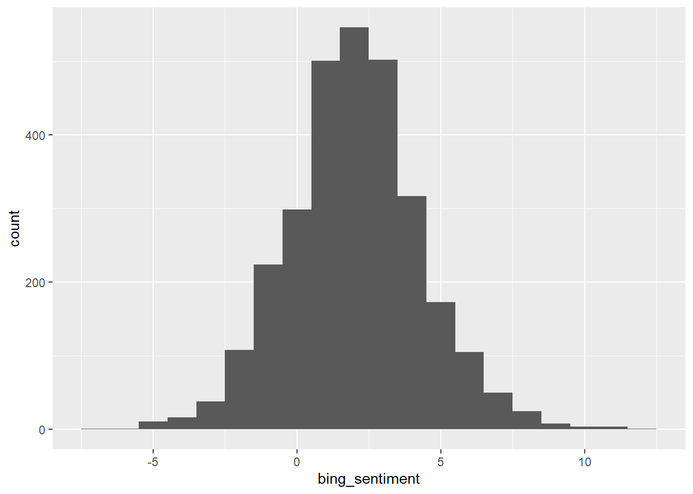

[**View Sentiment Distribution →**](visualizations/sentiment-analysis/01_bing_sentiment_distribution.png)

---

## Average Sentiment by Product Category

Average sentiment varied across product classes.

The analysis identified relatively higher average sentiment for:

- Sleep
- Swim
- Jackets

Relatively lower sentiment was observed for:

- Layering
- Jeans
- Trend

These differences provide a useful starting point for investigating why customer experiences vary between product categories.

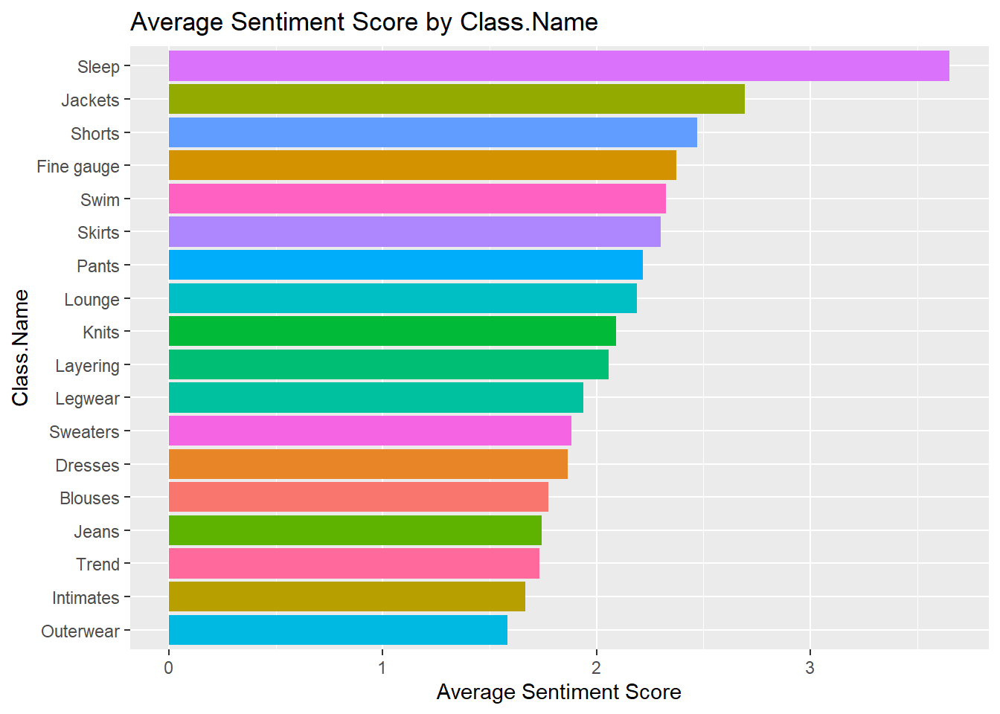

[**View Average Sentiment by Product Category →**](visualizations/sentiment-analysis/02_average_sentiment_by_product_category.png)

---

## Sentiment and Customer Rating

The relationship between numerical ratings and textual sentiment was examined using a box plot.

Higher customer ratings generally corresponded with higher median Bing sentiment scores.

This indicates a clear alignment between the language used in reviews and the numerical evaluations provided by customers.

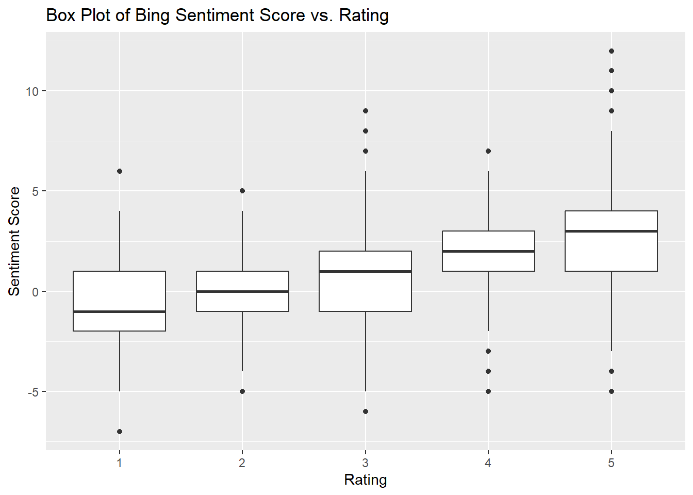

[**View Sentiment vs Rating →**](visualizations/sentiment-analysis/03_sentiment_vs_rating.png)

---

<a name="emotion-analysis"></a>

# 💭 Emotion Analysis

## NRC Emotion Analysis

The **NRC sentiment/emotion lexicon** was used to identify emotional categories within customer reviews.

The analysis considered:

- Joy
- Trust
- Anticipation
- Surprise
- Sadness
- Anger
- Disgust
- Fear
- Positive
- Negative

Emotion counts were calculated at review level and subsequently aggregated across product departments.

---

## Department-Level Emotion Patterns

A department-by-emotion heatmap was used to examine how emotional intensity varied across product departments.

The analysis showed relatively strong positive emotional signals, particularly:

- Trust
- Joy
- Anticipation

These patterns are consistent with the generally positive tone observed in the Bing sentiment analysis.

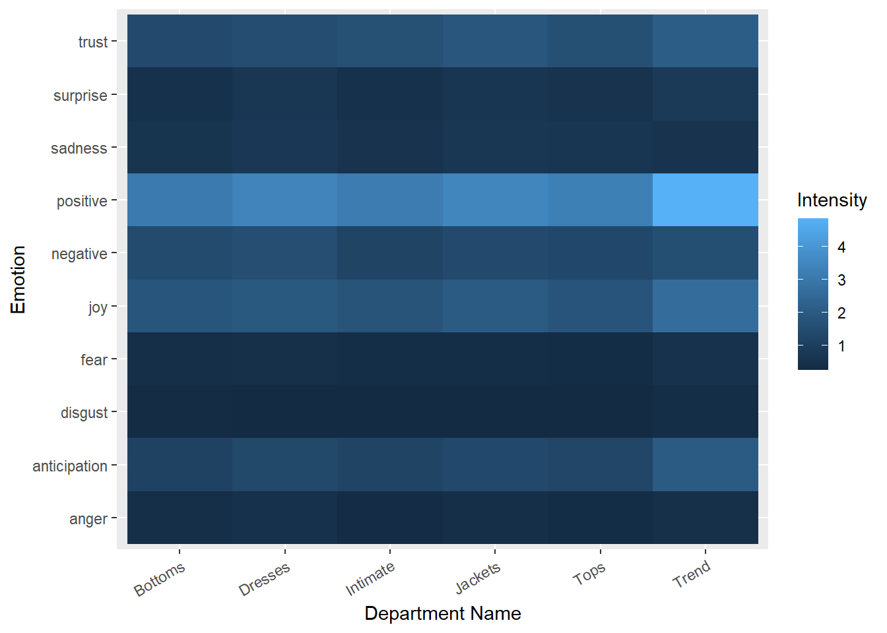

[**View NRC Emotion Heatmap →**](visualizations/sentiment-analysis/04_nrc_emotion_heatmap.png)

---

<a name="topic-modelling"></a>

# 🧩 Topic Modelling

## Term-Document Matrix

Topic modelling was performed using a cleaned **Term-Document Matrix (TDM)**.

The topic-modelling preprocessing included:

- Lowercasing
- Punctuation removal
- Stopword removal
- Stemming
- Vocabulary filtering
- Removal of extremely common terms
- Removal of extremely rare terms
- Removal of remaining generic terms
- Removal of empty documents

Only reviews containing at least **50 words** were retained for the topic modelling stage.

---

## Term Frequency Analysis

The initial term-frequency distribution was highly right-skewed.

Most terms appeared relatively infrequently, while a smaller number of terms occurred very frequently.

This motivated the removal of extremely common and extremely rare terms before fitting the topic model.

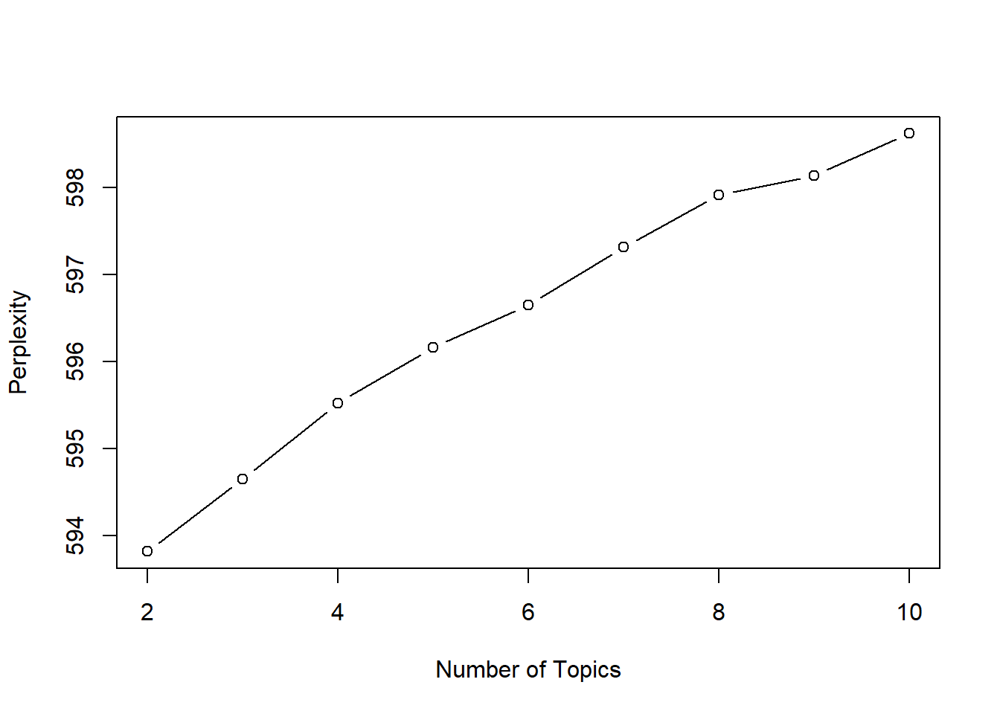

[**View Topic Perplexity Analysis →**](visualizations/topic-modelling/03_topic_perplexity.png)

---

## Latent Dirichlet Allocation

**Latent Dirichlet Allocation (LDA)** was used to identify latent themes within the review corpus.

The analysis evaluated topic counts from:

```text
k = 2 to k = 10
```

using perplexity as a model-selection diagnostic.

The lowest perplexity occurred at **2 topics**.

For interpretive analysis, a **3-topic LDA model** was also fitted and examined to provide a more granular view of the recurring themes present in the review corpus.

---

## Identified Topics

### Topic 1 — Fit, Comfort and Returns

Prominent terms included:

- `return`
- `hip`
- `body`
- `shoulder`

This theme reflects customer experiences relating to garment fit, comfort and dissatisfaction that can lead to returns.

---

### Topic 2 — Product Appearance and Online Presentation

Prominent terms included:

- `light`
- `detail`
- `front`
- `model`
- `online`

This theme relates more strongly to product characteristics, appearance, construction and how products are perceived through online presentation.

---

### Topic 3 — Sizing, Design and Expectations

Prominent terms included:

- `big`
- `cut`
- `button`
- `arm`
- `expect`

This theme captures customer discussion around sizing, garment construction, design features and whether products meet expectations.

---

## Topic Term Importance

The topic-term visualisation highlights the most influential terms associated with each identified topic.

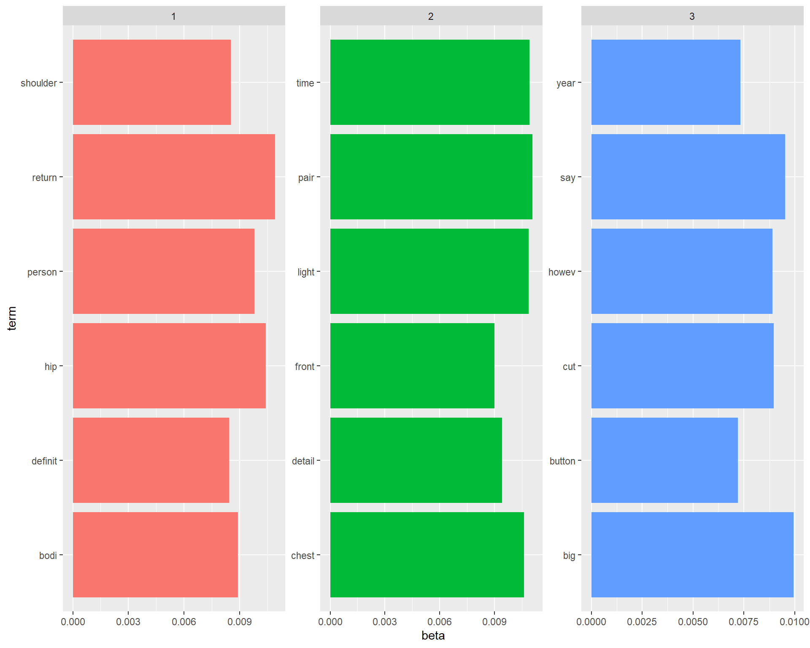

[**View Topic Term Importance →**](visualizations/topic-modelling/05_topic_term_importance.png)

---

## Interactive Topic Visualisation

The project also uses **LDAvis** to explore:

- Topic prevalence
- Topic separation
- Topic-term relationships
- Salient terms
- Topic-specific vocabulary

The interactive visualisation is available through the rendered HTML report.

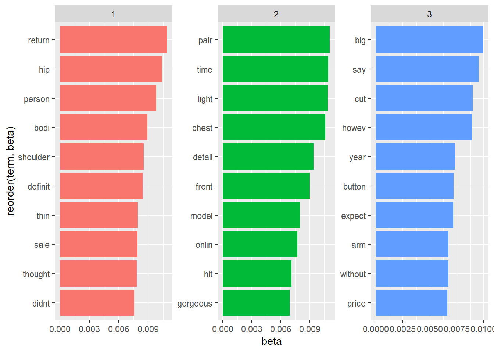

[**View LDA Topic Visualisation →**](visualizations/topic-modelling/04_lda_topic_visualisation.png)

---

<a name="recommendation-modelling"></a>

# 📈 Recommendation Modelling

## Logistic Regression

A logistic regression model was developed to examine whether textual sentiment could explain the probability of a customer recommending a product.

A derived recommendation variable was created using the customer rating:

```text
Rating ≥ 4  →  Recommended
Rating < 4  →  Not Recommended
```

This should be interpreted as a **rating-based recommendation proxy** rather than the original recommendation field in the source dataset.

---

## Model Variables

### Outcome

```text
recommendation
```

### Predictors

```text
bing_sentiment
Age
```

The model was fitted using:

```r
glm(
  recommendation ~ bing_sentiment + Age,
  data = model_data,
  family = "binomial"
)
```

---

## Model Results

The fitted model produced the following coefficients:

| Variable | Estimate | Std. Error | p-value |
|---|---:|---:|---:|
| Intercept | -0.0464 | 0.1790 | 0.796 |
| Bing Sentiment | **0.3817** | 0.0216 | **< 2e-16** |
| Age | 0.0029 | 0.0039 | 0.460 |

The sentiment coefficient was positive and statistically significant in the fitted model, while age was not statistically significant at conventional levels.

The model therefore provides evidence within this sample that **more positive textual sentiment is associated with a higher probability of the rating-derived recommendation outcome**.

---

## Probability of Recommendation

The relationship was visualised using a logistic probability curve.

The resulting S-shaped relationship shows increasing predicted recommendation probability as sentiment becomes more positive.

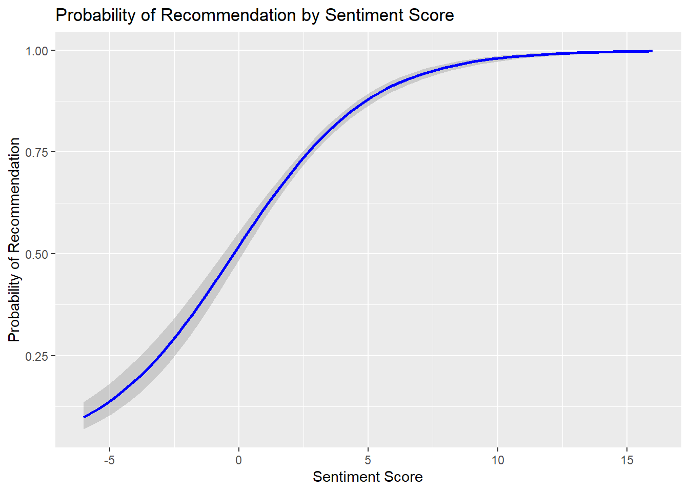

[**View Recommendation Probability →**](visualizations/recommendation-analysis/01_recommendation_probability.png)

---

<a name="key-findings"></a>

# 🔎 Key Findings

The analysis produced several consistent findings across the different techniques.

### 1. Fit and sizing are major customer concerns

Text mining repeatedly identified fit and sizing as important themes, particularly within:

- Tops
- Dresses
- Bottoms

Phrases such as `true size`, `fit perfectly` and `usual size` were prominent in the cleaned text.

---

### 2. Customer priorities vary by department

Different departments show different language patterns.

Core clothing categories place stronger emphasis on:

- Fit
- Size
- Garment dimensions

The Intimate category places greater emphasis on:

- Comfort
- Softness
- Material
- Wear experience

---

### 3. Customer sentiment is predominantly positive

The Bing sentiment distribution showed an overall positive tendency, indicating that positive language was more prevalent than negative language in the analysed sample.

---

### 4. Sentiment aligns with numerical ratings

Higher customer ratings generally corresponded with higher textual sentiment scores.

This provides evidence that review text captures information that is broadly consistent with the numerical rating provided by the customer.

---

### 5. Positive emotions are prominent

NRC analysis identified strong representation of positive emotional categories such as:

- Trust
- Joy
- Anticipation

---

### 6. Customer reviews contain identifiable latent themes

LDA identified interpretable themes around:

- Fit, comfort and returns
- Product appearance and online presentation
- Sizing, design and customer expectations

---

### 7. Sentiment is strongly associated with recommendation behaviour

The logistic regression model produced a positive and statistically significant sentiment coefficient.

The predicted probability curve also showed a clear increase in recommendation probability as sentiment became more positive.

---

### 8. Age contributed less strongly than sentiment

Within the fitted logistic regression model, the age coefficient was not statistically significant, whereas the sentiment coefficient was strongly significant.

This suggests that, within this modelling setup, textual sentiment carried more explanatory information for the rating-derived recommendation outcome than age.

---

<a name="visualisations"></a>

# 📊 Visualisations

The project contains **18 visualisations** covering text mining, sentiment analysis, emotion analysis, topic modelling and recommendation modelling.

Each visualisation is embedded below and is also stored in its corresponding repository folder.

---

## 😊 Sentiment Analysis

### 1. Bing Sentiment Distribution

Shows the distribution of review-level Bing sentiment scores.


[**View Bing Sentiment Distribution →**](visualizations/sentiment-analysis/01_bing_sentiment_distribution.png)

---

### 2. Average Sentiment by Product Category

Compares the average Bing sentiment score across product categories.


[**View Average Sentiment by Product Category →**](visualizations/sentiment-analysis/02_average_sentiment_by_product_category.png)

---

### 3. Sentiment Score vs Rating

Shows how textual Bing sentiment varies across customer rating levels.


[**View Sentiment Score vs Rating →**](visualizations/sentiment-analysis/03_sentiment_vs_rating.png)

---

### 4. NRC Emotion Heatmap

Shows the intensity of detected emotions across product departments.


[**View NRC Emotion Heatmap →**](visualizations/sentiment-analysis/04_nrc_emotion_heatmap.png)

---

## 🧩 Topic Modelling

### 5. Topic Perplexity

Shows model perplexity across candidate topic numbers from 2 to 10.


[**View Topic Perplexity →**](visualizations/topic-modelling/03_topic_perplexity.png)

---

### 6. LDA Topic Visualisation

Provides a visual representation of the identified LDA topics and their associated terms.


[**View LDA Topic Visualisation →**](visualizations/topic-modelling/04_lda_topic_visualisation.png)

---

### 7. Topic Term Importance

Shows the most important terms associated with each identified topic.


[**View Topic Term Importance →**](visualizations/topic-modelling/05_topic_term_importance.png)

---

## 🔤 Text Mining

### 8. Top Words

Shows the most frequent words identified during the initial text-mining stage.

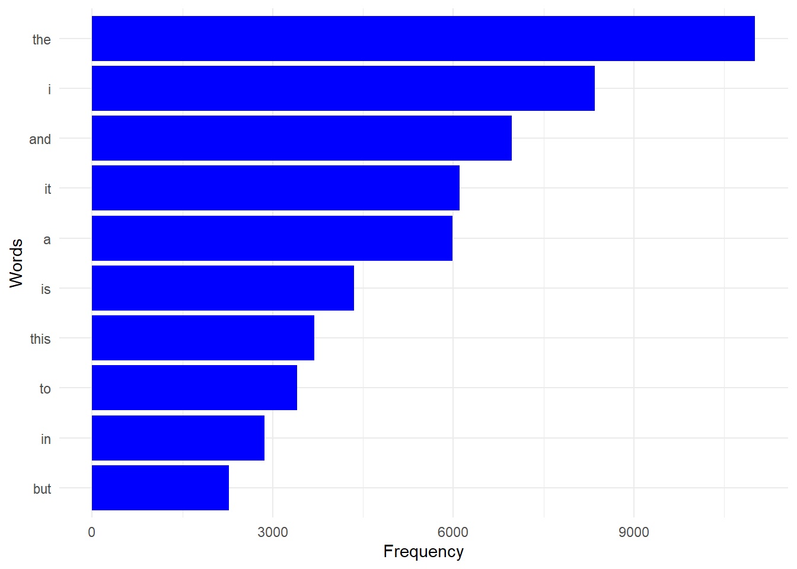

[**View Top Words →**](visualizations/text-mining/01_top_words.png)

---

### 9. Top Bigrams

Shows the most frequent two-word combinations identified during initial text exploration.

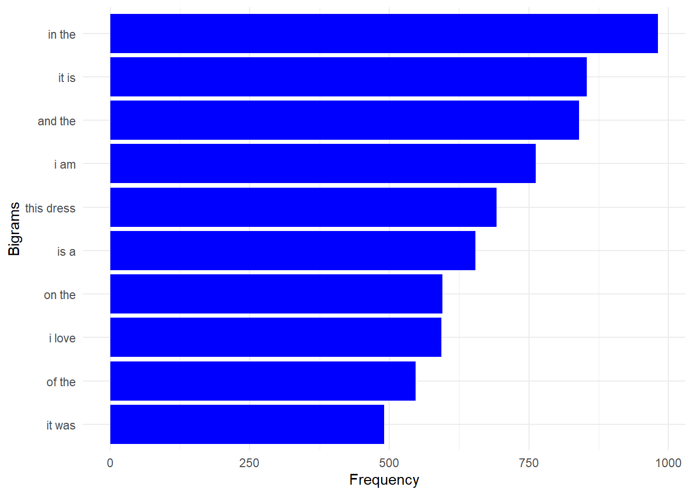

[**View Top Bigrams →**](visualizations/text-mining/02_top_bigrams.png)

---

### 10. Word Cloud

Provides a visual representation of the dominant vocabulary in the review corpus.

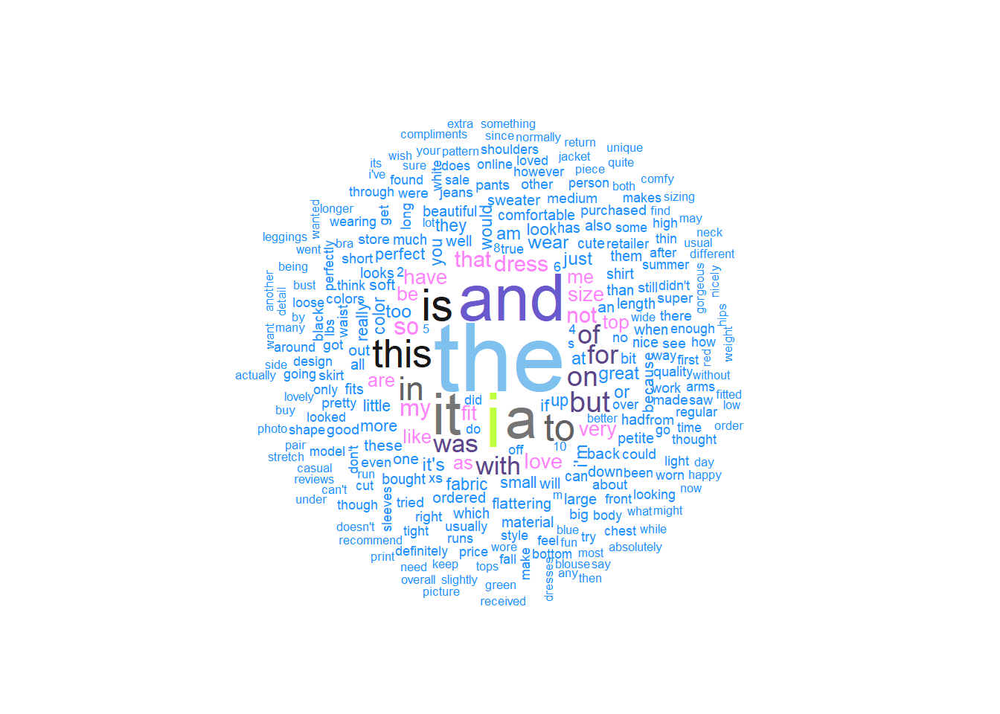

[**View Word Cloud →**](visualizations/text-mining/03_word_cloud.png)

---

### 11. Cleaned Word Frequency

Shows word frequencies after text cleaning and preprocessing.

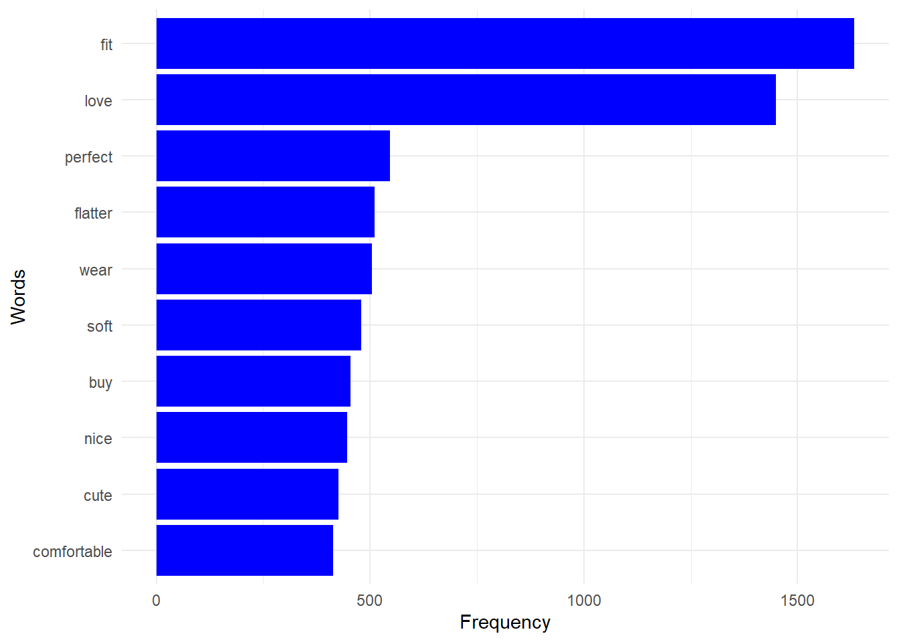

[**View Cleaned Word Frequency →**](visualizations/text-mining/04_cleaned_word_frequency.png)

---

### 12. Cleaned Bigram Frequency

Shows the most frequent two-word combinations after text preprocessing.

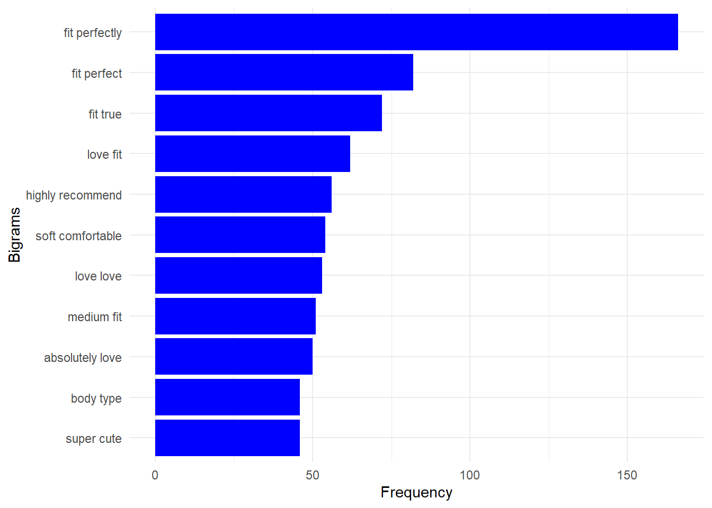

[**View Cleaned Bigram Frequency →**](visualizations/text-mining/05_cleaned_bigram_frequency.png)

---

### 13. Cleaned Word Cloud

Shows the dominant vocabulary after stopword removal and other preprocessing.

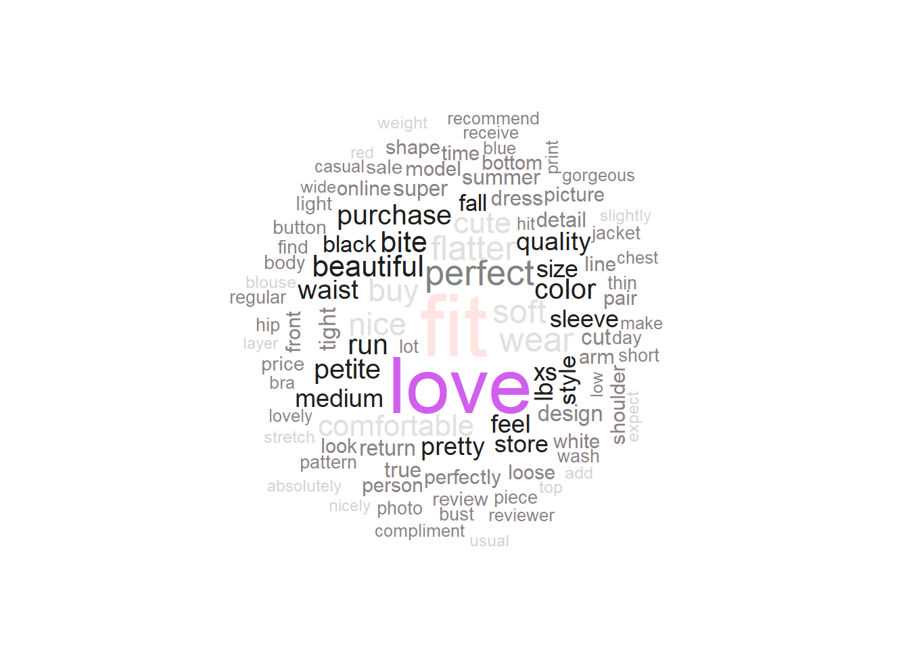

[**View Cleaned Word Cloud →**](visualizations/text-mining/06_cleaned_word_cloud.png)

---

### 14. Department Word Frequency

Compares important word frequencies across product departments.

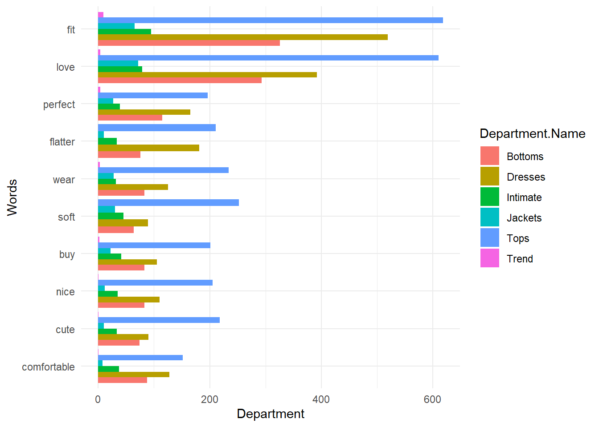

[**View Department Word Frequency →**](visualizations/text-mining/07_department_word_frequency.png)

---

### 15. Department Bigram Frequency

Compares important two-word phrases across product departments.

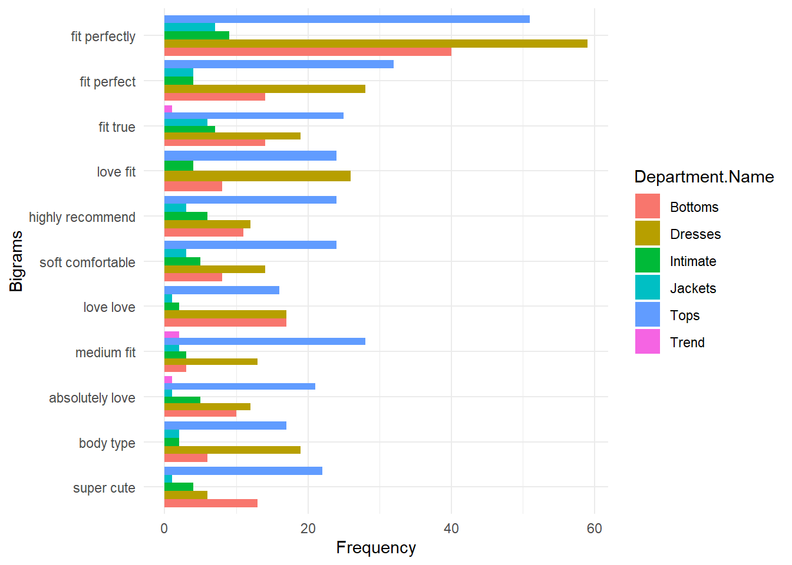

[**View Department Bigram Frequency →**](visualizations/text-mining/08_department_bigram_frequency.png)

---

### 16. Term Frequency Distribution

Shows the distribution of term frequencies before vocabulary filtering.

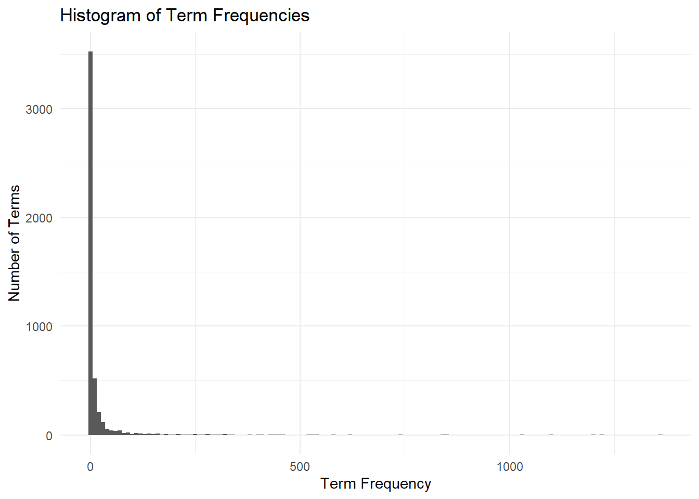

[**View Term Frequency Distribution →**](visualizations/text-mining/01_term_frequency_distribution.png)

---

### 17. Filtered Term Frequency Distribution

Shows the term-frequency distribution after filtering extremely common and rare terms.

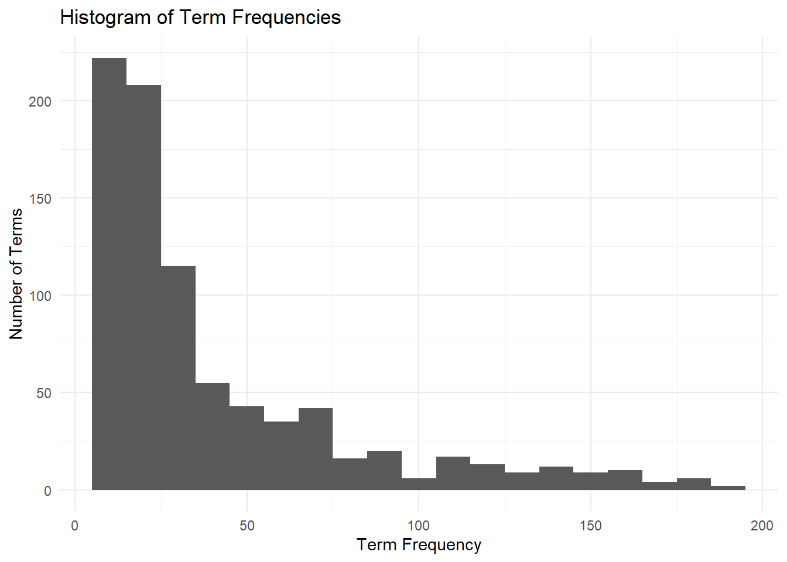

[**View Filtered Term Frequency Distribution →**](visualizations/text-mining/02_filtered_term_frequency_distribution.png)

---

## 📈 Recommendation Analysis

### 18. Probability of Recommendation by Sentiment Score

Shows the predicted probability of the rating-derived recommendation outcome as textual sentiment becomes more positive.


[**View Recommendation Probability →**](visualizations/recommendation-analysis/01_recommendation_probability.png)

---

<a name="technologies-and-libraries"></a>

# 🛠️ Technologies and Libraries

## Programming Language

- **R**

## Data Manipulation

- `dplyr`
- `tidyr`
- `tibble`
- `stringr`

## Text Mining and NLP

- `tidytext`
- `tm`
- `textstem`
- `textdata`

## Sentiment and Emotion Analysis

- **Bing Sentiment Lexicon**
- **NRC Emotion Lexicon**

## Topic Modelling

- `topicmodels`
- `LDAvis`
- `slam`

## Data Visualisation

- `ggplot2`
- `wordcloud`

## Statistical Modelling

- Logistic Regression
- Generalised Linear Models

## Supporting Libraries

- `Matrix`
- `reshape2`
- `jsonlite`
- `e1071`
- `caTools`
- `caret`

---

<a name="repository-structure"></a>

# 📁 Repository Structure

```text
data-mining-sentiment-analysis/
│
├── README.md
│
├── code/
│   ├── data_mining_sentiment_analysis.Rmd
│   └── data_mining_sentiment_analysis.html
│
├── data/
│   └── womens_clothing_customer_reviews.csv
│
└── visualizations/
    │
    ├── sentiment-analysis/
    │   ├── 01_bing_sentiment_distribution.png
    │   ├── 02_average_sentiment_by_product_category.png
    │   ├── 03_sentiment_vs_rating.png
    │   └── 04_nrc_emotion_heatmap.png
    │
    ├── topic-modelling/
    │   ├── 03_topic_perplexity.png
    │   ├── 04_lda_topic_visualisation.png
    │   └── 05_topic_term_importance.png
    │
    ├── text-mining/
    │   ├── 01_top_words.png
    │   ├── 02_top_bigrams.png
    │   ├── 03_word_cloud.png
    │   ├── 04_cleaned_word_frequency.png
    │   ├── 05_cleaned_bigram_frequency.png
    │   ├── 06_cleaned_word_cloud.png
    │   ├── 07_department_word_frequency.png
    │   ├── 08_department_bigram_frequency.png
    │   ├── 01_term_frequency_distribution.png
    │   └── 02_filtered_term_frequency_distribution.png
    │
    └── recommendation-analysis/
        └── 01_recommendation_probability.png
```

---

<a name="reproducibility"></a>

# ♻️ Reproducibility

The analysis is designed to be reproducible using the supplied R Markdown workflow.

A fixed random seed is used when sampling the review dataset:

```r
set.seed(1)
```

This ensures that the same 3,000 reviews are selected each time the analysis is executed under the same data conditions.

The same reproducibility approach is also applied during the LDA modelling stage.

---

## Running the Analysis

### 1. Install R

Install R from:

https://cran.r-project.org/

### 2. Install RStudio

RStudio provides a convenient environment for running and rendering the R Markdown analysis.

https://posit.co/download/rstudio-desktop/

### 3. Open the R Markdown File

Open:

```text
code/data_mining_sentiment_analysis.Rmd
```

### 4. Ensure the Dataset Path Is Correct

The analysis expects the review dataset to be available to the R Markdown document.

The repository contains:

```text
data/womens_clothing_customer_reviews.csv
```

If required, update the dataset path in the R Markdown file.

### 5. Install Required Packages

The analysis uses packages including:

```r
tm
tidytext
ggplot2
wordcloud
syuzhet
dplyr
tibble
textstem
textdata
tidyr
Matrix
topicmodels
stringr
reshape2
LDAvis
jsonlite
e1071
caTools
caret
slam
```

### 6. Knit the R Markdown File

The R Markdown document can be knitted to HTML to reproduce the full analytical report.

---

<a name="project-files"></a>

<a name="project-files"></a>

<a name="project-files"></a>

# 📂 Project Files

The complete project files are available below.

### 📄 R Markdown Source

The complete R Markdown source code used to perform the analysis.

**[👁️ View R Markdown Source](https://github.com/xzibitetok/xzibitetok.github.io/blob/master/data-mining-sentiment-analysis/code/data_mining_sentiment_analysis.Rmd)**

**[⬇️ Download R Markdown Source](https://github.com/xzibitetok/xzibitetok.github.io/releases/latest/download/data_mining_sentiment_analysis.Rmd)**

---

### 🌐 HTML Analysis Report

The complete rendered analytical report containing the analysis, results and visualisations.

**[⬇️ Download HTML Report](https://github.com/xzibitetok/xzibitetok.github.io/releases/latest/download/data_mining_sentiment_analysis.html)**

---

### 📊 Dataset

The customer review dataset used for the analysis.

**[⬇️ Download Dataset (Excel)](https://github.com/xzibitetok/xzibitetok.github.io/releases/latest/download/womens_clothing_customer_reviews.xlsx)**
---

### 🌐 HTML Analysis Report

The complete rendered analytical report containing the analysis, results and visualisations.

**[⬇️ Download HTML Report](https://raw.githubusercontent.com/xzibitetok/xzibitetok.github.io/master/data-mining-sentiment-analysis/code/data_mining_sentiment_analysis.html)**

---

### 🗃️ Dataset

The customer review dataset used for the analysis.

**[⬇️ Download Dataset (CSV)](https://raw.githubusercontent.com/xzibitetok/xzibitetok.github.io/master/data-mining-sentiment-analysis/data/womens_clothing_customer_reviews.csv)**

---

### 🗃️ Dataset

The anonymised women's clothing customer review dataset used for the analysis.

**[⬇️ Download Dataset (CSV)](https://raw.githubusercontent.com/xzibitetok/data-mining-sentiment-analysis/master/data/womens_clothing_customer_reviews.csv)**

---

### 🗃️ Dataset

The anonymised women's clothing customer review dataset used for the analysis.

**[⬇️ Download Dataset (CSV)](https://github.com/xzibitetok/data-mining-sentiment-analysis/raw/refs/heads/master/data/womens_clothing_customer_reviews.csv)**

---

<a name="references"></a>

# 📚 References

The analytical methods draw on established work in sentiment analysis, topic modelling and topic visualisation.

### NRC Emotion Lexicon

Mohammad, S.M. and Turney, P.D. (2012). Crowdsourcing a word-emotion association lexicon. *Computational Intelligence*, 29(3), pp.436–465.

https://doi.org/10.1111/j.1467-8640.2012.00460.x

### Latent Dirichlet Allocation

Blei, D.M., Ng, A.Y. and Jordan, M.I. (2003). Latent Dirichlet Allocation. *Journal of Machine Learning Research*, 3, pp.993–1022.

https://www.jmlr.org/papers/v3/blei03a.html

### LDAvis

Sievert, C. and Shirley, K. (2014). LDAvis: A method for visualizing and interpreting topics. *Proceedings of the Workshop on Interactive Language Learning, Visualization, and Interfaces*, pp.63–70.

---

<a name="author"></a>

# 👤 Author

## Ubong Etok

**MSc Data Science | Data Analytics | Business Intelligence | SQL | Machine Learning**

I develop data-driven solutions that combine statistical analysis, machine learning, data visualisation and business-oriented interpretation to transform complex datasets into actionable insights.

### 🔗 Connect

- GitHub: [**@xzibitetok**](https://github.com/xzibitetok)
- Portfolio: [**xzibitetok.github.io**](https://xzibitetok.github.io)

---

## ⭐ Project Highlights

This project demonstrates practical experience in:

- **Natural Language Processing**
- **Text Mining**
- **Sentiment Analysis**
- **Emotion Analysis**
- **Topic Modelling**
- **Latent Dirichlet Allocation**
- **Logistic Regression**
- **Statistical Analysis**
- **Data Cleaning and Preprocessing**
- **Feature Engineering**
- **Exploratory Data Analysis**
- **Data Visualisation**
- **Customer Behaviour Analysis**
- **R Programming**
- **Reproducible Data Analysis**

---

> **Key takeaway:** Customer review text provides a rich source of behavioural insight. Across the analysis, product fit, sizing, comfort, expectations and sentiment emerged as important dimensions of the customer experience, while statistical modelling showed a strong relationship between textual sentiment and the rating-derived recommendation outcome.
