# 🌱 EcoStream Energy — AWS Cloud Infrastructure & Data Analytics

> A practical AWS cloud engineering project covering cloud object storage, NoSQL data ingestion and query validation, reusable EC2 machine images, and a networked web application.

This README follows the five supplied technical guides in their original order. The step-by-step explanations below are taken from the PDFs, with the matching repository screenshots placed after the corresponding guide-page content. Image names use the case-sensitive filenames in `visualizations/`.

## Table of Contents

1. [Project Overview](#project-overview)
2. [Project Objectives](#project-objectives)
3. [Business Context](#business-context)
4. [Dataset and Query Results](#dataset-and-query-results)
5. [Technology Stack](#technology-stack)
6. [Objective 1 — Amazon S3 Bucket Setup](#objective-1--amazon-s3-bucket-setup)
7. [Objective 2 — DynamoDB Table and S3 Import](#objective-2--dynamodb-table-and-s3-import)
8. [Objective 3 — DynamoDB Query Validation](#objective-3--dynamodb-query-validation)
9. [Objective 4 — Custom Amazon Machine Image and Node.js Validation](#objective-4--custom-amazon-machine-image-and-nodejs-validation)
10. [Objective 5 — Networking and Web Application](#objective-5--networking-and-web-application)
11. [Key Outcomes](#key-outcomes)
12. [Project Files](#project-files)
13. [Repository Structure](#repository-structure)
14. [Reproducibility](#reproducibility)
15. [Limitations and Considerations](#limitations-and-considerations)
16. [References](#references)
17. [Author](#author)

---

## Project Overview

EcoStream Energy is a renewable energy provider using Amazon Web Services to store telemetry data, import it into a NoSQL database, validate business queries, create a reusable EC2 image containing Node.js, and deploy a web application using a custom VPC and Apache HTTP Server.

The project includes five technical guides, 80 numbered terminal/AWS screenshots in the repository's `visualizations/` folder, a telemetry JSON dataset, and five CSV query-result files. The five guides are available for direct download from the project's GitHub Release.

## Project Objectives

1. Create and configure the Amazon S3 bucket `23122931-ecostream-energy-bucket` and upload the telemetry dataset.
2. Import the telemetry dataset from Amazon S3 into the DynamoDB table `23122931-ecostream-telemetry-db`.
3. Run and validate five DynamoDB Scan queries, export the results as CSV files, and upload them to Amazon S3.
4. Create and validate a reusable custom Amazon Machine Image with Node.js installed.
5. Configure a custom VPC, launch an EC2 web server, install Apache HTTP Server, and verify the EcoStream welcome page.

## Business Context

The workflow connects data storage, database querying, reusable compute configuration, and application hosting. The query-validation guide specifies five business questions: facilities with maintenance incidents changing between 2024 and 2025; low 2025 energy output; wind facilities on the High-Performance tier; high energy output in both 2024 and 2025; and impossible downtime values for 2024.

## Dataset and Query Results

- **Source dataset:** [`energy-telemetry-2025-2026-dbjson.json`](https://github.com/xzibitetok/xzibitetok.github.io/releases/download/Ubong_s_EcoStream_AWS_v1.0.0/energy-telemetry-2025-2026-dbjson.json)
- **Query 1:** [`23122931query1.csv.csv`](https://github.com/xzibitetok/xzibitetok.github.io/releases/download/Ubong_s_EcoStream_AWS_v1.0.0/23122931query1.csv.csv)
- **Query 2:** [`23122931query2.csv.csv`](https://github.com/xzibitetok/xzibitetok.github.io/releases/download/Ubong_s_EcoStream_AWS_v1.0.0/23122931query2.csv.csv)
- **Query 3:** [`23122931query3.csv.csv`](https://github.com/xzibitetok/xzibitetok.github.io/releases/download/Ubong_s_EcoStream_AWS_v1.0.0/23122931query3.csv.csv)
- **Query 4:** [`23122931query4.csv.csv`](https://github.com/xzibitetok/xzibitetok.github.io/releases/download/Ubong_s_EcoStream_AWS_v1.0.0/23122931query4.csv.csv)
- **Query 5:** [`23122931query5.csv.csv`](https://github.com/xzibitetok/xzibitetok.github.io/releases/download/Ubong_s_EcoStream_AWS_v1.0.0/23122931query5.csv.csv)

## Technology Stack

- **Amazon S3** — telemetry data and CSV result storage.
- **Amazon DynamoDB** — NoSQL table creation, import, Scan operations, and query filtering.
- **Amazon EC2** — template, validation, and web-server instances.
- **Amazon Machine Image (AMI)** — reusable instance configuration with Node.js installed.
- **Amazon VPC** — subnets, route tables, internet gateway, and DNS configuration.
- **Apache HTTP Server** — serving the EcoStream welcome page.
- **Ubuntu Linux / Amazon Linux 2023** — EC2 operating systems used in the guides.
- **Node.js** — software installation and AMI validation.
- **GitHub Markdown** — project documentation and visual evidence.

---

## Objective 1 — Amazon S3 Bucket Setup

**Full guide:** [23122931 S3 Bucket step-by-step guide.pdf](https://github.com/xzibitetok/xzibitetok.github.io/releases/download/Ubong_s_EcoStream_AWS_v1.0.0/23122931%2BS3%2BBucket%2Bstep-by-step%2Bguide.pdf)

23122931 S3 Bucket Step-by-Step Guide

### Introduction
This document guides you through creating and configuring the Amazon S3 bucket needed for the EcoStream Energy cloud storage solution. The guide describes how to create the bucket “23122931-ecostream-energy-bucket” in Amazon Web Services (AWS), including the settings applied to make secure and reliable cloud-based data storage possible. The page also displays the successful upload of the given telemetry collection into the S3 bucket for future database integration and querying. The tutorial includes relevant screenshots and configuration explanations throughout to help EcoStream staff with limited expertise of cloud computing to successfully repeat the setup process. I signed into the AWS Academy Learner Lab environment and began the work of configuring cloud storage for EcoStream Energy. The learner lab environment gave temporary access to the AWS services and resources I will need to build and operate the S3 storage architecture. To start the configuration procedure, the following steps were used:

## Step 1: 
After successfully entering the AWS Management Console from the learner lab environment, the AWS search bar was utilized to search for "S3". Then I selected the Amazon S3 service under category “Services” to start the configuration of the cloud storage bucket needed to store the EcoStream telemetry data provided in the assessment resource. This step was an important step as Amazon S3 provides scalable object storage, which would later be utilized to store the “energy-telemetry-2025-2026-dbjson” dataset before integrating it with DynamoDB for querying and analysis.

## Visual evidence — (3 images)

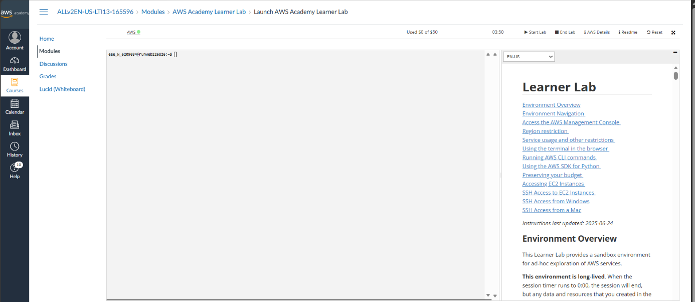

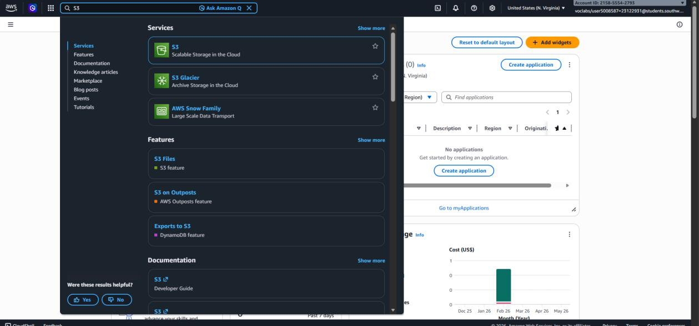

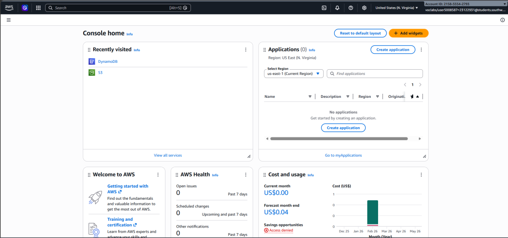

## Step 2:
To set up the cloud storage environment required for the EcoStream dataset, the Amazon S3 bucket creation page was opened from the S3 service dashboard. In the “General configuration” section, the AWS Region “US East (N. Virginia) us-east-1” was kept so that it would be the same as that utilized across the assessment brief. The “General purpose” bucket type was chosen because it is suitable for common cloud storage operations and offers high availability across many Availability Zones. The bucket name “23122931-ecostream-energy-bucket " is given in the assessment brief.

The default “ACLs disabled” object ownership setting was retained to simplify access management using bucket policies instead of legacy access control lists. Furthermore, the “Block all public access” setting was still enabled to increase the security of the bucket and prevent unauthorised public access to the stored telemetry dataset. The “bucket versioning” was disabled because the assessment did not require the ability to save multiple object versions, only required the fundamental dataset storage feature. For the encryption settings, the default server-side encryption option “SSE-S3” was kept to automatically encrypt all uploaded files stored in the bucket using Amazon S3-managed encryption keys.

These parameters were chosen to establish a secure, well designed and cost effective cloud storage environment for the EcoStream telemetry dataset in line with AWS best security practices.

## Visual evidence — (4 images)

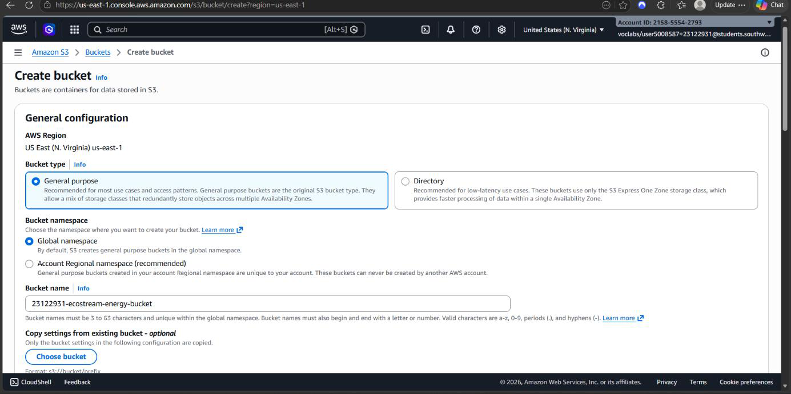

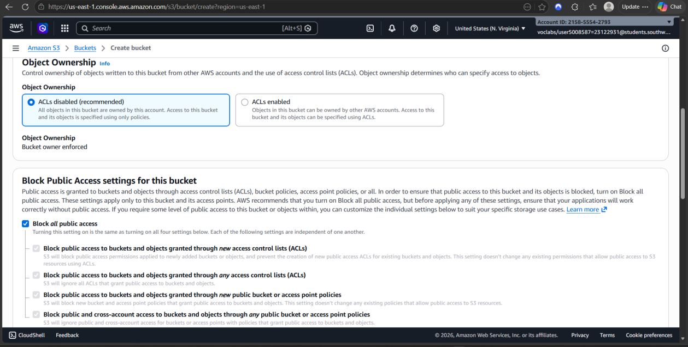

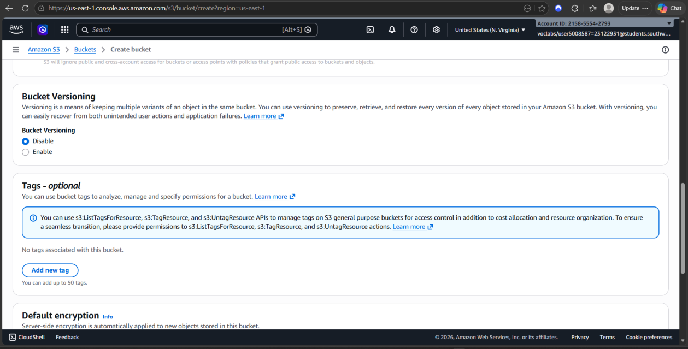

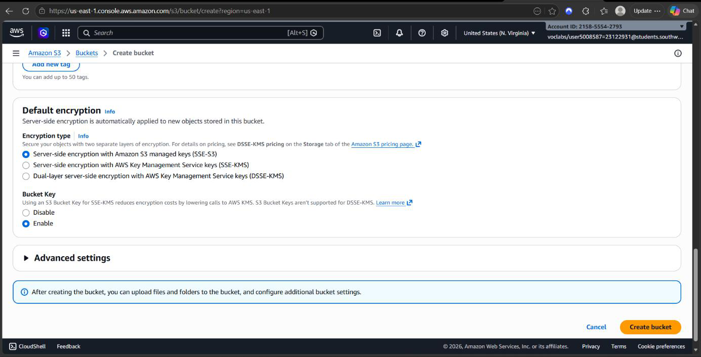

## Step 3: 
After setting up the bucket configuration, the option “Create bucket” was selected to deploy the storage bucket. AWS successfully created the bucket “23122931-ecostream-energy- bucket”. And the bucket dashboard opened automatically. The bucket interface had the Objects, Properties, Permissions, Metrics, and Management tabs proving the successful provisioning of the storage environment ready to store data. This phase verified that the S3 bucket infrastructure required for the evaluation has been successfully set up. The “Upload” option inside the S3 bucket dashboard was selected to upload the EcoStream telemetry dataset into the newly created storage bucket. The dataset file “energy-telemetry- 2025-2026-dbjson” was uploaded successfully into the bucket storage environment. The upload status screen indicated that the upload was completed successfully and no mistakes were detected. The uploaded file was listed in the files and folders area with its file type and storage size, which signified that the dataset was successfully stored in the Amazon S3 bucket. This step was necessary because according to the assessment brief, the telemetry dataset has to be saved in Amazon S3 first, and then imported into DynamoDB for database analysis and querying operations.

This step was necessary because the assessment required the telemetry dataset to be stored inside Amazon S3 before it could later be imported into DynamoDB for querying and database analysis tasks.

## Visual evidence — (2 images)

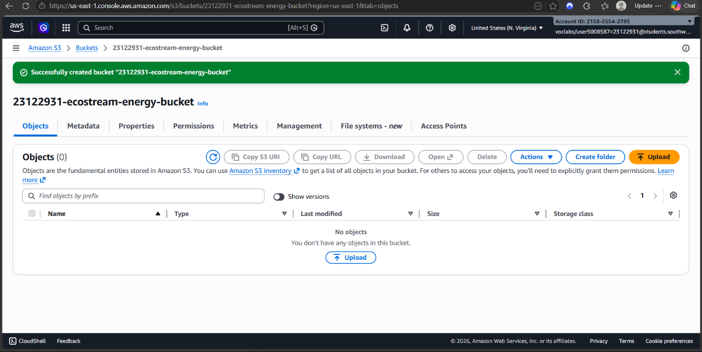

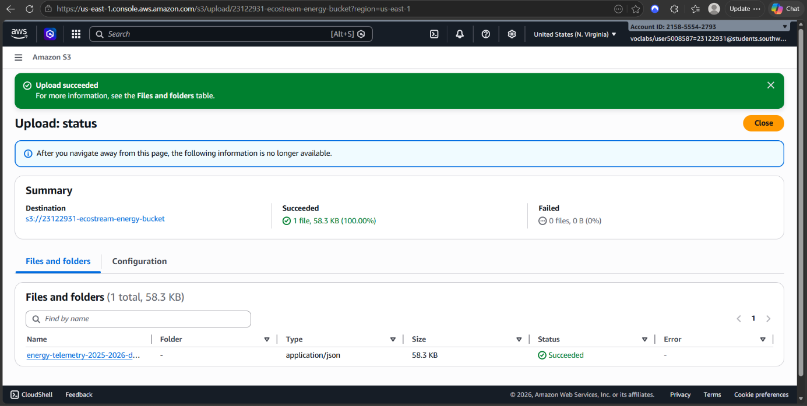


---


## Objective 2 — DynamoDB Table and S3 Import

**Full guide:** [23122931 DynamoDB step-by-step guide.pdf](https://github.com/xzibitetok/xzibitetok.github.io/releases/download/Ubong_s_EcoStream_AWS_v1.0.0/23122931%2BDynamoDB%2Bstep-by-step%2Bguide.pdf)

## Introduction 
This document provides step-by-step instructions for creating and configuring the Amazon DynamoDB table required for the EcoStream telemetry data environment. The instruction demonstrates how to import the uploaded telemetry dataset in Amazon S3 into a DynamoDB table called “23122931-ecostream-telemetry-db”. This document contains the parameters applied during the import process, such as choosing the partition key, table configuration settings, and import validation methods. Relevant screenshots and technical descriptions are provided throughout the guide to ensure that EcoStream workers can successfully reproduce the DynamoDB deployment and data import procedure in the AWS environment.

## Step 1: 
Having completed the S3 bucket configuration and uploaded the dataset, the AWS search bar was used to locate for the Amazon DynamoDB service. DynamoDB was then picked to start the process of establishing the NoSQL database environment needed to import and query the EcoStream telemetry dataset stored in Amazon S3. The DynamoDB dashboard was opened successfully, displaying the database management interface and available DynamoDB features. In the navigation panel, the “Imports from S3” option was selected to create a DynamoDB table directly from the dataset file stored in the previously created S3 bucket. The DynamoDB dashboard was successfully opened, and the database administration interface and available functionalities of DynamoDB were displayed. In the navigation panel, the “Imports from S3” option was selected to create a DynamoDB table directly from the dataset file stored in the previously created S3 bucket. This step was necessary because the assessment required importing the EcoStream telemetry dataset from Amazon S3 into a DynamoDB table for querying and analysis. The “Imports from S3” feature provided a direct integration between Amazon S3 and DynamoDB, simplifying dataset import.

## Visual evidence — (2 images)

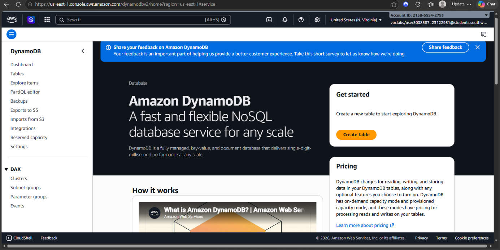

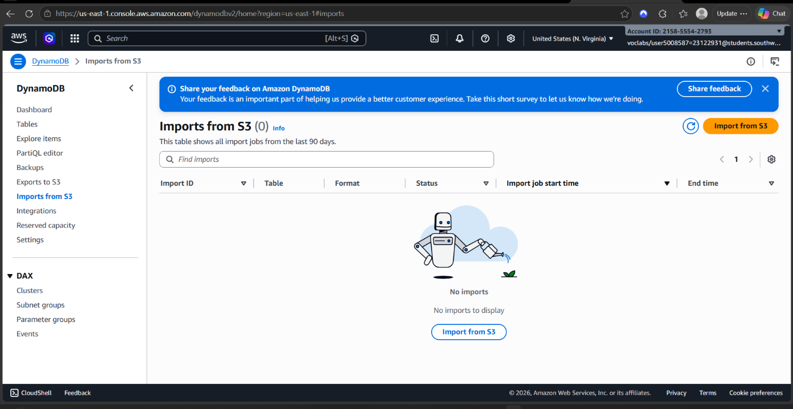

## Step 2:
The S3 bucket containing the EcoStream telemetry dataset was selected using the “Browse S3” option within the DynamoDB import configuration page. The bucket “23122931- ecostream-energy-bucket” was successfully identified and selected from the list of available S3 buckets in the AWS account. The current AWS account was retained as the S3 bucket owner because both the S3 bucket and DynamoDB resources were created within the same AWS learner lab environment. The import file compression setting was left at “No compression” because the uploaded dataset file was stored in its original, uncompressed format. Under the import file format settings, the “DynamoDB JSON” option was selected because the uploaded telemetry dataset used the DynamoDB-compatible JSON structure required for direct table import into Amazon DynamoDB. These settings ensured that DynamoDB could correctly locate, interpret, and import the EcoStream telemetry dataset from Amazon S3 into a new NoSQL database table for further querying and analysis tasks. After configuring the “Import options”, the “Next” option was selected to continue to the “Specify table details page”.

## Visual evidence — (2 images)

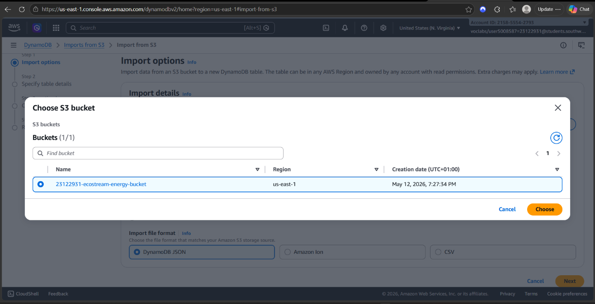

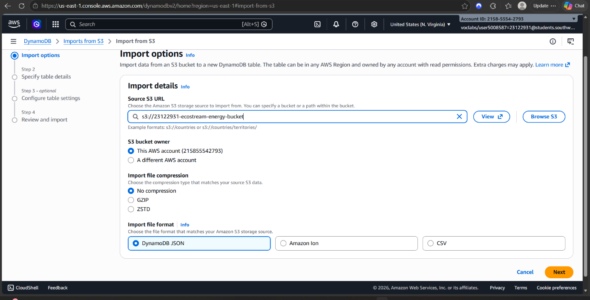

## Step 3: 
The DynamoDB table configuration page was completed by specifying the table details needed to import the EcoStream telemetry dataset from Amazon S3. The table was named “23122931-ecostream-telemetry-db” to clearly identify it as the main telemetry database table for the assessment task. The partition key was configured as “Facility ID” with the data type set to “String”. This field was selected because each facility identifier in the dataset is unique to its registered region, making it suitable as the primary key for organizing and efficiently retrieving records in DynamoDB. No sort key was configured because the assessment requirements only required a primary partition key for uniquely identifying records. After confirming the table configuration settings, the “Next” option was selected to continue to the table settings configuration stage. This step was necessary because DynamoDB requires a primary key to organize and distribute data efficiently across the database infrastructure, enabling scalable querying and storage operations.

## Visual evidence — (1 image)

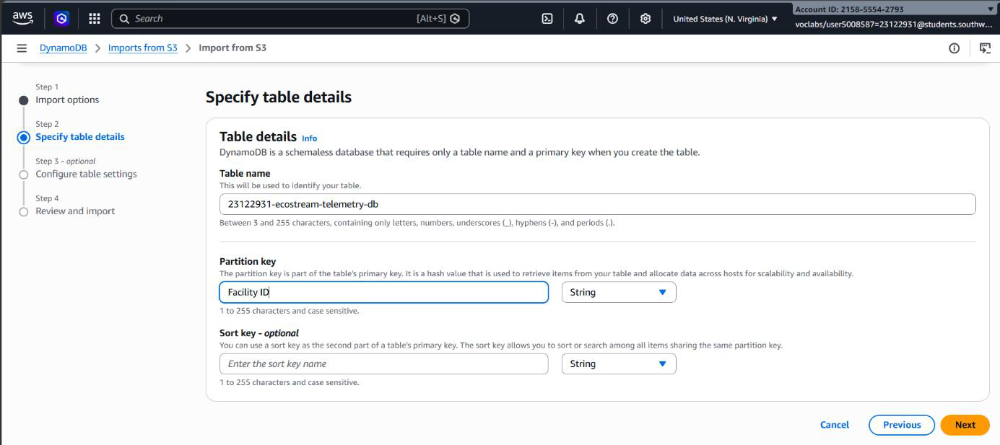

## Step 4: 
The DynamoDB table settings configuration page was opened to review the default database configuration options before importing the telemetry dataset. The “Default settings” option was retained to simplify the deployment process and allow AWS to automatically apply the recommended DynamoDB configuration values. This step was necessary because the default DynamoDB settings provided a fully managed, scalable NoSQL database configuration that efficiently stored and queried the EcoStream telemetry dataset without additional administrative overhead.

## Visual evidence — (1 image)

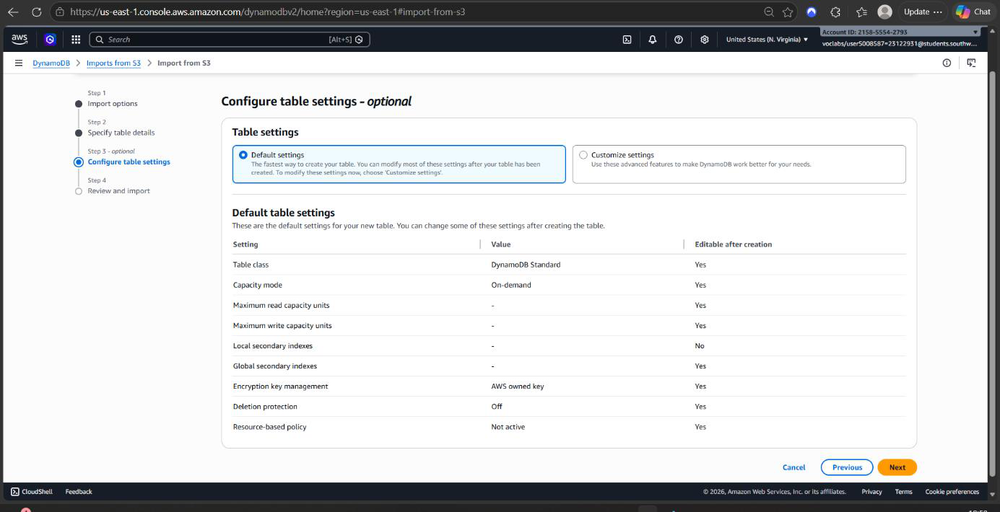

## Step 5: 
The final review page was opened to verify all DynamoDB import configurations before starting the database import process. The review confirmed that the S3 source bucket “s3://23122931-ecostream-energy-bucket” was correctly selected and that the dataset format was configured to “DynamoDB JSON”. The destination table details were also reviewed, confirming that the table name “23122931- ecostream-telemetry-db” and partition key “Facility ID” were correctly configured. The table class remained “Standard” with “On-demand” capacity mode enabled to allow automatic scaling of database read and write operations. Additional settings, such as AWS-owned encryption keys and disabled deletion protection, were also verified before proceeding. After confirming that all configurations matched the assessment requirements, the “Import” button was selected to begin importing the telemetry dataset from the S3 bucket into DynamoDB. This step was necessary to validate that the S3 source location, DynamoDB table structure, and database settings were correctly configured before creating the telemetry database.

## Visual evidence — (1 image)

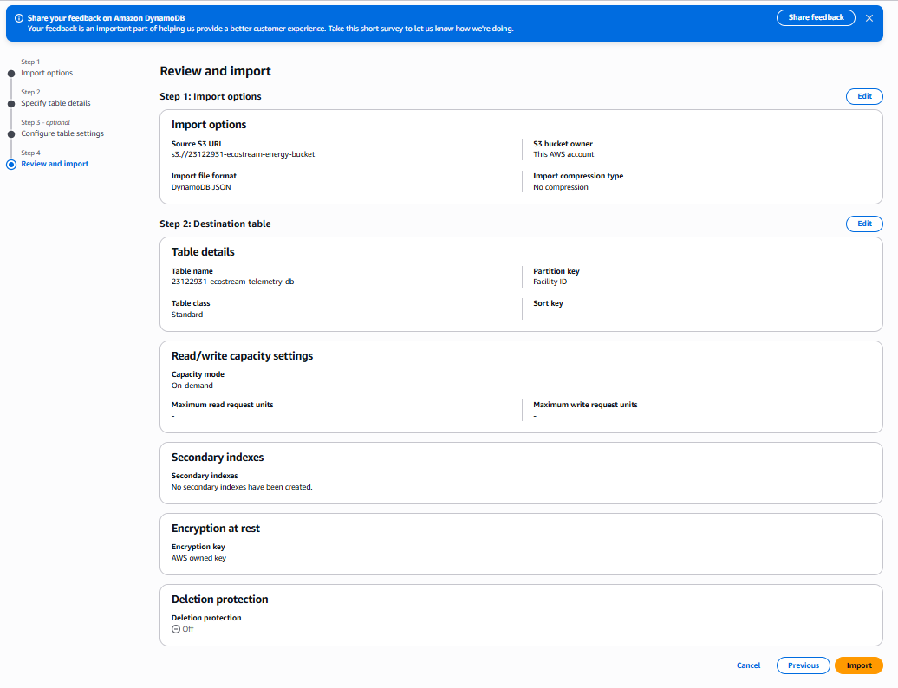

## Step 6: 
The DynamoDB Imports from S3 dashboard confirmed that the import process for the EcoStream telemetry dataset had started successfully. The import job displayed the destination table “23122931-ecostream-telemetry-db,” the selected “DynamoDB JSON” file format, and the import status. The import monitoring page confirmed that AWS was processing the telemetry dataset from the S3 bucket and automatically creating DynamoDB table records. This step verified that the integration between Amazon S3 and DynamoDB was functioning correctly and that the telemetry data import operation had been initiated successfully.

## Visual evidence — (1 image)

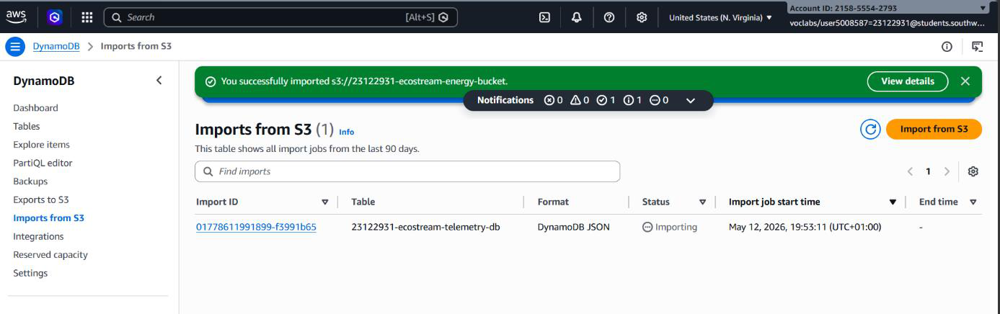

## Step 7: 
The Amazon S3 bucket page was revisited to verify that the uploaded telemetry dataset “energy-telemetry-2025-2026-dbjson.json” remained successfully stored inside the “23122931- ecostream-energy-bucket”. The Objects section displayed the uploaded JSON dataset together with its file size, storage class, and last modified date. This verification step confirmed that the source dataset remained available and accessible for DynamoDB import operations. It also confirmed that the telemetry file was correctly stored within the S3 bucket and ready for future querying, backup, or database integration tasks required by the assessment.

## Visual evidence — guide page 6 (2 images)

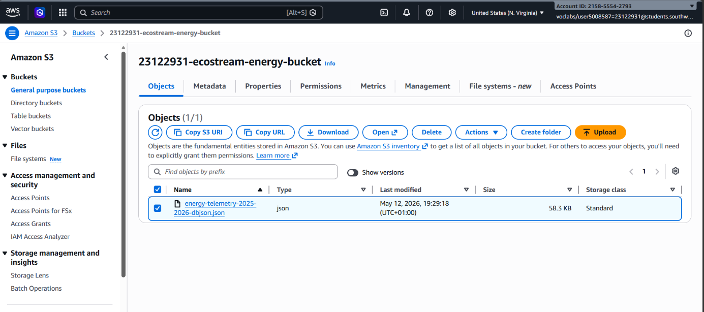

---


## Objective 3 — DynamoDB Query Validation

**Full guide:** [23122931 Query Validation.pdf](https://github.com/xzibitetok/xzibitetok.github.io/releases/download/Ubong_s_EcoStream_AWS_v1.0.0/23122931%2BQuery%2BValidation.pdf)

Query Validation Introduction This document contains the validation evidence for DynamoDB query operations on the EcoStream telemetry database. The paper includes screenshots of each query produced in Amazon DynamoDB. It shows the query logic, the filters applied, the attributes selected, and the outputs generated from the telemetry dataset.

The objective of this document is to show how to correctly implement the required queries on the “23122931-ecostream-telemetry-db” table in the database and extract the requested analytical findings. The screenshots also confirm that the query results were validated and suitable for export and storage to the specified Amazon S3 bucket.

**Step 1:** Go to the AWS Console dashboard and open the DynamoDB service.

**Step 2:** Navigate to the Explore items area in the DynamoDB navigation panel and choose the table: “23122931-ecostream-telemetry-db”. Before creating the queries, check if the dataset and the necessary attributes are accessible within the table.

**Visual evidence — guide page 1 (2 images)**

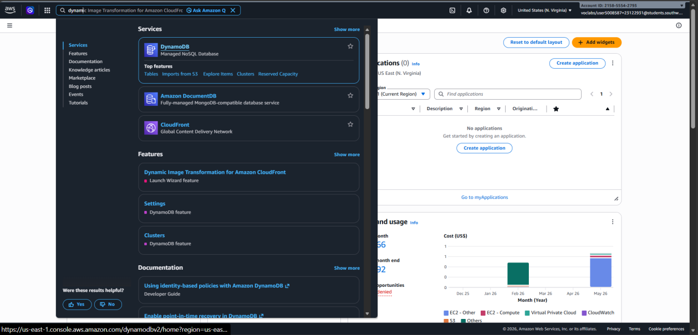

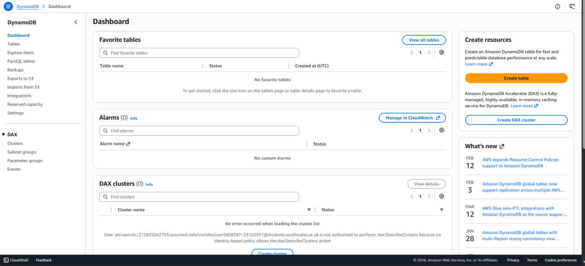

Step 3 - Queries: Use the Scan operation to allow filtering across all records in the dataset for Queries 1 to 5 below. Query 1: Return all data for facilities that had no maintenance incidents in 2024 but at least one maintenance incident in 2025. Query 1 Logic To identify facilities with no maintenance incidents in 2024 but at least one incident in 2025, the attribute projection was set to “All attributes” because the requirement requested all facility data. Two filters were used to compare maintenance activity between the two years. The attribute names "Maintenance Incidents 2024" and "Maintenance Incidents 2025" were selected because they directly store the yearly maintenance records. The condition Equal to, with a value of “0” was used to identify facilities with no incidents in 2024, while the condition “Greater than” with a value above “0” was used to identify facilities that recorded incidents in 2025. The Number type was selected because maintenance incident values are numeric. • Specific Attribute Projection: All attributes • 1st filter: • Attribute Name: Maintenance Incidents 2024 • Condition: Equal to • Type: Number • Value: 0

- 2nd filter:
- Attribute Name: Maintenance Incidents 2025
- Condition: Greater than
- Type: Number
- Value: 0

**Visual evidence — guide page 2 (1 image)**

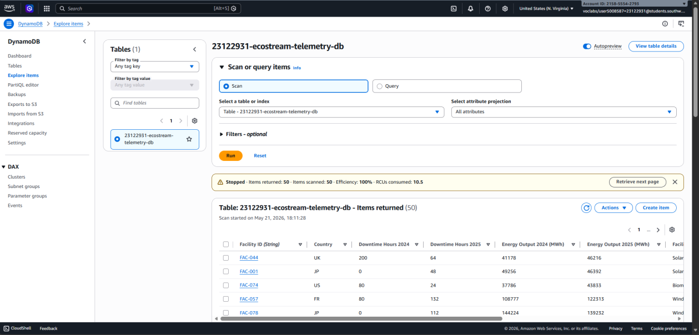

After clicking Run, the query result will be exported as a CSV file by selecting the Actions dropdown and choosing Download results to CSV. The downloaded file was then renamed to “23122931query1.csv.”

Query 2: Return Facility ID and Country for facilities with Energy Output less than 50,000 MWh in 2025. Query 2 Logic To identify facilities with low energy production in 2025, the attribute projection was set to “Specific attributes” because only “Facility ID” and “Country” were required in the result. The attribute name “Energy Output 2025 (MWh)” was selected because it stores the energy generation data for 2025. The “Less than” condition with a value of “50000” was applied to return facilities producing less than 50,000 MWh. The “Number” type was selected because energy output values are numeric. • Specific Attribute Projection: Specific attributes • Specific attributes to project: Facility ID, Country • Attribute Name: Energy Output 2025 (MWh) • Condition: Less than • Type: Number • Value: 50000 After clicking Run, the query result will be exported as a CSV file by selecting the Actions dropdown and choosing Download results to CSV. The downloaded file was then renamed to “23122931query2.csv.”

**Visual evidence — guide page 3 (1 image)**

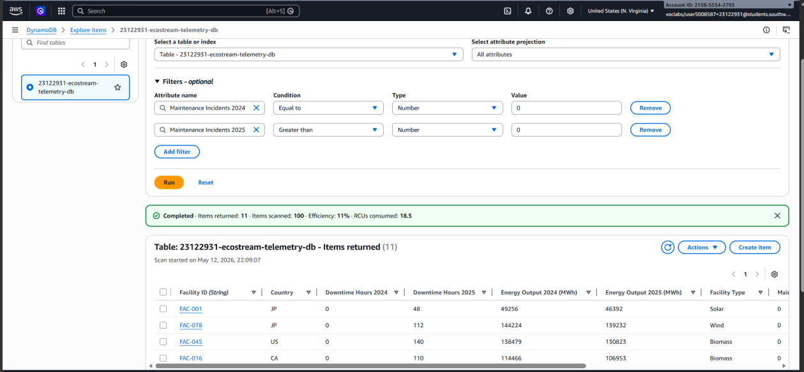

Query 3: Return Facility ID for facilities with a Wind type on the High-Performance tier. Query 3 Logic To identify wind facilities operating within the high-performance tier, the attribute projection was set to “Specific attributes” because only the “Facility ID” was required in the output. Two filters were used to ensure both conditions were satisfied. The attribute name “Facility Type” was selected to identify the type of renewable facility, while “Operational Tier” was selected to identify the operational performance category. The condition “Equal to” was used in both filters because exact matching values were required. The values “Wind” and “High-Performance” were entered to return only facilities matching both conditions. The “String” type was selected because the values are text-based. • Select attribute projection: Specific attributes • Specific attributes to Project: Facility ID • 1st filter: • Attribute Name: Facility Type • Condition: Equal to • Type: String • Value: Wind • 2nd filter: • Attribute Name: Operational Tier • Condition: Equal to • Type: String • Value: High-Performance

**Visual evidence — guide page 4 (1 image)**

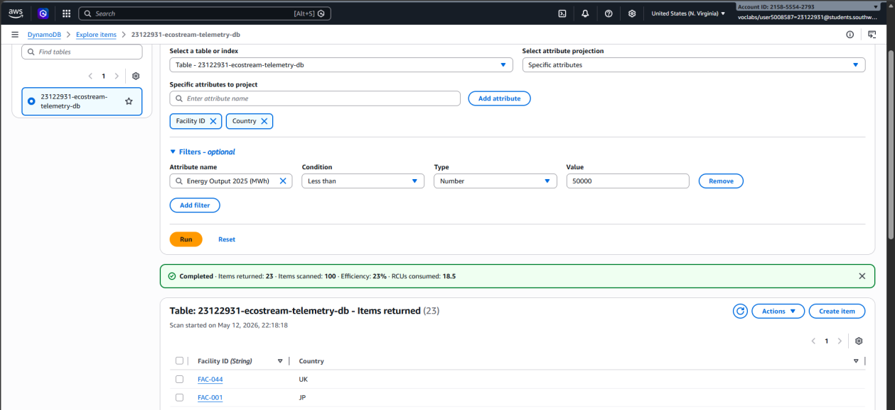

After clicking Run, the query result will be exported as a CSV file by selecting the Actions dropdown and choosing Download results to CSV. The downloaded file was then renamed to “23122931query3.csv.”

Query 4: Return all data for facilities that have an Energy Output greater than 100,000 MWh for both 2024 and 2025. Query 4 Logic To identify facilities with consistently high energy production across both years, the attribute projection was set to “All attributes” because the requirement requested complete facility records. Two filters were applied to compare energy output values for both 2024 and 2025. The attribute names “Energy Output 2024 (MWh)” and “Energy Output 2025 (MWh)” were selected because they contain the yearly energy generation values. The “Greater than” condition with a value of “100000” was used in both filters to return facilities that generate above 100,000 MWh in each year. The “Number” type was selected because energy output values are numeric. • Select attribute projection: All attributes • 1st filter: • Attribute Name: Energy Output 2024 (MWh) • Condition: Greater than • Type: Number • Value: 100000

- 2nd filter:
- Attribute Name: Energy Output 2025 (MWh)
- Condition: Greater than
- Type: Number
- Value: 100000 After clicking Run, the query result will be exported as a CSV file by selecting the Actions dropdown and choosing Download results to CSV. The downloaded file was then renamed to “23122931query4.csv.”

**Visual evidence — guide page 5 (1 image)**

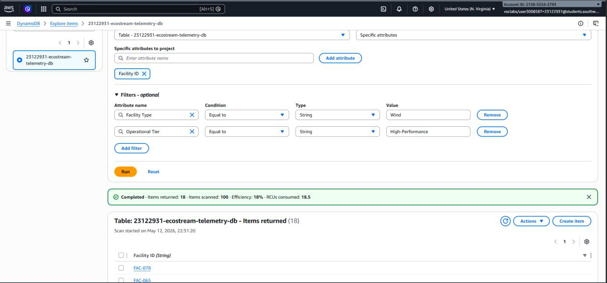

Query 5: Identify facilities with impossible downtime hours for 2024 data. Query 5 Logic To identify facilities with impossible downtime values in 2024, the attribute projection was set to “All attributes” because the requirement requested complete facility data. The attribute name “Downtime Hours 2024” was selected because it stores the downtime values for 2024. A full year contains “8760 hours (365 × 24)”, any value above 8,760 hours is considered impossible. The condition “Greater than” with a value of “8760” was used to identify such records. The Number type was selected because downtime values are numeric. • Select attribute projection: All attributes • Attribute name: Downtime Hours 2024 • Condition: Greater than • Type: Number • Value: 8760

After clicking Run, the query result will be exported as a CSV file by selecting the Actions dropdown and choosing Download results to CSV. The downloaded file was then renamed to “23122931query5.csv.”

**Step 4:** Navigate to the S3 bucket: 23122931-ecostream-energy-bucket and uploaded all 5 downloaded CSV files gotten from the 5 queries I created.

**Visual evidence — guide page 6 (2 images)**

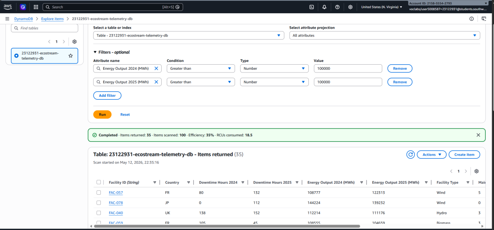

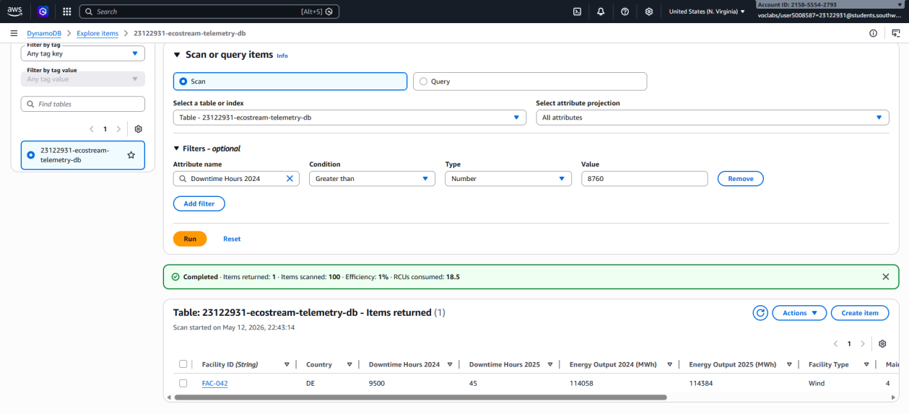

**Visual evidence — guide page 7 (1 image)**

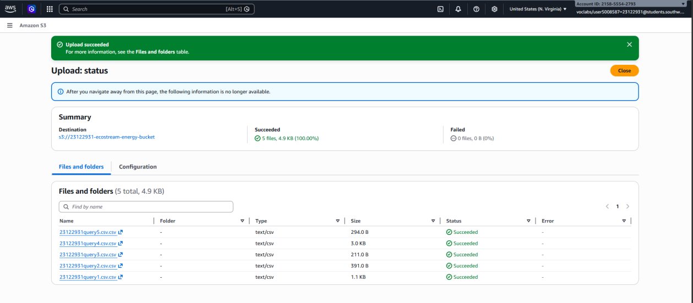

**Download the full step-by-step guide:** [23122931 Query Validation.pdf](https://github.com/xzibitetok/xzibitetok.github.io/releases/download/Ubong_s_EcoStream_AWS_v1.0.0/23122931%2BQuery%2BValidation.pdf)

---


## Objective 4 — Custom Amazon Machine Image and Node.js Validation

**Full guide:** [23122931 Amazon Machine Image step-by-step guide.pdf](https://github.com/xzibitetok/xzibitetok.github.io/releases/download/Ubong_s_EcoStream_AWS_v1.0.0/23122931%2BAmazon%2BMachine%2BImage%2Bstep-by-step%2Bguide.pdf)

Amazon Machine Image Step-by-Step Guide

Introduction This document presents a step-by-step method for creating and validating a custom Amazon Machine Image for EcoStream Energy using Amazon EC2 services. The guide explains how a typical Ubuntu Linux EC2 instance was set up as a template server, how to manually install the Node.js programming environment, and how the configured instance was turned into a reusable custom AMI. It also details how the AMI was validated by creating a second EC2 instance from the modified image and running “Node.js” commands to verify that the software installation was retained in the AMI. Relevant screenshots are attached, along with technical details to aid in replicating the deployment procedure in the AWS environment.

**Step 1:** The AWS search menu was used to locate and open the EC2 service in the AWS Management Console. The EC2 dashboard was opened successfully, displaying the available EC2 resources and the Launch Instance option.

**Step 2:** The instance was named 23122931-ec2-template-instance. The latest Ubuntu Linux AMI was selected with a 64-bit specification, and the instance type was set to “t3.nano”.

**Visual evidence — guide page 1 (2 images)**

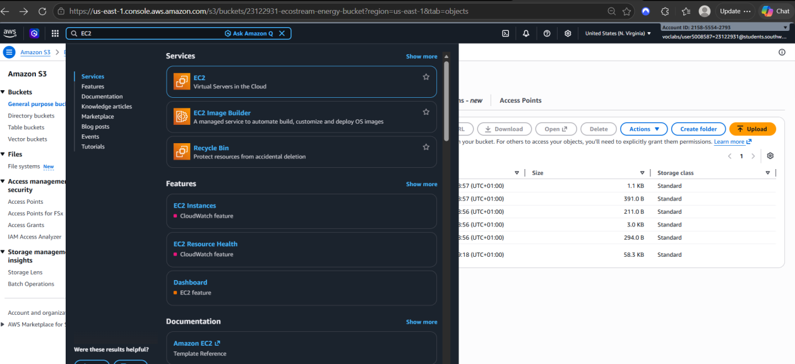

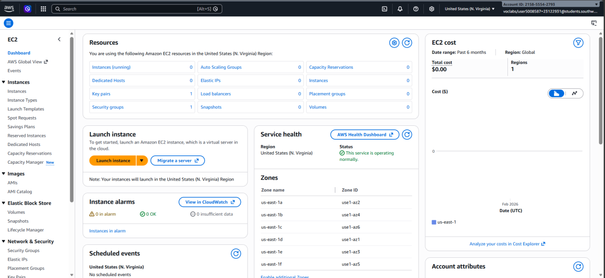

**Step 3:** A new RSA key pair named 23122931-keypair was created and configured in “.pem” format to enable secure SSH access to the EC2 instance. The created key pair was successfully attached to the EC2 instance configuration.

**Step 4:** The network security group and storage settings were configured for the EC2 instance. SSH traffic was enabled to support secure remote access, and the storage volume was configured with 12 GiB of gp3 storage, as required in the brief.

**Visual evidence — guide page 2 (3 images)**

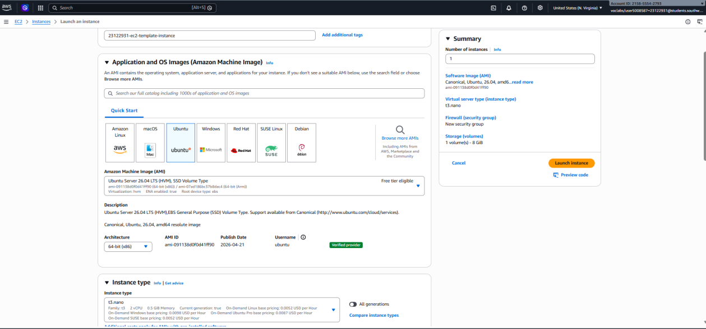

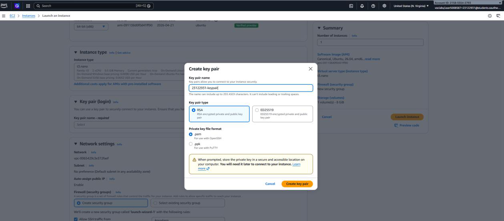

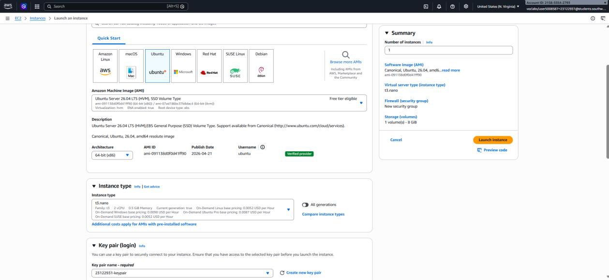

**Step 5:** The EC2 template instance was launched successfully, and the AWS launch log confirmed that the instance initialization, security groups, and security group rules were created successfully.

**Step 6:** The AWS EC2 Dashboard was opened, and the previously created template instance named “23122931-ec2-template-instance” was selected from the list of running instances. To begin creating a reusable Amazon Machine Image, the following navigation path was used from the EC2 Instances page: Actions → Image and templates → Create image. This process created a custom AMI with pre-installed Node.js, which was later used to launch and validate a new EC2 instance.

**Visual evidence — guide page 3 (2 images)**

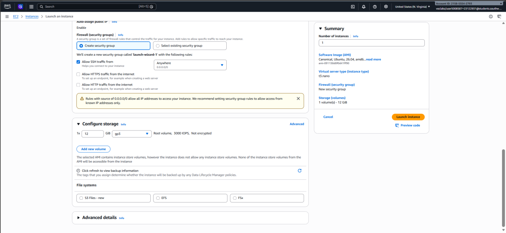

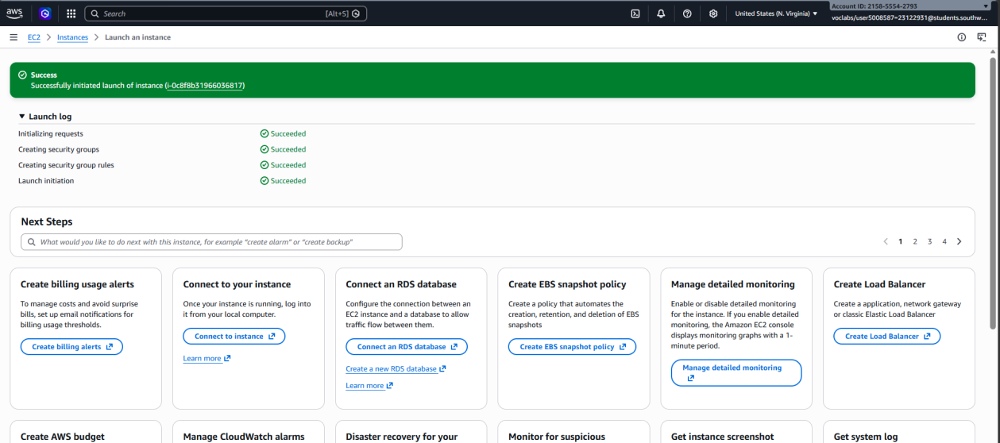

**Step 7:** The AMI configuration page was completed to create a reusable machine image from the running EC2 template instance. The image name was set to 23122931-nodejs-ami, and the image description was updated to indicate that the AMI included pre-installed Node.js. The Reboot instance option remained enabled to ensure consistency during snapshot creation; the storage configuration was set to 12 GB of GP3 storage; and the option to “tag image and snapshots together” was selected. After confirming the configuration settings, the Create image button was selected to generate the custom Amazon Machine Image containing the installed Node.js environment.

**Visual evidence — guide page 4 (2 images)**

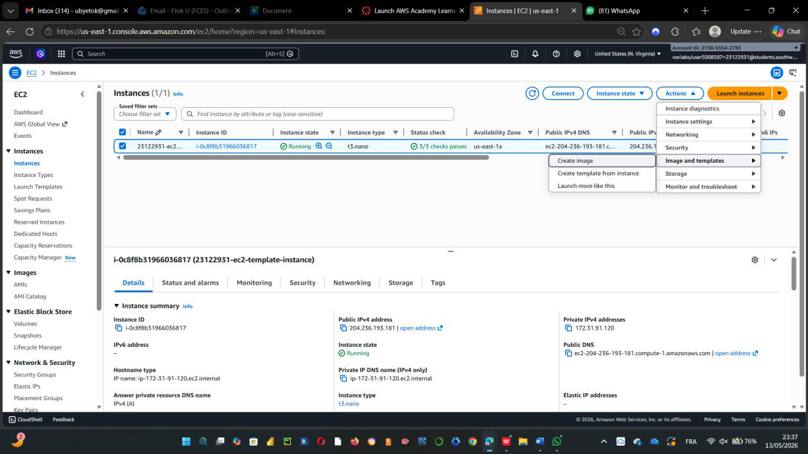

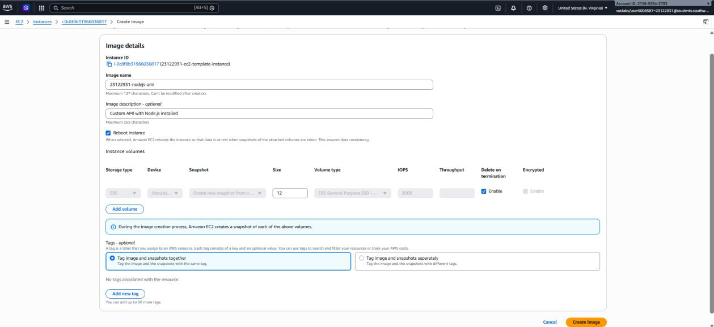

**Step 8:** From the EC2 navigation panel on the left side of the AWS console, the Images section was expanded, and AMIs were selected to open the Amazon Machine Images page. The Private images category was then used to display the reusable custom AMIs created within the account. The reusable Node.js AMI named “23122931-nodejs-ami” was selected from the list, and its status was confirmed as Available, indicating that the custom AMI containing the installed Node.js environment had been successfully created and was ready to be used to launch a new EC2 validation instance.

**Step 9:** On the launch configuration page, the instance name was set to “23122931-ecostream- nodejs-instance,” as required in the assessment brief. The previously created reusable AMI containing Node.js was automatically attached as the software image for the new EC2 instance.

**Step 10:** While configuring the validation EC2 instance, the Network settings section was reviewed, and a new security group was selected within the firewall configuration to control

**Visual evidence — guide page 5 (3 images)**

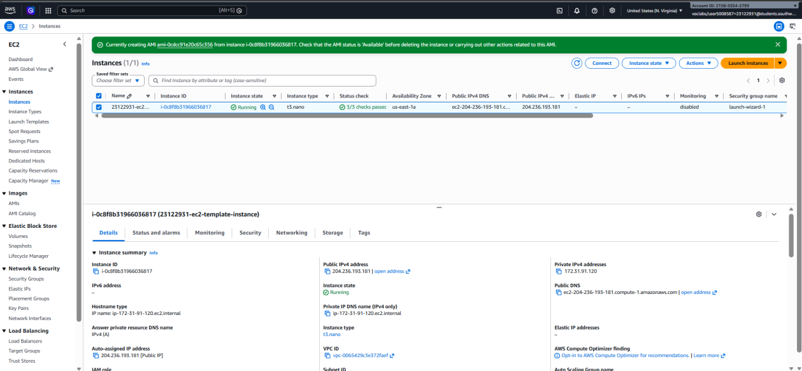

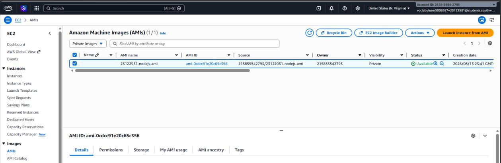

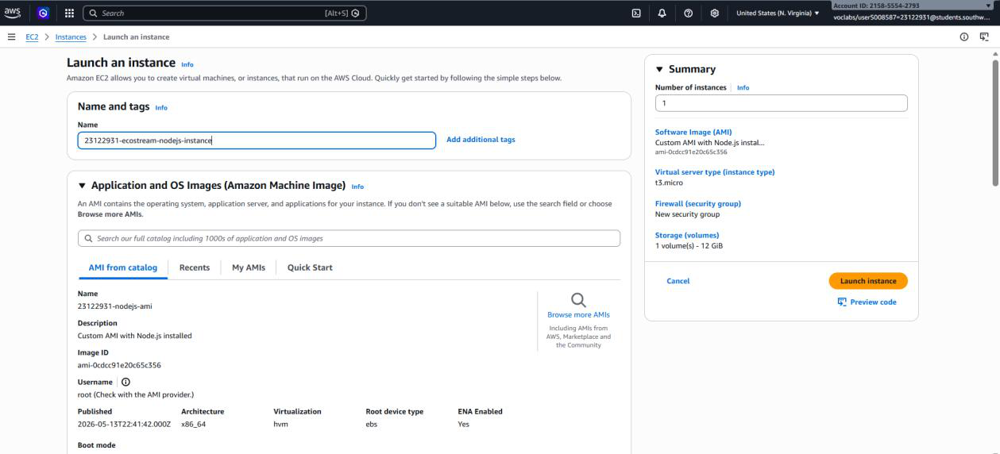

inbound access to the instance. During the launch process, AWS displayed a prompt requesting a key pair selection before the instance could be created. Since validation was performed via the AWS browser-based EC2 Instance Connect terminal, the “Proceed without key pair” option was selected. The “Allow SSH traffic from” option was selected, and the remaining launch settings were retained at their default values to ensure the validation instance launched successfully using the reusable Node.js AMI.

**Step 11:** After completing the launch configuration, the Launch instance button was selected to deploy the new EC2 validation instance from the reusable Node.js AMI. The AWS console displayed a successful launch confirmation message indicating that the EC2 validation instance had been created successfully, making the validation environment ready for testing the installed Node.js software.

**Step 12:** After launching the validation instance, the EC2 navigation panel was used to return to the Instances section to verify the status of both EC2 instances. The original template instance “23122931-ec2-template-instance” and the newly launched validation instance “23122931- ecostream-nodejs-instance” were both displayed as Running instances. The status checks also confirmed that the instances were operating correctly, indicating that the validation instance created from the reusable Node.js AMI had launched successfully and was ready for terminal- based Node.js validation. The newly created validation instance, 23122931-ecostream-nodejs-instance, was selected from the Instances list for software validation as required in the brief, and the connect button was used to open the instance connection page.

**Visual evidence — guide page 6 (2 images)**

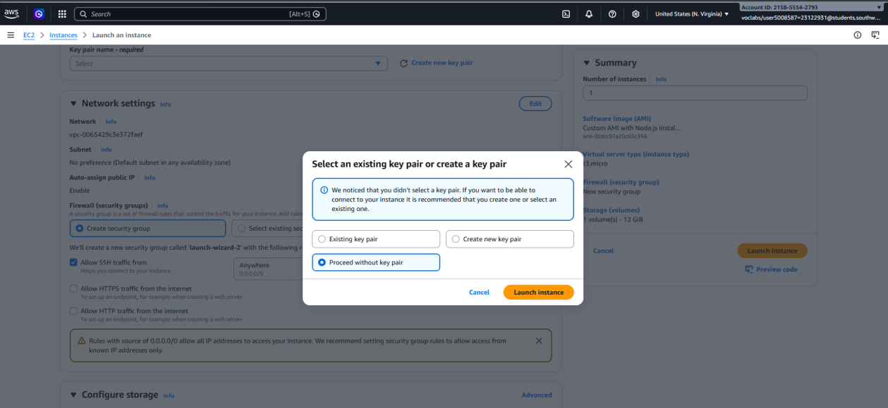

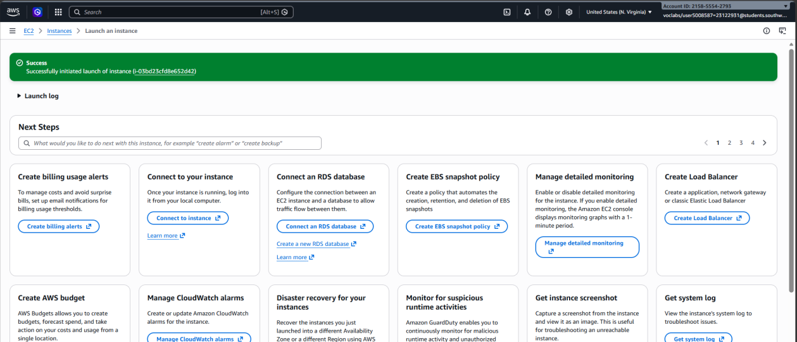

**Step 13:** On the connection page, the EC2 Instance Connect tab was selected to establish a browser-based terminal connection to the validation instance. The “Connect using a Public IP” option remained selected to allow remote browser access to the EC2 instance, while the default username root was retained because it matched the configuration of the reusable “Node.js” AMI. These settings were confirmed before selecting the “Connect” button to open the terminal environment required for validating the installed “Node.js” software.

**Step 14:** After selecting the “Connect” button from the EC2 Instance Connect page, a browser- based terminal session was successfully opened for the validation instance “23122931- ecostream-nodejs-instance”. The terminal displayed Ubuntu operating system information, system status details, and the root command prompt, confirming that the EC2 validation instance created from the reusable “Node.js” AMI was running successfully and accessible via the AWS browser terminal. This terminal session was required to perform the “Node.js” validation commands specified in the assessment brief.

**Visual evidence — guide page 7 (3 images)**

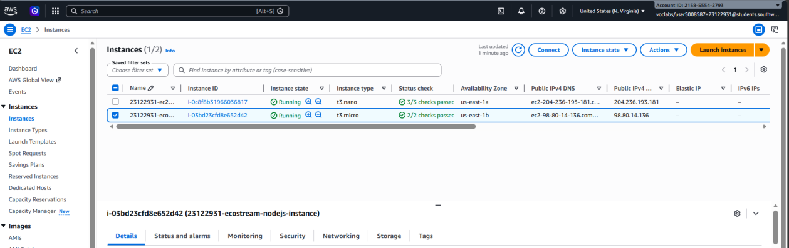

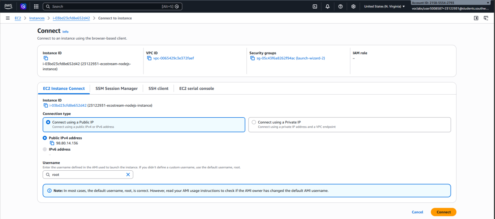

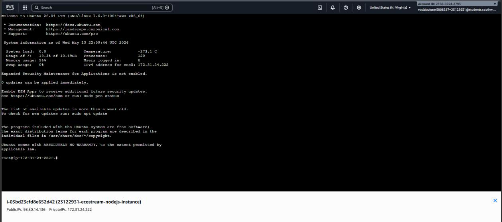

**Step 15:** This command, “sudo apt update,” was used to refresh the package index and retrieve the latest available information about software packages from the Ubuntu repositories before proceeding with the Node.js validation process. The terminal output confirmed that the system successfully connected to the Ubuntu repositories and downloaded updated package information required for package verification and software management within the EC2 validation instance.

**Step 16:** The command “sudo apt install nodejs -y” was used to install Node.js and its dependencies on the EC2 validation instance. The “-y” option automatically approved the installation process without requiring manual confirmation from the user. The terminal output confirmed that the system successfully downloaded and installed the Node.js package, along with its supporting libraries and dependencies, indicating that the Node.js environment was properly configured on the EC2 validation instance.

**Step 17:** The command “node -v” was used to verify that Node.js had been successfully installed on the validation instance. The terminal output displayed the installed Node.js version” v22.22.1”, confirming that the Node.js software package was properly installed and operational within the EC2 validation instance created from the reusable custom AMI.

**Visual evidence — guide page 8 (2 images)**

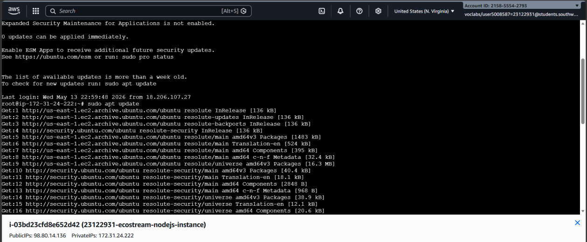

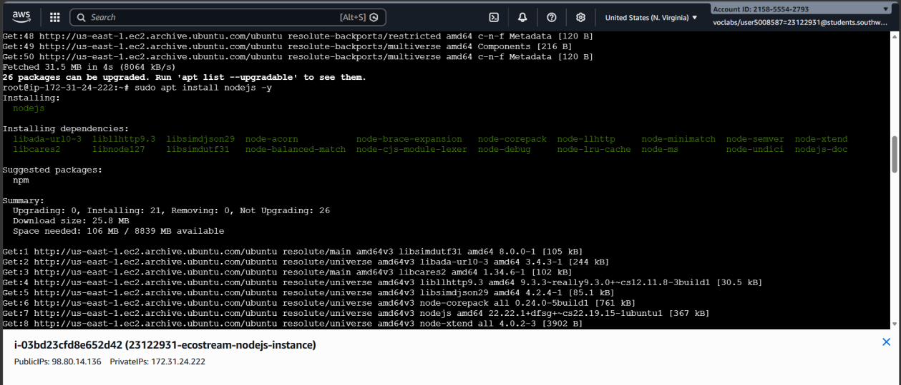

**Step 18:** The command “node 23122931_script.js” was used to run the Java script validation file created during the AMI testing process. The terminal output displayed the message: “23122931, NodeJS has been installed successfully for EcoStream!” confirming that the Node.js environment was functioning correctly within the EC2 validation instance and that the reusable custom AMI had been successfully validated.

**Visual evidence — guide page 9 (2 images)**

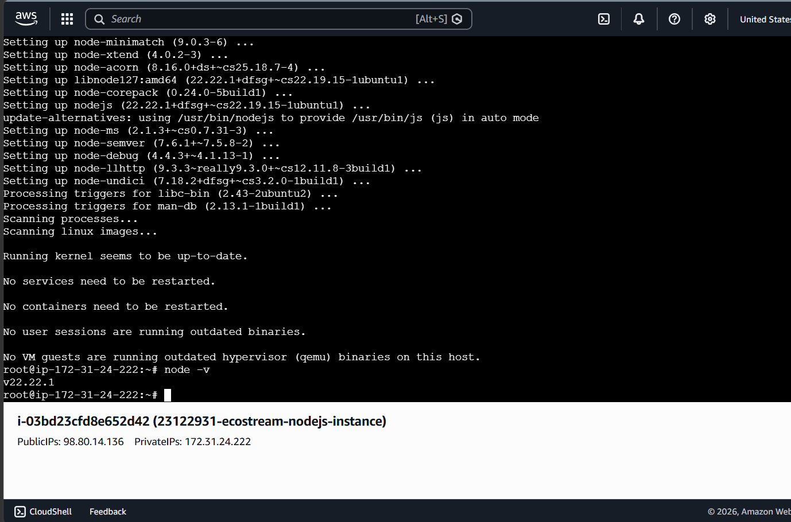

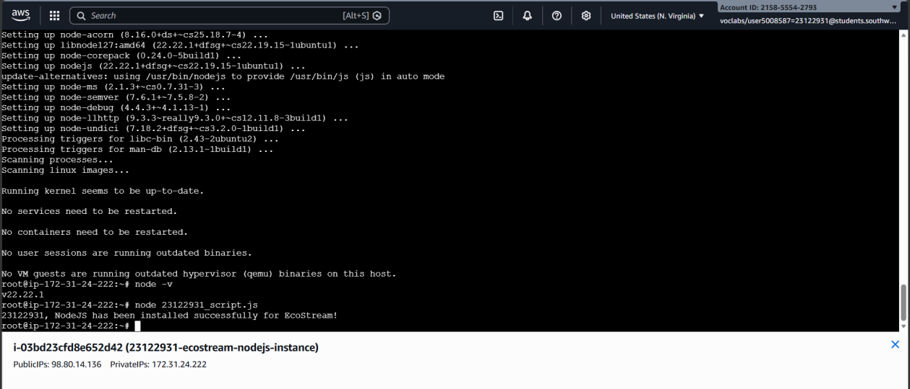

**Step 19:** After successfully validating Node.js within the EC2 validation instance, the EC2 navigation panel was used to return to the Instances section. The validation instance “23122931-ecostream-nodejs-instance” was selected, and the following navigation path was used to begin creating an additional backup AMI: Actions → Image and templates → Create image This step was performed to generate a reusable backup image from the fully validated Node.js EC2 instance.

**Step 20:** The Create image configuration page was opened for the validation instance after navigating through Actions → Image and templates → Create image. Initially, the AMI name “23122931-nodejs-ami” was entered; however, AWS displayed an error message indicating that the name was already associated with an existing AMI that had been previously created successfully. To resolve this issue, the AMI name was changed to “23122931-nodejs-ami-final”. The “Reboot instance” option remained selected to ensure AWS creates a consistent snapshot of the instance during image creation. Under the storage configuration, the default 12 GB storage volume settings were retained, while the “Delete on termination” option remained enabled. The “Tag image and snapshots together” option was also selected so that both the AMI and its associated snapshots would share the same tagging configuration. After confirming and retaining the remaining default snapshot and storage settings, the “Create image” button was selected to proceed with AMI creation.

**Step 21:** After the updated AMI creation request was submitted, a green status notification appeared at the top of the page confirming that AWS was currently creating the AMI from the validation instance “23122931-ecostream-nodejs-instance”.

**Visual evidence — guide page 10 (2 images)**

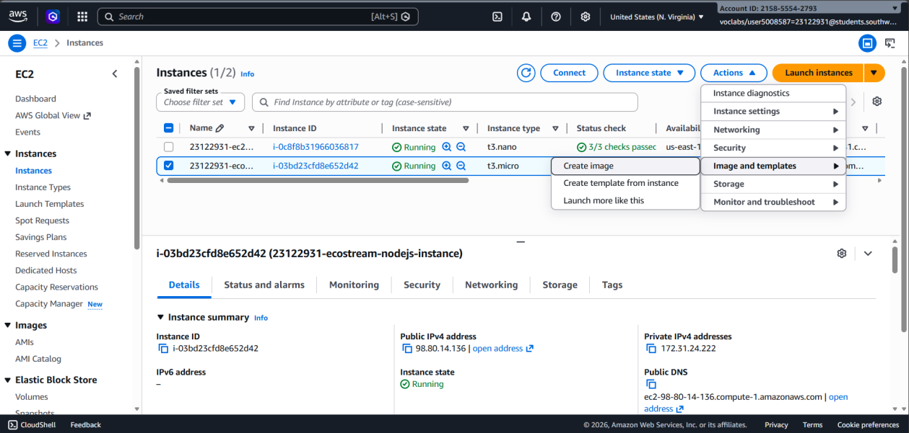

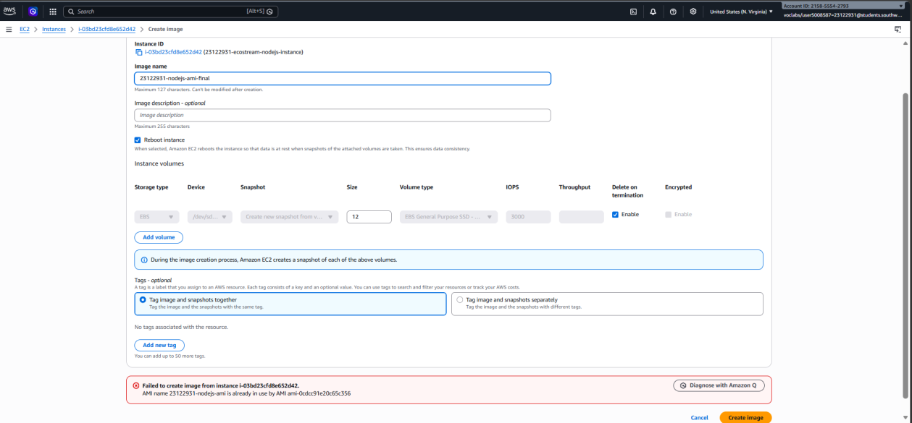

Both the original template instance “23122931-ec2-template-instance” and the validation instance “23122931-ecostream-nodejs-instance” remained in a Running state with all status checks passed successfully during the AMI creation process. This confirmed that the reusable “Node.js” AMI creation had started successfully and that the instance was operating correctly while AWS generated the machine image snapshots in the background. The EC2 navigation panel was used to navigate to Images → AMIs to verify the successful creation of the reusable Node.js machine images. Within the Private images section, both custom AMIs named “23122931-nodejs-ami” and “23122931-nodejs-ami-final” were displayed in the AMIs list. The status of both AMIs was shown as Available, confirming that AWS had successfully completed AMI creation and snapshot generation and was ready to launch EC2 validation instances with “Node.js” pre-installed.

**Step 22:** The EC2 navigation panel was used to remain in the Instances section, where the original template instance, “23122931-ec2-template-instance,” was selected. The following navigation path was then used to configure deletion protection for the template instance: Actions → Instance settings → Change termination protection This option was selected to prevent the EC2 template instance from being accidentally deleted during future AWS operations. Enabling “termination protection” ensured that the template instance complied with the assessment requirement for protecting critical insurance analytics infrastructure from accidental termination.

**Visual evidence — guide page 11 (2 images)**

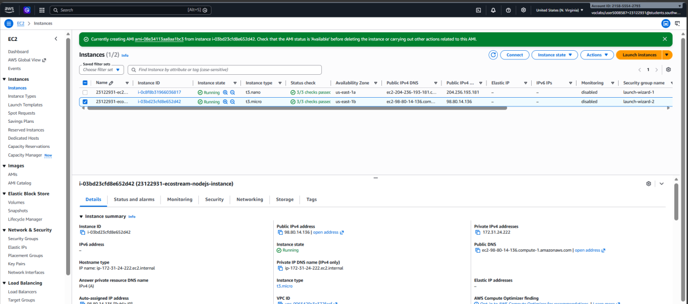

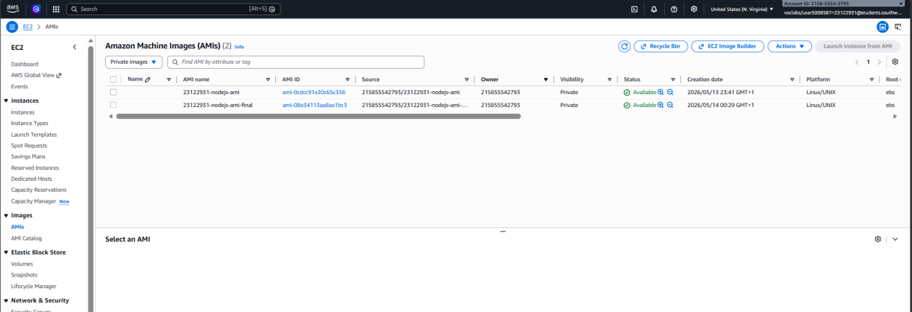

**Step 23:** The validation instance “23122931-ecostream-nodejs-instance” was then selected separately. The following navigation path was again used: Actions → Instance settings → Change termination protection This option was selected to prevent the EC2 validation instance from being accidentally deleted during future AWS operations. Enabling “termination protection” ensured that the validation instance complied with the assessment requirement for protecting critical insurance analytics infrastructure from accidental termination. AWS displayed a green success notification confirming that termination protection had been successfully enabled for the template instance.

**Visual evidence — guide page 12 (2 images)**

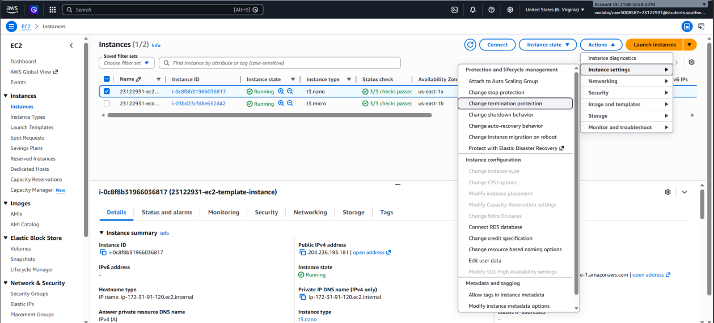

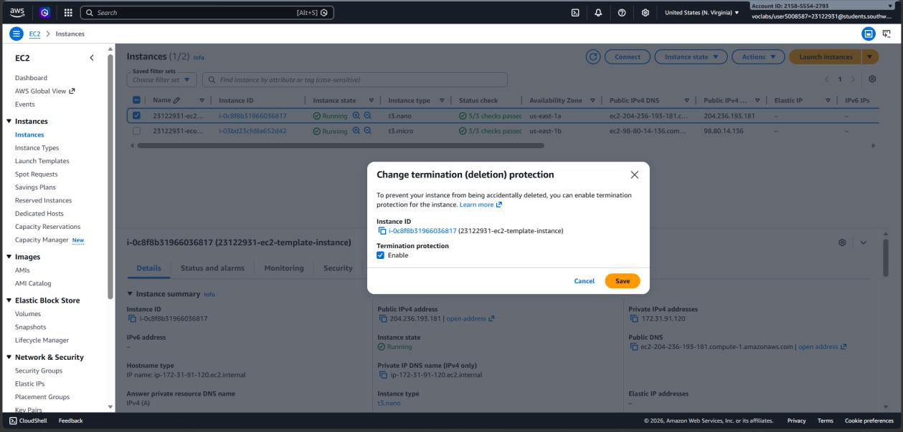

**Step 24:** AWS displayed a green success notification confirming that termination protection had been successfully enabled for the validation instance.

**Visual evidence — guide page 13 (3 images)**

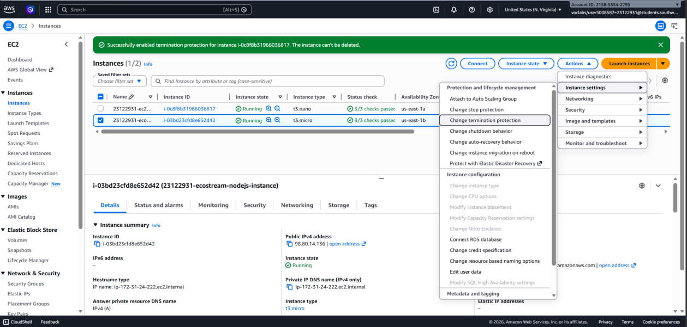

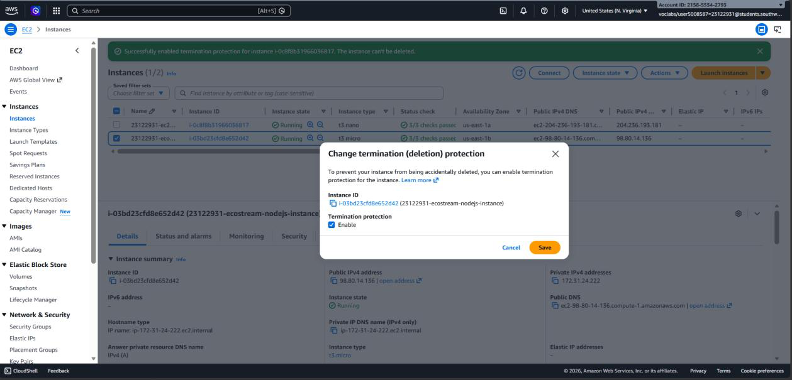

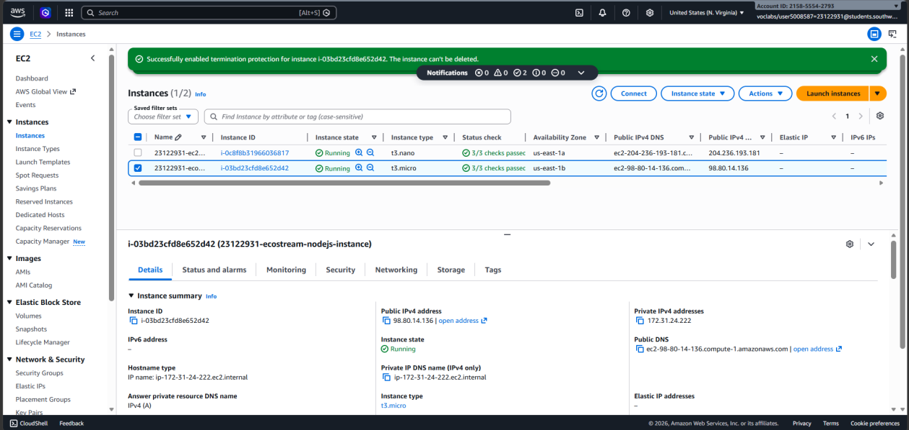

**Download the full step-by-step guide:** [23122931 Amazon Machine Image step-by-step guide.pdf](https://github.com/xzibitetok/xzibitetok.github.io/releases/download/Ubong_s_EcoStream_AWS_v1.0.0/23122931%2BAmazon%2BMachine%2BImage%2Bstep-by-step%2Bguide.pdf)

---


## Objective 5 — Networking and Web Application

**Full guide:** [23122931 Networking and Web Application step-by-step guide.pdf](https://github.com/xzibitetok/xzibitetok.github.io/releases/download/Ubong_s_EcoStream_AWS_v1.0.0/23122931%2BNetworking%2Band%2BWeb%2BApplication%2Bstep-by-step%2Bguide.pdf)

Networking and Web Application step-by-step guide

Introduction This document describes how to set up the networking and web application for the EcoStream Energy cloud environment using Amazon Web Services. This guide shows how to create a custom Virtual Private Cloud named “23122931-ecostream-vpc” with its public and private subnets, route tables, and internet connectivity settings.

The document further discusses setting up an EC2 instance in the defined VPC environment and configuring it as a web application server accessible publicly via the Apache HTTP Server. Relevant screenshots, configuration settings, terminal commands, and validation outputs are provided to enable EcoStream staff to follow along and successfully reproduce the networking and web application deployment.

**Step 1:** The AWS search bar was used to search for “VPC”, and the VPC service under the Services category was selected to begin configuring the networking infrastructure required for the EcoStream environment. The VPC Dashboard was opened successfully. From the dashboard, the “Create VPC” option was selected to begin creating a custom EcoStream Virtual Private Cloud containing the public and private subnets required to host the web application securely.

**Step 2:** The VPC configuration page was completed by selecting the “VPC and more” option, which automatically creates the networking resources required for the EcoStream environment. The VPC was named “23122931-ecostream-vpc” with an IPv4 CIDR block of “10.0.0.0/16”, while the default tenancy and no IPv6 option were retained.

**Visual evidence — guide page 2 (2 images)**

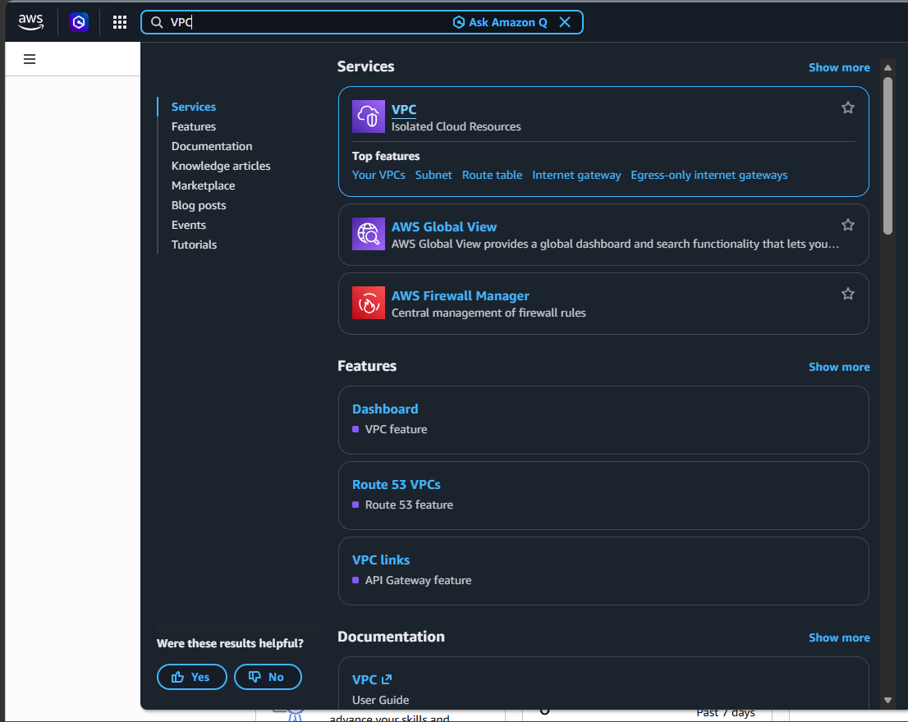

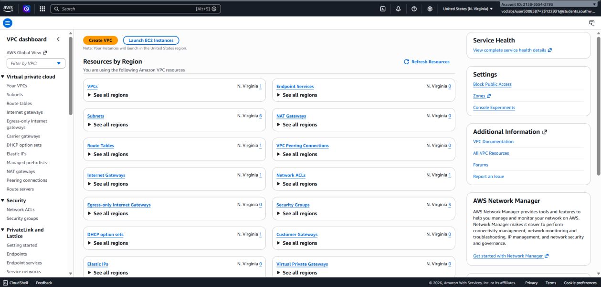

The network was configured across “2 Availability Zones” to improve availability and fault tolerance. In addition, “2 public subnets” and “2 private subnets” were created to separate publicly accessible resources from internal private resources. The NAT Gateway option was set to “None” to reduce unnecessary cost since the assessment brief only required a publicly accessible web application. DNS hostnames and DNS resolution were enabled to support proper communication and hostname resolution within the VPC environment.

**Step 3:** The VPC deployment workflow page confirmed that the EcoStream Virtual Private Cloud and its associated networking resources were successfully created. AWS automatically provisioned the required components, including the VPC, public and private subnets, route tables, internet gateway, and DNS configurations based on the previously selected settings. The workflow also verified that the route tables were correctly associated with the created subnets and that the internet gateway was successfully attached to provide public internet

**Visual evidence — guide page 3 (2 images)**

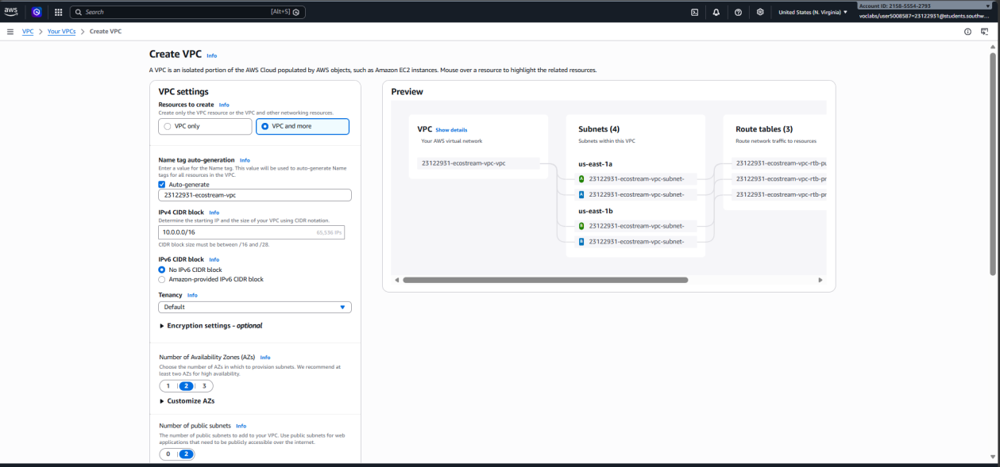

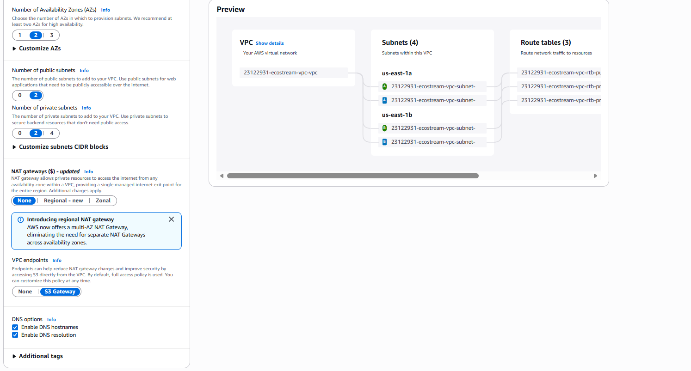

access for the web application instance. This step confirmed that the networking infrastructure required for hosting the EcoStream web application had been successfully configured and was ready for EC2 deployment.

**Step 4:** After completing the VPC configuration, the AWS search bar was used to locate the EC2 service. The EC2 service was then selected to deploy the EcoStream web application server within the newly created VPC. After navigating to the EC2 dashboard, the “Launch Instance” option was selected to create a new virtual server. The EC2 dashboard also confirmed that the AWS region in use was the “United States (N. Virginia)” and displayed the available EC2 resources and networking components associated with the account. This step was necessary because the assessment required that the EcoStream web application be hosted on a publicly accessible EC2 instance within the newly created VPC infrastructure.

**Visual evidence — guide page 4 (2 images)**

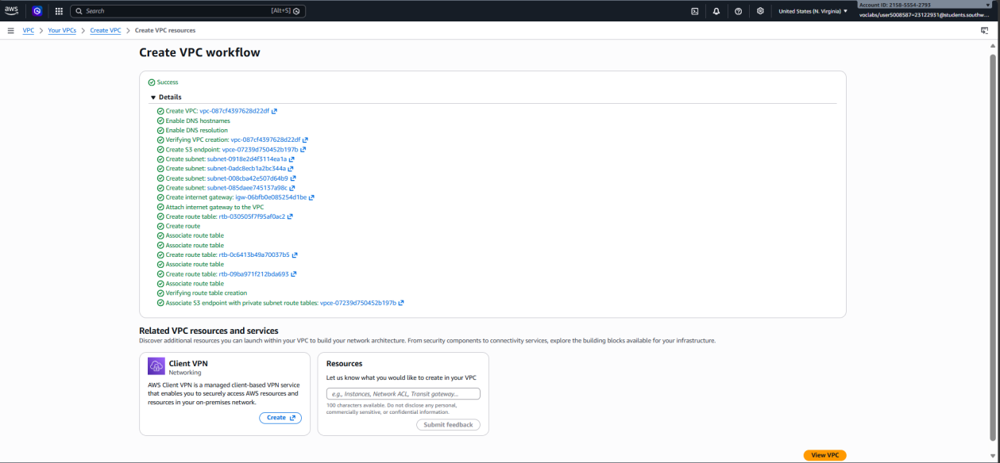

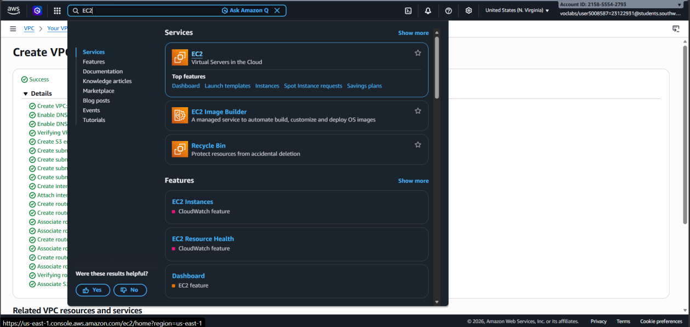

**Step 5:** The EC2 instance creation process was started by selecting the “Launch Instance” option from the EC2 dashboard. The instance was named “23122931-ecostream-web-instance” to clearly identify it as the EcoStream web application server, as required in the brief. The “Amazon Linux 2023 AMI” was selected as the operating system because it provides a stable Linux environment suitable for hosting web applications. The selected instance type, “t3.nano”, was sufficient for the lightweight web application required for the assessment. The previously created key pair “23122931-keypair” was selected to allow secure remote access to the EC2 instance. Under the network settings, the custom VPC “23122931- ecostream-vpc-vpc” was selected together with the public subnet “23122931-ecostream-vpc- subnet-public1-us-east-1a”. Auto-assign public IP was enabled so the web application could be accessed publicly through the internet. A new security group was created with inbound rules allowing: • HTTP traffic (Port 80) from anywhere (`0.0.0.0/0`) • SSH traffic (Port 22) from anywhere (`0.0.0.0/0`) These rules were necessary to allow public users to access the web application while also enabling remote administrative access to the server through the terminal. Finally, the “Launch Instance” button was selected, and AWS confirmed that the EcoStream web application instance had been successfully launched.

**Visual evidence — guide page 5 (1 image)**

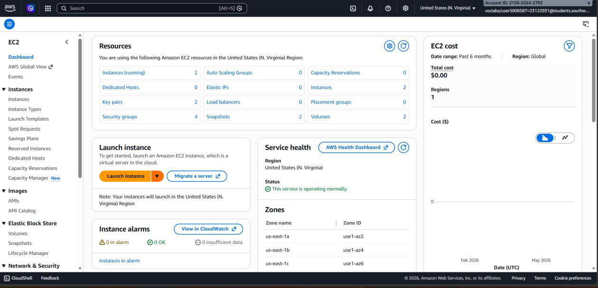

**Visual evidence — guide page 6 (3 images)**

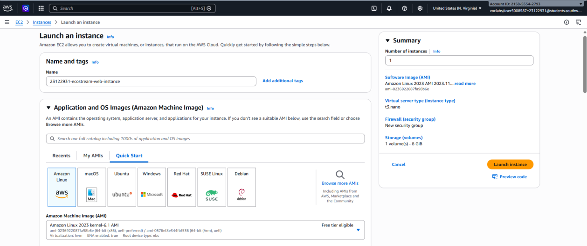

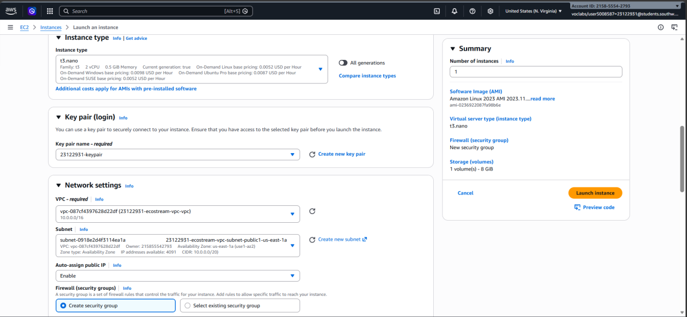

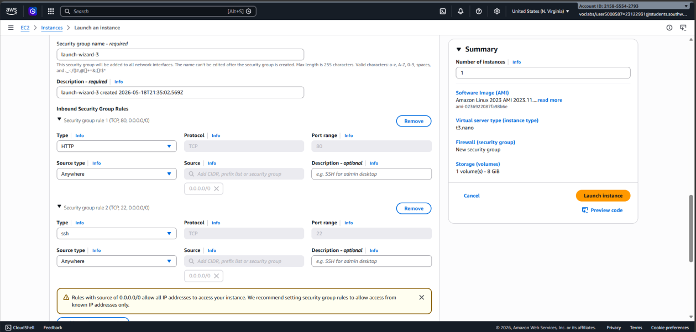

**Step 6:** After the EC2 instance was launched, the Instances page was opened to verify that the “23122931-ecostream-web-instance” was successfully running. The instance status checks showed “3/3 checks passed”, confirming that the server had been deployed correctly within the EcoStream VPC environment. The instance details section also displayed the assigned public IPv4 address and private IP address, confirming that the instance was connected to both the internet and the internal VPC network. The instance was then selected, and the “Connect” option was used to open the EC2 Instance Connect interface. The “EC2 Instance Connect” tab was selected with the default username “ec2-user” retained. The connection was configured using the instance’s public IP address to allow secure browser-based terminal access to the Linux server. This step was necessary to access the EC2 terminal and install the Apache web server required to host the EcoStream web application.

**Visual evidence — guide page 7 (2 images)**

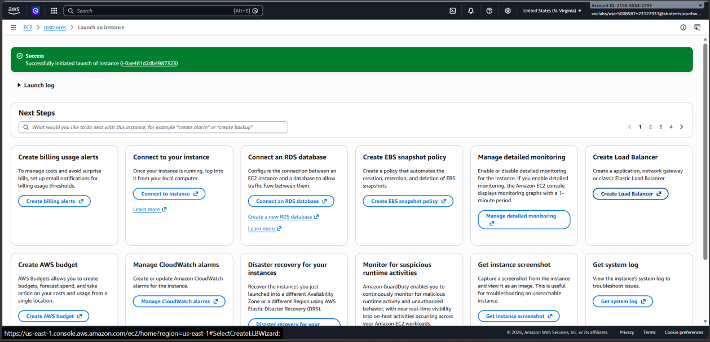

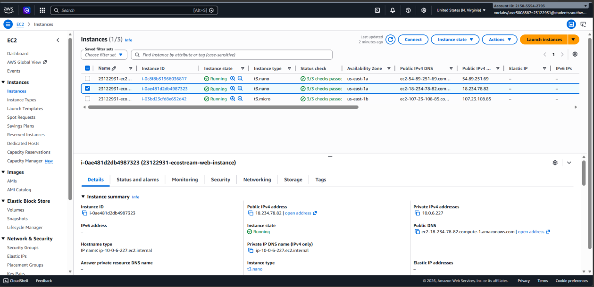

**Step 7:** The EC2 Instance Connect terminal was successfully opened for the “23122931- ecostream-web-instance”. The browser-based Linux terminal provided secure remote access to the Amazon Linux 2023 server using the default “ec2-user” account. This step confirmed that the EC2 instance was fully operational and ready for web server configuration. The terminal environment was then prepared for installing and deploying the EcoStream web application using Apache HTTP Server commands.

**Step 8:** The EC2 terminal session was elevated to root administrator access using the “sudo su –” command to allow system-level software installation and configuration. After this, the “yum update -y” command was executed to update the Amazon Linux package repositories and ensure the server environment was running the latest available system packages. The successful completion message confirmed that the system update process executed correctly and that the server environment was ready for Apache web server installation and web application deployment.

**Visual evidence — guide page 8 (2 images)**

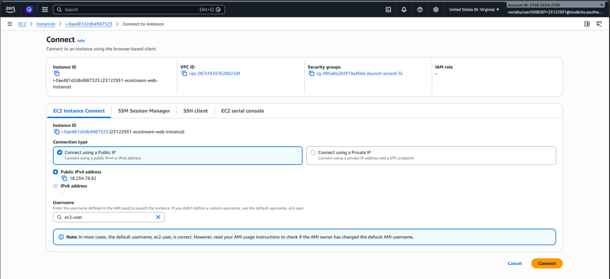

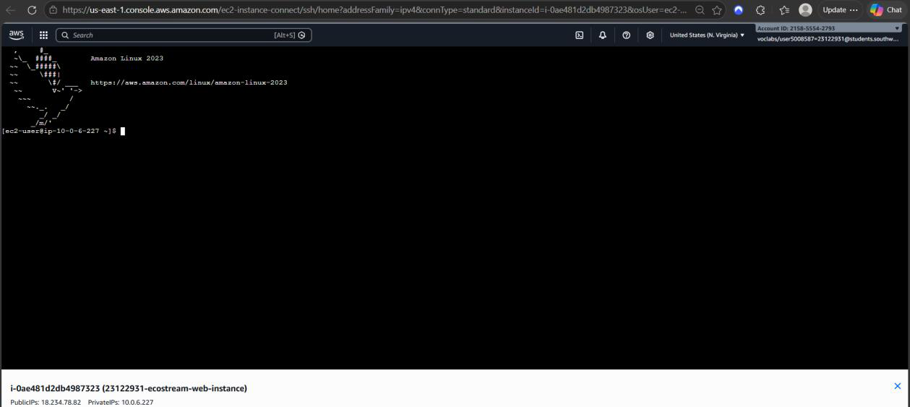

**Step 9:** The Apache HTTP Server installation was initiated with the command “yum install -y httpd”. This command installed the Apache web server package together with all required dependencies on the Amazon Linux EC2 instance. The terminal output displayed the download, installation, and verification stages of the required packages, confirming that the Apache HTTP Server “httpd” and its supporting components were successfully installed on the server. The completion message at the end of the installation process confirmed that the web server environment had been successfully configured and was ready for web application deployment.

**Step 10:** The command (echo "Welcome 23122931! Welcome to EcoStream, the largest renewable energy company in the United Kingdom." > /var/www/html/index.html) was executed

**Visual evidence — guide page 9 (3 images)**

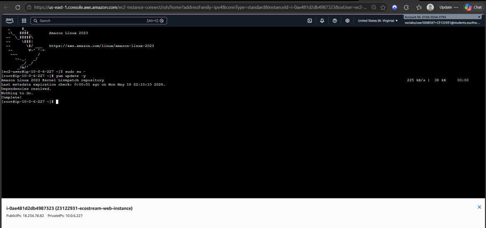

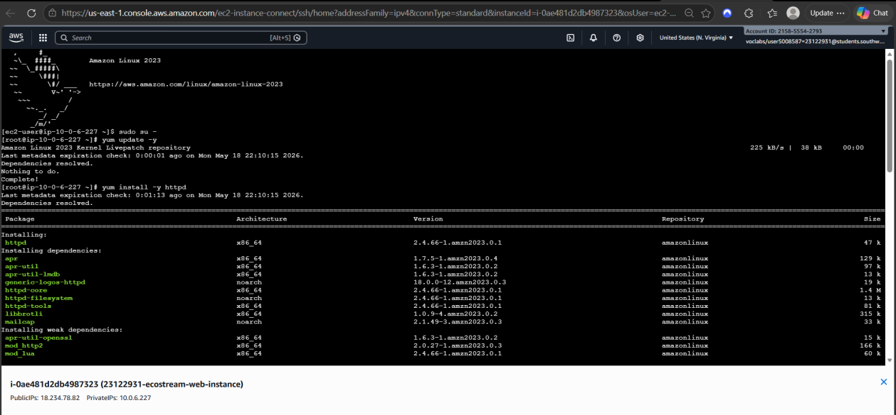

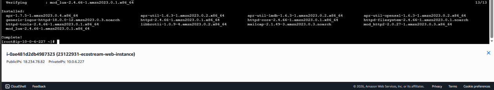

to create the default web page content for the EcoStream web application. The command automatically wrote the message, as required by the assessment brief, into the “index.html” file located inside the Apache web server directory. This step was important because the “index.html” file serves as the main webpage users see when accessing the EC2 instance via its public IP address. The successful execution of the command confirmed that the required web application content had been deployed to the Apache web server directory.

**Step 11:** The Apache web server service was configured to automatically start whenever the EC2 instance boots by executing the command “systemctl enable httpd”. The terminal output confirmed that the “httpd.service” symbolic link was successfully created within the system startup configuration. This step was necessary to ensure the EcoStream web application remained accessible after server restarts, without requiring the Apache service to be manually restarted.

**Visual evidence — guide page 10 (2 images)**

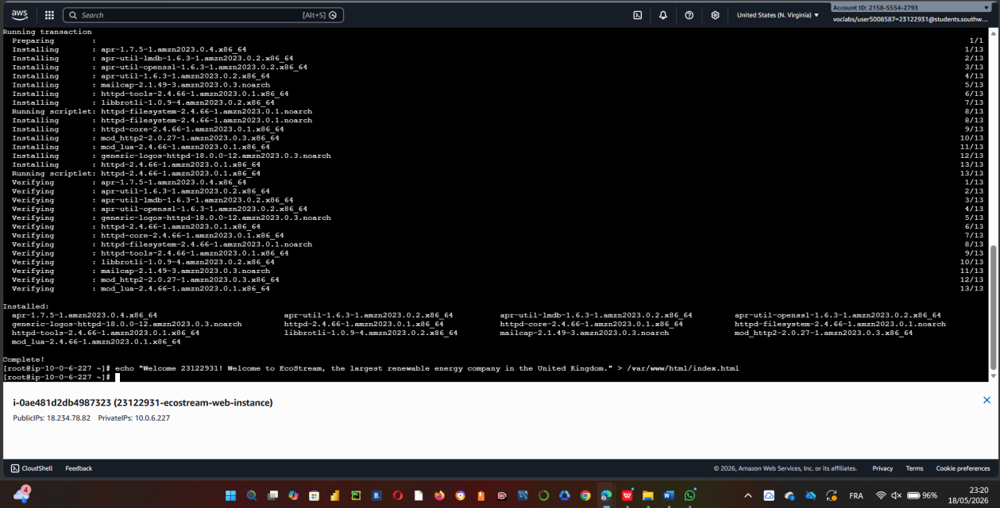

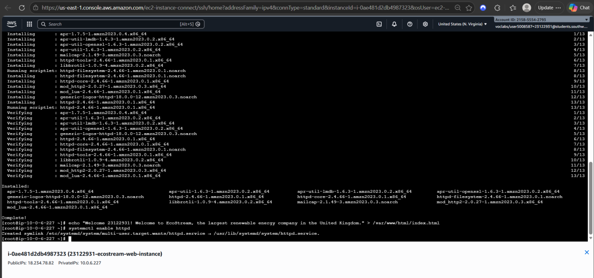

**Step 12:** The Apache web server was started using the command “systemctl start httpd”. This command started the Apache HTTP service on the EC2 instance, making the EcoStream web application accessible via the server’s public IP address. The successful execution of the command confirmed that the “httpd” service started successfully and that the web server was ready to host the EcoStream web application.

**Step 13:** The status of the Apache web server was verified using the command “systemctl status httpd”. The terminal output confirmed that the “httpd.service” was successfully loaded and running on the EC2 instance. The status message displayed “active (running)”, confirming that the Apache HTTP Server was operating correctly and listening on Port 80 for incoming web traffic. The output also confirmed that the EcoStream web application server was fully operational and ready to serve web content to the public via the instance’s public IP address.

**Step 14:** The EC2 Instances page was accessed to verify that the newly created EcoStream web server instance had been successfully launched and was running. The instance named “23122931-ecostream-web-instance” was selected from the Instances dashboard with its

**Visual evidence — guide page 11 (2 images)**

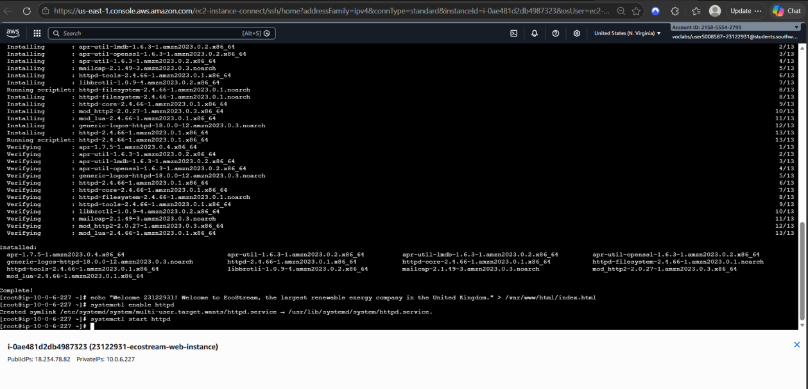

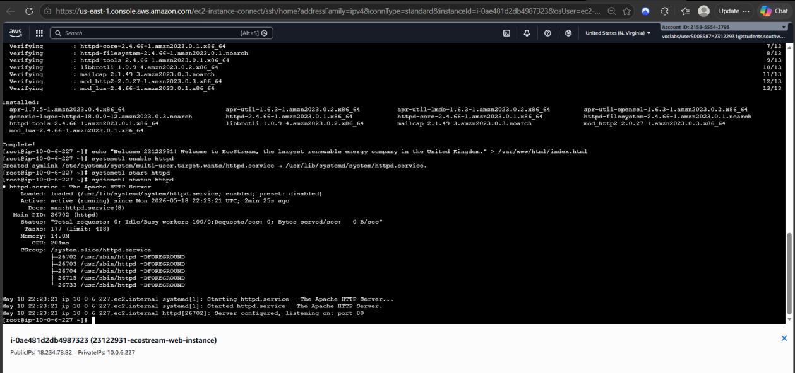

status showing “Running” with all status checks passed, confirming that the virtual server was functioning correctly within the created VPC environment. The public IPv4 address was then copied and opened in a web browser to test external connectivity to the deployed web application. The browser successfully displayed the custom EcoStream welcome message hosted on the Apache web server, confirming that: • the EC2 instance was publicly accessible, • the Apache HTTP server was running correctly, • HTTP traffic was permitted through the configured security group, • and the web application deployment was successful.

**Visual evidence — guide page 12 (2 images)**

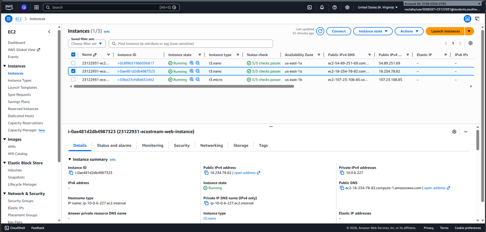

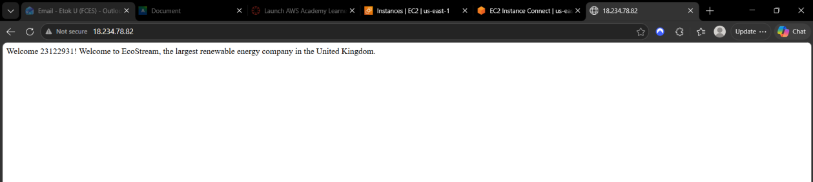

**Download the full step-by-step guide:** [23122931 Networking and Web Application step-by-step guide.pdf](https://github.com/xzibitetok/xzibitetok.github.io/releases/download/Ubong_s_EcoStream_AWS_v1.0.0/23122931%2BNetworking%2Band%2BWeb%2BApplication%2Bstep-by-step%2Bguide.pdf)

---

## Key Outcomes

- Stored the telemetry dataset in Amazon S3.
- Imported the dataset into DynamoDB.
- Exported five query results as CSV files.
- Created and validated a custom Node.js AMI.
- Deployed and tested the EcoStream welcome page on an EC2 web server.

## Project Files

The files below are attached to the GitHub Release. The links point directly to the assets on the release tagged `Ubong_s_EcoStream_AWS_v1.0.0`, rather than to local folders or guessed filenames. [Open the complete release and browse all assets](https://github.com/xzibitetok/xzibitetok.github.io/releases/tag/Ubong_s_EcoStream_AWS_v1.0.0).

### Step-by-Step Technical Guides

- [S3 Bucket Guide (PDF)](https://github.com/xzibitetok/xzibitetok.github.io/releases/download/Ubong_s_EcoStream_AWS_v1.0.0/23122931%2BS3%2BBucket%2Bstep-by-step%2Bguide.pdf)
- [DynamoDB Guide (PDF)](https://github.com/xzibitetok/xzibitetok.github.io/releases/download/Ubong_s_EcoStream_AWS_v1.0.0/23122931%2BDynamoDB%2Bstep-by-step%2Bguide.pdf)
- [Query Validation Guide (PDF)](https://github.com/xzibitetok/xzibitetok.github.io/releases/download/Ubong_s_EcoStream_AWS_v1.0.0/23122931%2BQuery%2BValidation.pdf)
- [Amazon Machine Image Guide (PDF)](https://github.com/xzibitetok/xzibitetok.github.io/releases/download/Ubong_s_EcoStream_AWS_v1.0.0/23122931%2BAmazon%2BMachine%2BImage%2Bstep-by-step%2Bguide.pdf)
- [Networking and Web Application Guide (PDF)](https://github.com/xzibitetok/xzibitetok.github.io/releases/download/Ubong_s_EcoStream_AWS_v1.0.0/23122931%2BNetworking%2Band%2BWeb%2BApplication%2Bstep-by-step%2Bguide.pdf)

### Dataset

- [Download telemetry dataset (JSON)](https://github.com/xzibitetok/xzibitetok.github.io/releases/download/Ubong_s_EcoStream_AWS_v1.0.0/energy-telemetry-2025-2026-dbjson.json)

### Query Results

- [Download Query 1 results (CSV)](https://github.com/xzibitetok/xzibitetok.github.io/releases/download/Ubong_s_EcoStream_AWS_v1.0.0/23122931query1.csv.csv)
- [Download Query 2 results (CSV)](https://github.com/xzibitetok/xzibitetok.github.io/releases/download/Ubong_s_EcoStream_AWS_v1.0.0/23122931query2.csv.csv)
- [Download Query 3 results (CSV)](https://github.com/xzibitetok/xzibitetok.github.io/releases/download/Ubong_s_EcoStream_AWS_v1.0.0/23122931query3.csv.csv)
- [Download Query 4 results (CSV)](https://github.com/xzibitetok/xzibitetok.github.io/releases/download/Ubong_s_EcoStream_AWS_v1.0.0/23122931query4.csv.csv)
- [Download Query 5 results (CSV)](https://github.com/xzibitetok/xzibitetok.github.io/releases/download/Ubong_s_EcoStream_AWS_v1.0.0/23122931query5.csv.csv)

### Source Code and Visual Evidence

- `code/` — implementation scripts and command references stored in the repository.
- `visualizations/` — numbered screenshots referenced throughout this README.
- `documentation/` — local copies of the five technical guides, if you choose to keep them in the repository as well as the release.

**Note:** The release screenshot provided confirms the exact names of the five PDFs, the JSON dataset, and the five CSV files above. It does not clearly show the two remaining assets in the 13-asset list, so this README does not invent links for those unseen filenames. If one of those assets is a complete-project ZIP, add its exact asset name here to make it downloadable.

## Repository Structure

```text
ecostream-energy-aws-cloud/
├── code/
├── data/
├── documentation/
├── query-results/
├── visualizations/
└── README.md
```

## Reproducibility

- Follow the five objectives in order. The DynamoDB import depends on the dataset being uploaded to S3 first.
- Use the exact resource names and configuration values recorded in the relevant guide.
- Query results are exported as CSV files and uploaded to the same S3 bucket.
- Runtime-generated values such as EC2 instance IDs and public IP addresses can differ when the steps are repeated.
- The screenshots are referenced using repository-relative paths. GitHub image links are case-sensitive, so the filenames must match the files in `visualizations/` exactly.

## Limitations and Considerations

- The workflow was completed in an AWS Academy Learner Lab environment; access to services and resources may be temporary.
- EC2 instance IDs, public IPv4 addresses, and other runtime-generated values can change between deployments.
- The query workflow uses DynamoDB Scan operations as documented in the guide; scans read across the table and may be less efficient than key-based queries for larger datasets.
- The security-group settings documented in the networking guide include SSH from `0.0.0.0/0`; for a production deployment, restrict SSH access to trusted IP ranges.
- The README references screenshots by their numbered filenames. If a screenshot is renamed or moved, update the corresponding Markdown image path.
- Release download links are tied to the tag `Ubong_s_EcoStream_AWS_v1.0.0`. If the release tag or asset filenames change, update these links.

## References

- Amazon Web Services. *Amazon S3 User Guide*.
- Amazon Web Services. *Amazon DynamoDB Developer Guide*.
- Amazon Web Services. *Amazon EC2 User Guide*.
- Amazon Web Services. *Amazon VPC User Guide*.

## Author

**Ubong Etok**

MSc Data Science | Cloud Engineering and Big Data Analytics
