# 🐘 PageTurner Books Ltd. — Linux, Bash & Hadoop Text Analytics


> A practical Linux and Big Data engineering project that moves from Bash-based business data organisation to distributed text analytics with Hadoop, HDFS, YARN, MapReduce, Hadoop Streaming and Python.

> **Evidence convention:** Each implementation step is presented in the same sequence as the technical reports: **step explanation → Bash command → visual evidence → result where applicable**.

## Project Overview

PageTurner Books Ltd. is a practical Linux and Big Data engineering project that combines Bash-based file and directory management with distributed text analytics using Apache Hadoop. The work progresses from organising business information in Ubuntu to processing large literary text files through HDFS, YARN, MapReduce, Hadoop Streaming and Python.

The project demonstrates the complete technical workflow rather than presenting isolated commands or scripts: each implementation step is explained, the Bash command used is shown, and the corresponding terminal screenshot is provided as visual evidence of execution.

### Project Highlights

- **Linux & Bash:** directory creation, navigation, file creation, copying, text insertion and verification.
- **Hadoop Cluster:** master/worker environment using HDFS and YARN.
- **MapReduce:** Python mapper and reducer workflows for two literary text-analytics problems.
- **Hadoop Streaming:** execution of custom Python processing across the Hadoop cluster.
- **Evidence-led documentation:** every implementation step is paired with its command and corresponding terminal screenshot.
- **Results:** top 10 word frequencies for *A Christmas Carol* and a total sentence count of **10,941** for *Moby Dick; Or, The Whale*.

## Table of Contents

1. [Project Overview](#project-overview)
2. [Project Objectives](#project-objectives)
3. [Business Context & Analytical Questions](#business-context--analytical-questions)
4. [Dataset](#dataset)
5. [Analytical Workflow](#analytical-workflow)
6. [Technology Stack](#technology-stack)
7. [Objective 1 — Linux & Bash Foundations](#objective-1--linux--bash-foundations)
8. [Objective 2 — PageTurner Books Data Organisation](#objective-2--pageturner-books-data-organisation)
9. [Objective 3 — Hadoop Architecture](#objective-3--hadoop-architecture)
10. [Objective 4 — Distributed Word-Frequency Analysis](#objective-4--distributed-word-frequency-analysis)
11. [Objective 5 — Distributed Sentence-Count Analysis](#objective-5--distributed-sentence-count-analysis)
12. [Key Findings](#key-findings)
13. [Project Files](#project-files)
14. [Repository Structure](#repository-structure)
15. [Reproducibility](#reproducibility)
16. [Limitations and Considerations](#limitations-and-considerations)
17. [References](#references)
18. [Author](#author)

---

## Project Objectives

1. **Linux & Bash Foundations** — understand Bash, its role in Linux, its comparison with GUI environments, and the core commands used in the project.
2. **PageTurner Books Data Organisation** — create and verify the complete `PageTurnerBooks` directory structure using Bash only.
3. **Hadoop Architecture** — understand how HDFS, MapReduce, YARN and Hadoop Common work together in a cluster.
4. **Distributed Word-Frequency Analysis** — process *A Christmas Carol* with Hadoop MapReduce and identify the top 10 words.
5. **Distributed Sentence-Count Analysis** — process *The Moby Dick or The Whale* with Hadoop MapReduce and determine the total number of sentences.

## Business Context & Analytical Questions

The project applies Hadoop to practical bookstore analytics. The word-frequency workflow on *A Christmas Carol* was used to identify commonly occurring words that could provide insight into marketing keywords and the author's writing style. The sentence-count workflow on *The Moby Dick or The Whale* was used to quantify the scale and complexity of the text, supporting the potential marketing of longer or more complex books to advanced readers.

### Business Requirement 1 — Word Frequency Analysis

Identify the most frequently used words in *A Christmas Carol* using Hadoop MapReduce. The resulting word frequencies provide evidence that can be used to understand recurring vocabulary, support targeted marketing keywords and provide insight into the author's writing style.

### Business Requirement 2 — Total Number of Sentences

Determine the total number of sentences in *The Moby Dick or The Whale* using Hadoop MapReduce. The resulting count provides a simple measure of text volume and complexity that could support the marketing of longer or more complex books to advanced readers.

These analyses demonstrate how unstructured literary text can be transformed into structured information that could support keyword analysis, recommendation systems, reading-level classification and targeted marketing.

## Dataset

| Dataset | Purpose |
|---|---|
| *A Christmas Carol* | Word-frequency analysis and identification of the top 10 most frequent words |
| *Moby Dick; Or, The Whale* | Sentence-count analysis and measurement of total sentence volume |

The two literary texts are treated as unstructured text inputs and transformed into structured analytical results through Hadoop MapReduce.

## Analytical Workflow

The implementation follows a clear progression from local Linux operations to distributed Hadoop processing:

```text
Ubuntu / Bash
      ↓
PageTurner Books Directory Organisation
      ↓
Hadoop Master / Worker Cluster
      ↓
HDFS Data Storage
      ↓
Python Mapper + Reducer
      ↓
Hadoop Streaming
      ↓
Distributed MapReduce Processing
      ↓
Hadoop Output Verification
      ↓
Text Analytics Results
```

Each implementation section follows the same evidence pattern used throughout the technical work: **step explanation → Bash command → visual evidence → resulting output where applicable**.

## Technology Stack

| Technology | Purpose |
|---|---|
| Ubuntu Linux | Operating environment |
| Bash | Command-line file, directory and process management |
| Apache Hadoop 3.4.1 | Distributed data-processing framework |
| HDFS | Distributed storage |
| YARN | Resource management and job execution |
| MapReduce | Distributed processing model |
| Hadoop Streaming | Runs Python mapper and reducer programs |
| Python 3 | Mapper and reducer implementation |
| Virtual machines | Master/worker Hadoop environment |

## Objective 1 — Linux & Bash Foundations

### Objective

Build a practical understanding of Bash in Linux: what it is, the history of its creation, how it fits into Linux systems, how it compares with graphical user interfaces (GUIs), and how commands such as `mkdir`, `cd`, `touch`, `cp`, `echo` and `ls` are used to manage files and directories at PageTurner Books Ltd.

### Introduction

This section covers the requirements of Question 1 Task A, which entails explaining what Bash is, the history of its creation, and how it fits into the Linux systems. It also compares Bash with graphical user interfaces (GUIs) and with how important Bash commands like mkdir, cd, touch, cp, echo and ls can be used to manage files and directories at PageTurner Books Ltd.

### Brief Overview of Bash

Bash, also known as the Bourne Again Shell is a command-line shell and scripting language that is widely used in Unix and Linux operating systems (e.g., Ubuntu). Bash was originally written for the GNU Project as a replacement for the Bourne Shell and is known to be one of the standard command interpreters for the Linux operating system. Bash acts as an intermediary between the user and the operating system, enabling the user to interact with the system by entering commands directly into the terminal, rather than using graphical menus.

### Importance of Bash in Linux Systems

Bash is particularly crucial to Linux operating systems because it offers system-level access and file management. As explored during the module lectures, Linux operating systems are often used in virtualized environments and Big Data systems because they are efficient, flexible, and provide a level of access and control. Bash allows users to create and manage files, manage directories, automate processes, and set up environments by entering typed commands.

### Bash vs Graphical User Interface (GUI)

A Graphical User Interface (GUI) enables the user to interact with a computer using icons, menus and windows. Bash can be more effective for technical purposes than GUIs, though GUIs are often easier to use. Bash has a faster approach to performing routine tasks, can automate commands through scripts and consumes less system resources than other interfaces. In Ubuntu systems, command-line tools are most commonly used as they offer more accuracy and are more easily replicated. For PageTurner Books Ltd, Bash offers a way to organise a system of directories to organize company data.

### Key Bash Commands Used

- The `mkdir` command means “make directory” and is used to create folders. In this assessment, it was used to create the main `PageTurnerBooks` directory and subfolders such as inventory, customer, and reviews.
- The `cd` command means “change directory” and allows users to move between folders. In this assessment, it was used to move into “PageTurnerBooks” and then into the inventory directory before creating files.
- The `touch` command creates empty files. In this assessment, it was used to create “book_catalog.csv”, “bestsellers.txt”, and “store_info.md”.
- The `cp` command means “copy” and duplicates files between locations. In this assessment, it was used to copy the `bestsellers.txt` file from the inventory into the reviews directory.
- The `echo` command outputs text to the terminal or inserts text into a file. In this assessment, it was used to write a company introduction into the “store_info.md” file.
- The `ls` command means “list” and displays files and folders within a directory. In this assessment, it was used time to time to confirm that directories and files had been created correctly.

### Conclusion

To sum up, Bash is an effective and efficient tool of communicating with Linux systems via command-line operations. The fact that it can handle files, automate, and operate with minimal system resources make it more suitable than graphical interfaces in technical environments. The use of commands such as: “mkdir, cd, touch, copy, echo, and ls” demonstrates that Bash can be used to effectively plan and manage the data for PageTurner Books Ltd.

---

## Objective 2 — PageTurner Books Data Organisation

### Objective

Create a structured `PageTurnerBooks` storage system entirely from the Ubuntu terminal, including the business directories, inventory files, duplicated bestseller file and `store_info.md` company information.

### Introduction

This section will discuss the specifications of Question 1 Task B that will enable the creation of a structured directory system of PageTurner Books Ltd. using Bash commands only. The assignment shows how command-line operations can be practically used to create directories, work with files, and structure company data. All the steps are backed up with screenshot evidence to demonstrate how the commands were successfully executed and what the file structure was.

### Step 1: Creating a Directory called “PageTurnerBooks” in Home Directory

The initial step was to change the current directory in Ubuntu to the home location by using the command “cd ~”. This guarantees the main business folder is stored in the user's home directory, as per the assessment brief. The “mkdir PageTurnerBooks” command was used to create the main directory, which will hold all of the company data. The “ls” command was then used to confirm that the directory was created.

**Bash command used:**

```bash
cd ~
mkdir PageTurnerBooks
ls
```

**Visual evidence — `Q1_01_Create_PageTurnerBooks_Directory.png`:**

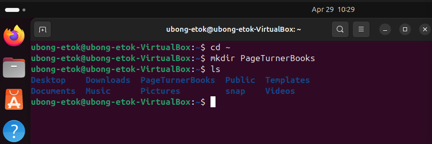

### Step 2: Creating Subdirectories inside the “PageTurnerBooks” directory

After entering the “PageTurnerBooks” folder using the “cd PageTurnerBooks” command, a number of subdirectories were created to categorise business data. The inventory, customer, orders, reviews, and library folders were created with the “mkdir” command. This pattern allows for business information to be categorised, increasing file organisation and facilitating future growth. The “ls” command was then used to verify that the folders had been created.

**Bash command used:**

```bash
cd PageTurnerBooks
mkdir inventory
mkdir customer
mkdir orders
mkdir reviews
mkdir library
ls
```

**Visual evidence — `Q1_02_Create_Project_Subdirectories.png`:**

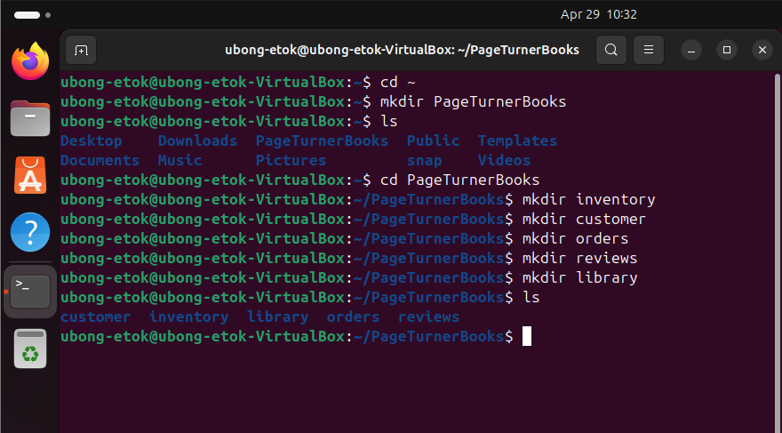

### Step 3: Creating two empty files in the Inventory directory

This was followed by changing the current directory to inventory via the “cd inventory” command. The “touch” command was used to create two empty files: “book_catalog.csv” and “bestsellers.txt”. The CSV file provides storage for structured inventory data, and the text file provides storage for information containing bestselling books. The “ls” command was then used to verify that both files were present in the inventory directory.

**Bash command used:**

```bash
cd inventory
touch book_catalog.csv
touch bestsellers.txt
ls
```

**Visual evidence — `Q1_03_Create_Inventory_Files.png`:**

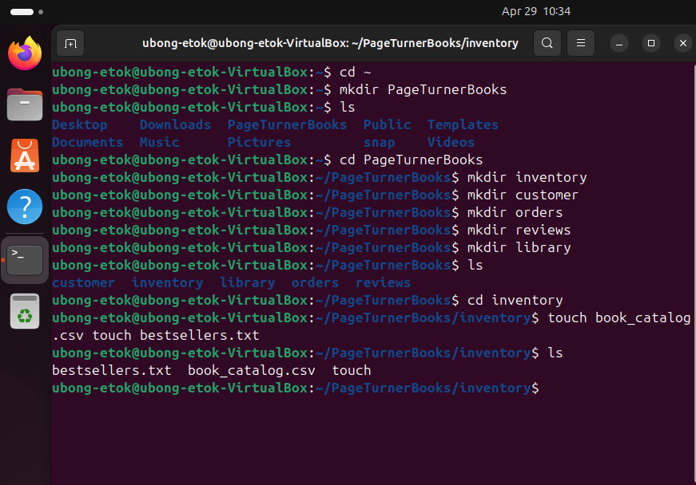

### Step 4: Copying bestsellers.txt to the Reviews Directory

The “bestsellers.txt” file was copied into the reviews file using the “cp” command. The copy command “cp bestsellers.txt ../reviews/” made a duplicate and left the original file in the inventory folder. This is an example of how Linux Bash commands can be used to copy information to different destinations while maintaining the original file. I verified the copying of the file by listing the contents of the inventory and reviews folders using the “ls” command.

**Bash command used:**

```bash
cp bestsellers.txt ../reviews/
ls
ls ../reviews/
```

**Visual evidence — `Q1_04_Copy_Bestsellers_to_Reviews.png`:**

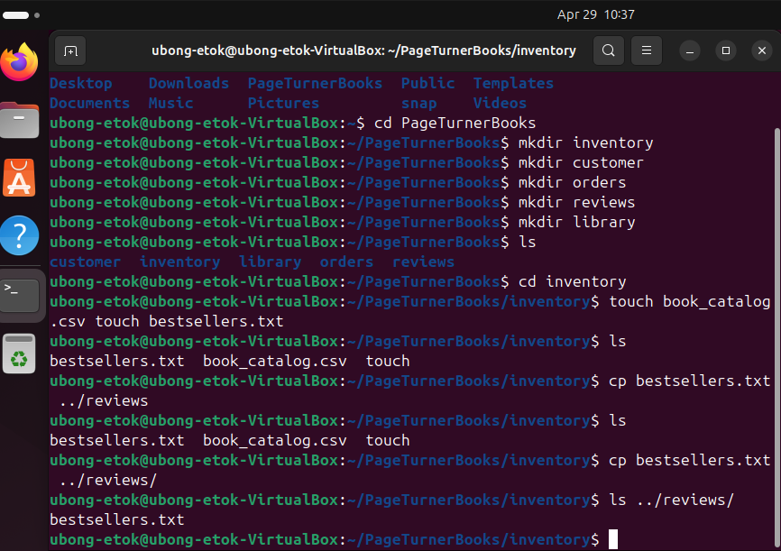

### Step 5: Returning to the “PageTurnerBooks” Root Directory and creating a Markdown File

The last step was to move up to the PageTurnerBooks directory with the “cd ..” command. A new Markdown file called “store_info.md” was created with the “touch” command. A brief description of the company was written to the file using the “echo” command. Markdown is useful as it provides a simple way to format text without being too complicated. The “cat” command was used to view the contents of the file to ensure that the information was written correctly.

**Bash command used:**

```bash
cd ..
touch store_info.md
echo "PageTurner Books Ltd is an independent bookstore based in Manchester specializing in fiction, non-fiction, and rare books." > store_info.md
cat store_info.md
```

**Visual evidence — `Q1_05_Create_and_Populate_Store_Info.png`:**

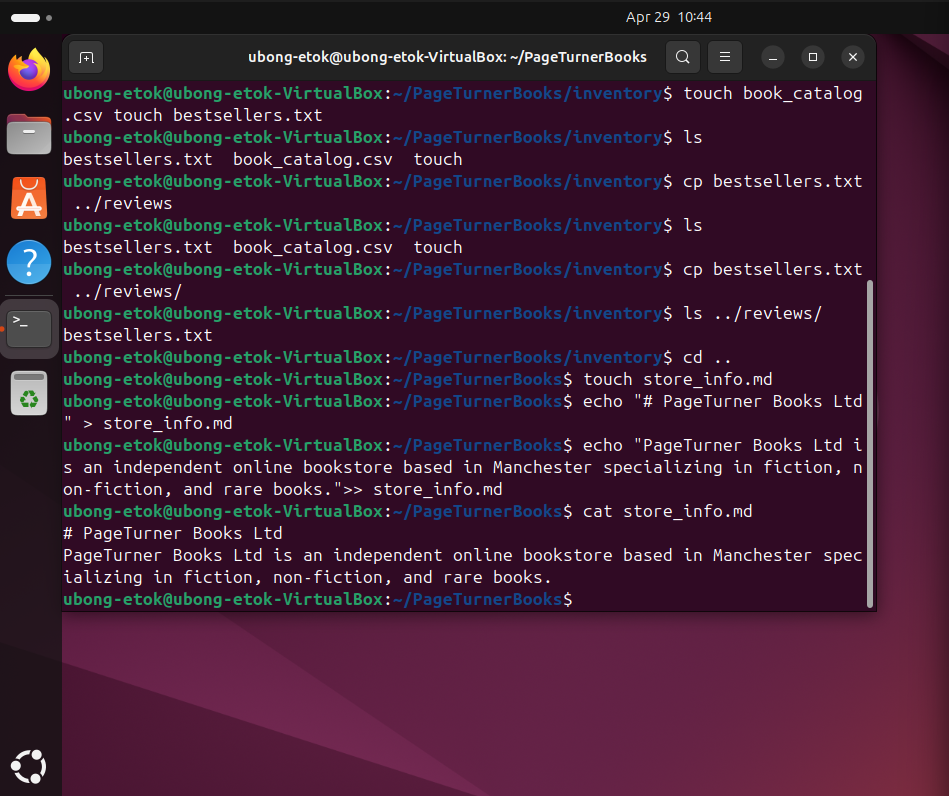

### Conclusion

To sum up, the directory structure of PageTurner Books Ltd. was successfully developed with the help of Bash commands. It was shown how command-line applications can be utilised to systematise files and directories effectively. This organised framework offers a scalable and well organised method of handling business data.

---

## Objective 3 — Hadoop Architecture

### Objective

Understand how HDFS, MapReduce, YARN and Hadoop Common fit together to store, manage and process large datasets across a Hadoop cluster.

### Hadoop Cluster Startup

The Hadoop services were launched on the master machine by use of the HDFS and YARN startup commands. The cluster was then checked by ensuring that the master and worker virtual machines were communicating well. On both machines, the Java process lists were checked to ensure that the necessary services of Hadoop such as NameNode, SecondaryNameNode, ResourceManager, DataNode and NodeManager were successfully running before processing started.

**Bash command used on Master:**

```bash
start-dfs.sh
start-yarn.sh
jps
```

**Bash command used on Worker:**

```bash
jps
```

**Visual evidence — `Q2_01_Start_Hadoop_and_Verify_Cluster.png`:**

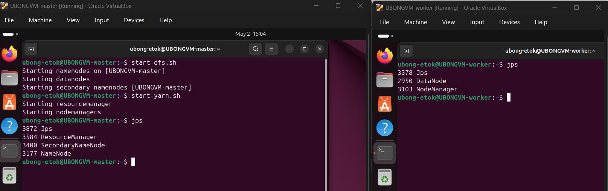

### How the Hadoop components work together

- **HDFS** provides distributed storage for the book datasets and generated outputs.
- **MapReduce** provides the processing model through mapper and reducer stages.
- **YARN** manages cluster resources and job execution.
- **Hadoop Common** provides shared libraries and utilities used by the Hadoop ecosystem.

The workflow used in this project was:

```text
Ubuntu / Bash
      ↓
HDFS
      ↓
YARN
      ↓
MapReduce
      ↓
Mapper → Shuffle/Sort → Reducer
      ↓
Structured Output
```

---

## Objective 4 — Distributed Word-Frequency Analysis

### Objective

Build a Python MapReduce workflow that processes *A Christmas Carol* through HDFS and Hadoop Streaming, then identify and rank the ten most frequent words.

### B.1: WORD FREQUENCY COUNT (“A CHRISTMAS CAROL”)

### Introduction

PageTurner Books Ltd. expects to use big data analytics to gain information about its book collection using Hadoop. The following task utilizes Hadoop MapReduce to perform Word Frequency Analysis on A Christmas Carol in order to gain insight into marketing the text and the writing style used by the author.

Practical implementation will consist of writing Python-based mapper and reducer scripts, uploading the text file into HDFS, running a Hadoop Streaming job, and analysing the resulting output. In this report, every step of the working process will be documented with the help of screen shots as evidence and, as a result, the top 10 most frequent words will be identified.

### Step 1: Starting Hadoop Services and Verifying Cluster Communication Between the two machines

The Hadoop services were launched on the master machine by use of the HDFS and YARN startup commands. This cluster was then checked by ensuring that the master and worker virtual machines were communicating well. On both machines, the Java process lists were checked to ensure that the necessary services of Hadoop such as NameNode, SecondaryNameNode, ResourceManager, DataNode and NodeManager were successfully running before processing started.

**Bash code used on Master:**

```bash
start-dfs.sh
start-yarn.sh
jps
```

**Bash used on Worker:**

```bash
jps
```

**Visual evidence — `Q2_01_Start_Hadoop_and_Verify_Cluster.png`:**


### Step 2: Creating and moving into working directory

The working directory named Question2_Task_B1 was created to store all the scripts, input files and outputs of the Word Frequency task. Switching into the directory allowed keeping all the commands, mapper scripts, reducer scripts, and generated outputs are retained in one organized location.

**Bash code used on Master:**

```bash
cd ~
mkdir Question2_Task_B1
cd Question2_Task_B1
pwd
```

**Visual evidence — `Q2_02_Create_B1_Working_Directory.png`:**

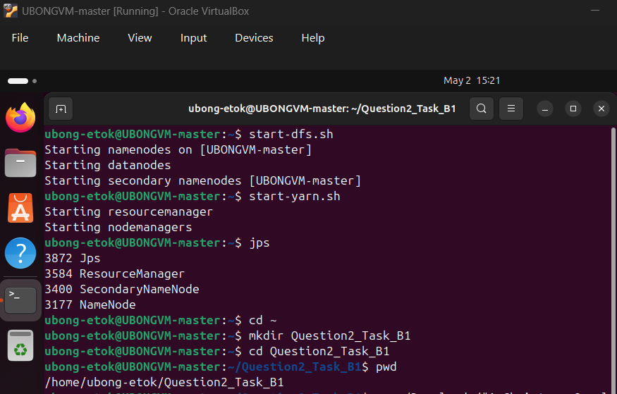

### Step 3: Copying input file into working directory and confirming output

The “A Christmas Carol” text file was copied from the Downloads folder into the working directory. This enabled it to be accessed locally before being uploaded to Hadoop. To verify that the input file had been copied successfully into the directory, the ls command was used to confirm the input file had been copied successfully into the directory.

**Bash code used on Master:**

```bash
cp ~/Downloads/"A Christmas Carol.txt" .
ls
```

**Visual evidence — `Q2_03_Copy_A_Christmas_Carol_Dataset.png`:**

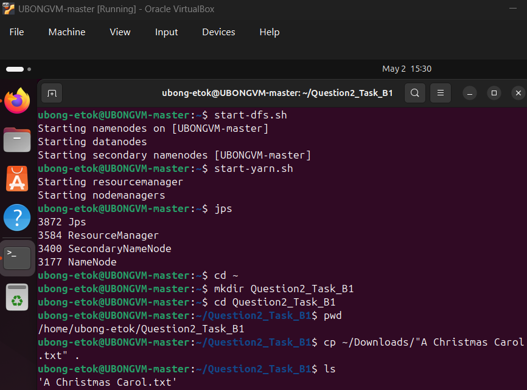

### Step 4: Creating a mapper script

The mapper script was designed to read the text file line by line and remove individual words from the content of the text file. The words identified were all converted to lowercase, with a value of “1” attached to the words. This step is the first step in the MapReduce workflow, in which raw text is converted into key-value pairs, which can be distributed across multiple computers to accomplish distributed processing.

**Bash code used on Master:**

```bash
nano word_count_mapper.py
```

**Python code:**

```python
#!/usr/bin/env python3
import sys
import re
for line in sys.stdin:
    line = line.strip().lower()
    words = re.findall(r'\b[a-z]+\b', line)
    for word in words:
        print(f"{word}\t1")
```

**Visual evidence — `Q2_04_Create_Word_Frequency_Mapper.png`:**

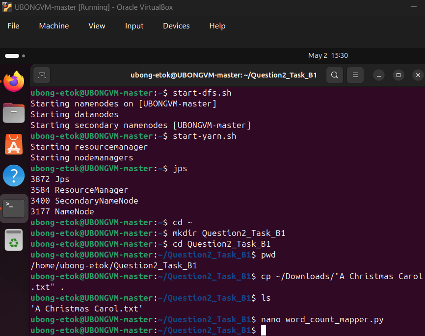

### Step 5: Creating reducer script

The reducer script was created to take in the key-value pairs that the mapper generates and combine identical words into one total frequency count. This process of aggregation enables Hadoop to compute the frequency of occurrence of each word in the text.

**Bash code used on Master:**

```bash
nano word_count_reducer.py
```

**Python code:**

```python
#!/usr/bin/env python3
import sys
last_key = None
running_total = 0
for input_line in sys.stdin:
    input_line = input_line.strip()
    this_key, value = input_line.split("\t", 1)
    value = int(value)
    if last_key == this_key:
        running_total += value
    else:
        if last_key:
            print(f"{last_key}\t{running_total}")
        running_total = value
        last_key = this_key
if last_key == this_key:
    print(f"{last_key}\t{running_total}")
```

**Visual evidence — `Q2_05_Create_Word_Frequency_Reducer.png`:**

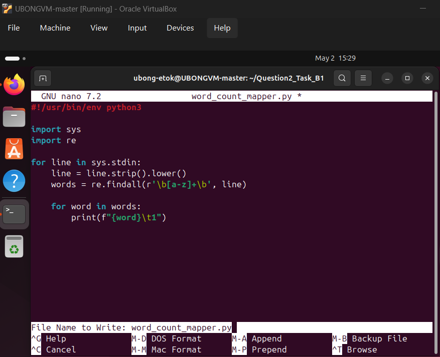

**Additional reducer-code evidence — `Q2_07_Word_Frequency_Reducer_Code.png`:**

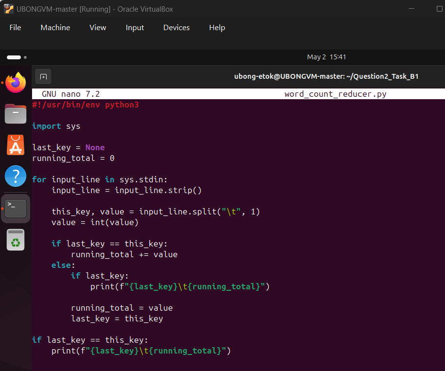

### Step 6: Making scripts executable

Both the mapper and the reducer scripts were given execution permissions with “chmod” commands. This was necessary to ensure Hadoop streaming is able to identify and run the scripts in the processing. The output of the command proves that it was possible to grant executable permissions.

**Bash code used on Master:**

```bash
chmod +x word_count_mapper.py
chmod +x word_count_reducer.py
ls -l
```

**Visual evidence — `Q2_06_Word_Frequency_Scripts_and_Permissions.png`:**

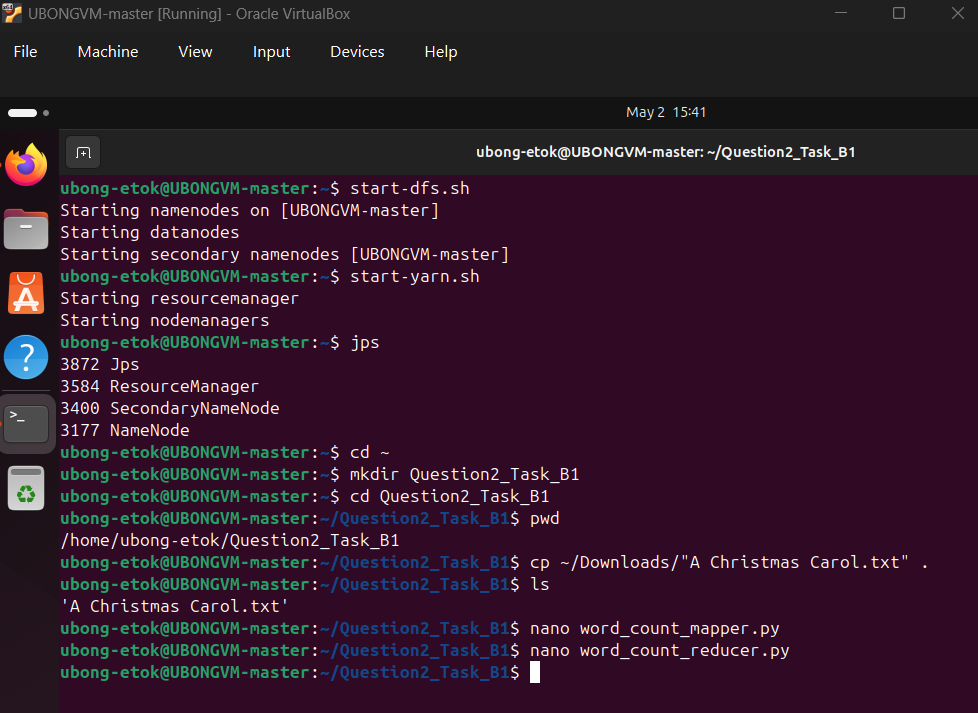

**Additional verification evidence — `Q2_08_Verify_Executable_Scripts.png`:**

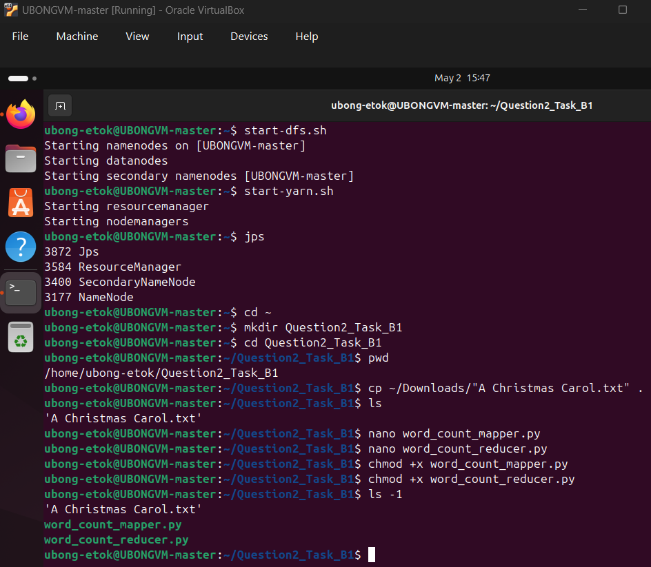

### Step 7: Creating HDFS directory

A special directory was made in the Hadoop Distributed File System (HDFS) to keep the uploaded text file and the generated output. This directory structure offers a structured, distributed storage for the Hadoop workflow and stores all Word Frequency files in one place.

**Bash code used on Master:**

```bash
hadoop fs -mkdir /user/ubong-etok/WordCount_ChristmasCarol
hadoop fs -ls /user/ubong-etok
```

**Visual evidence — `Q2_09_Create_Word_Count_HDFS_Directory.png`:**

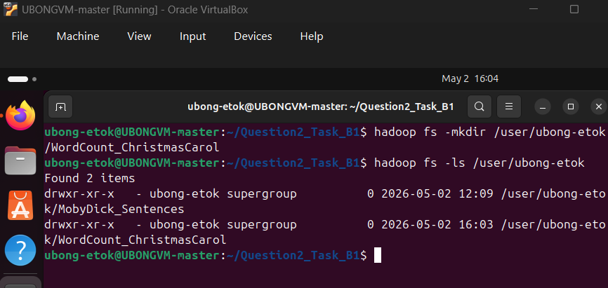

### Step 8: Uploading file to HDFS and confirming the upload

The text file was loaded into the HDFS so that it could be accessed and processed by Hadoop on the cluster. Once uploaded, the files in the directory in the HDFS were listed to ensure that the file had been transferred successfully. This verification guarantees that the input file can be accessed by Hadoop to process the file.

**Bash code used on Master:**

```bash
hadoop fs -put A_Christmas_Carol.txt /user/ubong-etok/WordCount_ChristmasCarol/
hadoop fs -ls /user/ubong-etok/WordCount_ChristmasCarol
```

**Visual evidence — `Q2_10_Upload_Christmas_Carol_to_HDFS.png`:**

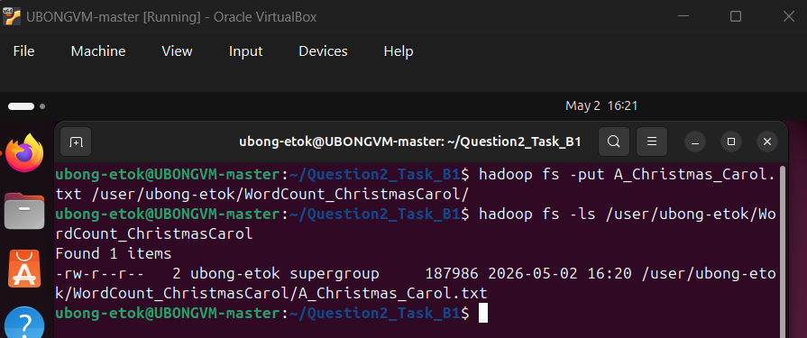

### Step 9: Running Hadoop Streaming

The implementation of Hadoop streaming was done with the help of the custom mapper and reducer scripts. In this step, Hadoop distributed the processing task around the cluster and used the MapReduce workflow to find out the frequency of words. The output shows successful completion of the streaming and indicates the place where the generated output directory is located. The Hadoop streaming enabled Python scripts to be incorporated into the Hadoop MapReduce system, allowing custom mapper and reducer programs to be run across the cluster. The mapper script is executed first, followed by the reducer script, to generate intermediate pairs of key-values in the first instance and to aggregate and combine similar values in the second instance to produce final word frequency counts.

**Bash code used on Master:**

```bash
yarn jar /usr/local/hadoop/share/hadoop/tools/lib/hadoop-streaming-3.4.1.jar -files /home/ubong-etok/Question2_Task_B1/word_count_mapper.py,/home/ubong-etok/Question2_Task_B1/word_count_reducer.py -mapper "python3 word_count_mapper.py" -reducer "python3 word_count_reducer.py" -input /user/ubong-etok/WordCount_ChristmasCarol/A_Christmas_Carol.txt -output /user/ubong-etok/WordCount_ChristmasCarol/output
```

**Visual evidence — `Q2_11_Hadoop_Streaming_Execution_Output.png`:**

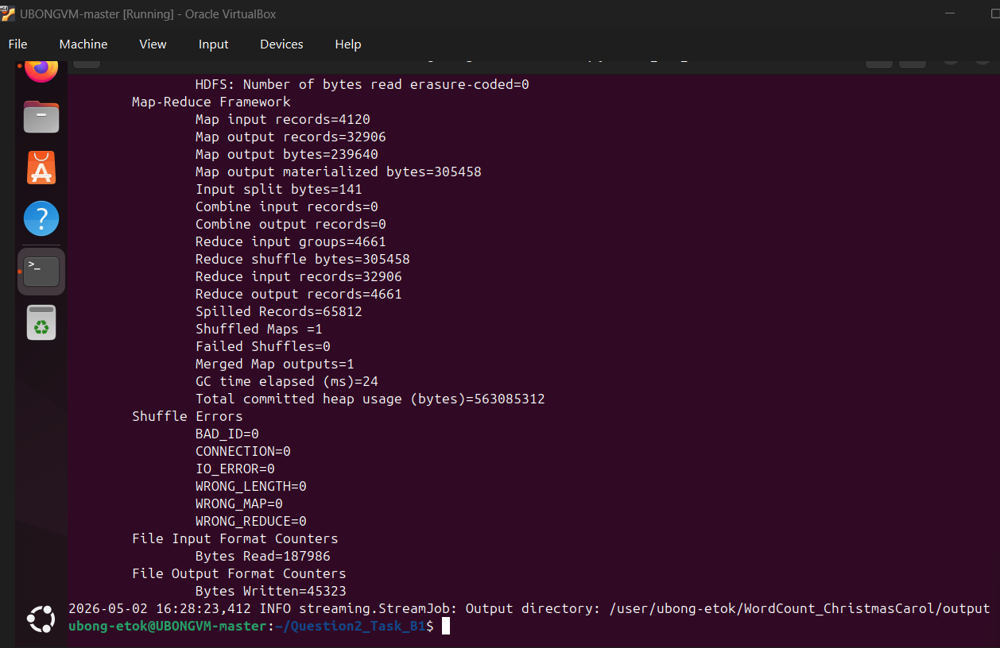

### Step 10: Confirming Successful Creation of Hadoop Output Files in HDFS Directory

The output directory created in HDFS was analyzed to ensure that Hadoop was able to create the desired result files. The presence of the part-00000 file and _SUCCESS marker shows successful completion of the Hadoop job, indicating that the word count results were written to distributed storage with no errors.

**Bash code used on Master:**

```bash
hadoop fs -ls /user/ubong-etok/WordCount_ChristmasCarol/output
```

**Visual evidence — `Q2_12_Verify_HDFS_Output_Files.png`:**

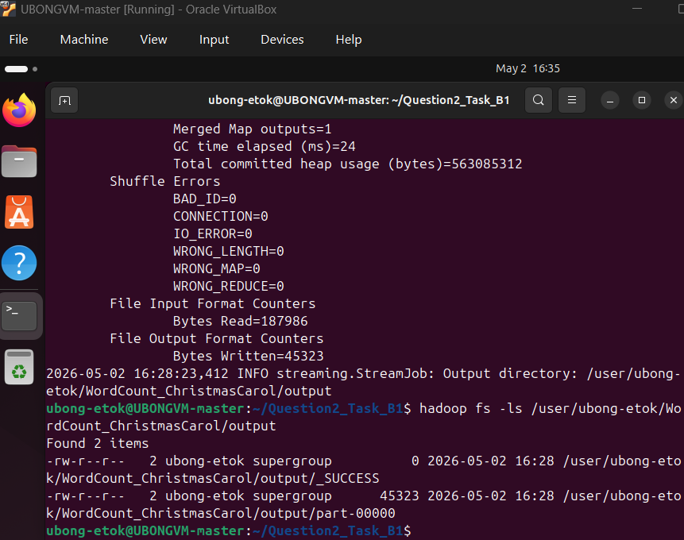

### Step 11: Copying output to local system and checking output files

The Hadoop output generated was transferred out of HDFS into the Ubuntu local directory. This enabled the results to be obtained locally, where inspection and reporting can take place. The output directory was then inspected in order to ensure that the desired Hadoop output files were in place.

**Bash code used on Master:**

```bash
hadoop fs -get /user/ubong-etok/WordCount_ChristmasCarol/output
ls output
```

**Visual evidence — `Q2_13_Retrieve_Word_Frequency_Output.png`:**

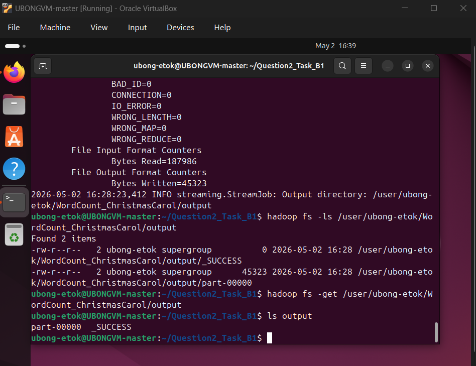

### Step 12: Viewing the Complete Word Frequency Output from Hadoop MapReduce

The output file generated was opened and the entire list of words was displayed with the number of times they appeared. This action reveals that Hadoop was able to process the text file, and generate a complete dataset that reveals the frequency of each word in the novel. The output file part-00000 stores the final processed results.

**Bash code used on Master:**

```bash
cat output/part-00000
```

**Visual evidence — `Q2_14_Complete_Word_Frequency_Output.png`:**

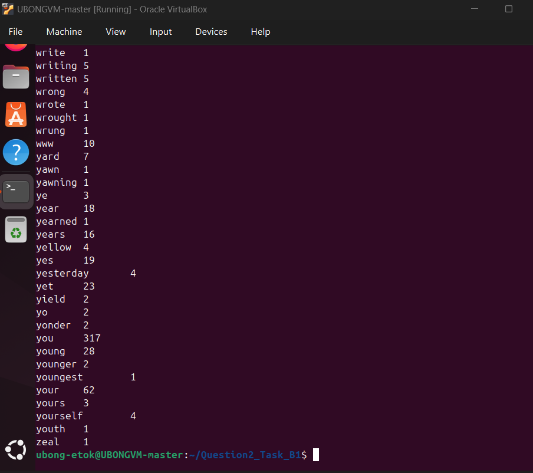

### Step 13: Identifying top 10 words

The output data was ranked in descending order in order to determine the ten most common words within “A Christmas Carol.txt”. This last step not only gives us an idea of the most prevalent vocabulary featured in the text, but also shows that Hadoop MapReduce is very effective in processing large amounts of text. Sorting was done in descending order using the Linux sort command.

**Bash code used on Master:**

```bash
sort -k2 -nr output/part-00000 | head -10
```

**Visual evidence — `Q2_15_Top_10_Word_Frequencies.png`:**

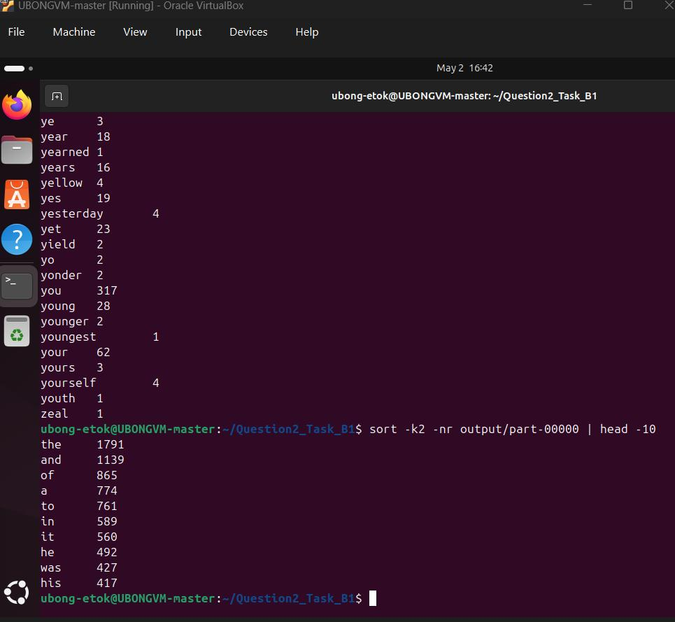

### Result

| Rank | Word | Frequency |
|---:|---|---:|
| 1 | `the` | 1,791 |
| 2 | `and` | 1,139 |
| 3 | `of` | 865 |
| 4 | `a` | 774 |
| 5 | `to` | 761 |
| 6 | `in` | 589 |
| 7 | `it` | 560 |
| 8 | `he` | 492 |
| 9 | `was` | 427 |
| 10 | `his` | 417 |

### Conclusion

This task was able to illustrate how Hadoop MapReduce can be used to perform Word Frequency Analysis on A Christmas Carol. The workflow included writing mapper and reducer scripts, starting Hadoop services, uploading the data to HDFS, running Hadoop streaming job, and analysing the output generated.

These results confirmed that Hadoop was effective in processing the text file, giving precise word frequency counts that were stored in the part-00000 output file with the “success” marker confirming a successfully completed job. The most common words recognized present valuable information about the typical vocabulary and writing styles.

In general, this activity underscores the ability of Hadoop to convert unstructured text data to structured analytic output, to support scalable analysis of keywords, marketing strategies and recommendation systems for PageTurner Books Ltd.

---

## Objective 5 — Distributed Sentence-Count Analysis

### Objective

Build and locally validate a Python MapReduce workflow for *Moby Dick; Or, The Whale*, run it through Hadoop Streaming and determine the total number of sentences.

### B.2 TOTAL NUMBER OF SENTENCES (“THE MOBY DICK OR THE WHALE”)

### Introduction

PageTurner Books Ltd. is implementing the engineering aspects of big data to analyse large digital book files. This task requires one to find the total number of sentences in “The Moby Dick or The Whale” using Hadoop MapReduce. It is a real-world text processing problem in which an unstructured text file is converted to a structured numerical output.

The input file to be used in this task is “The Moby Dick or The Whale.txt”, which was imported into the BDEA-master Ubuntu virtual machine. In this report, every step of the working process will be documented with the help of screen shots as evidence, and, as a result, the total number of sentences will be identified.

### Step 1: Starting Hadoop Services and Verification of Clusters Running on Both Machines

The Hadoop services were launched on the master machine by use of the HDFS and YARN startup commands. The Hadoop cluster was confirmed by ensuring that the master and the worker virtual machines were both started and connected. Hadoop services were initiated and verified with the help of the Java process list. This step ensures that the required Hadoop components, which include NameNode, DataNode, ResourceManager, and NodeManager are functioning properly prior to the process taking place.

**Bash Code used on Master:**

```bash
start-dfs.sh
start-yarn.sh
jps
```

**Bash Code used on Worker:**

```bash
jps
```

**Visual evidence — `Q2_16_Start_Hadoop_for_Sentence_Count.png`:**

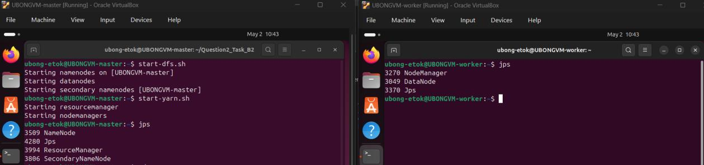

### Step 2: Creating and Moving into a Working Directory

A special working directory was prepared to store all the scripts, input files, and output of Task B2. Relocating to the directory meant that all files generated in the course of the task would be in one location to be executed and recorded easily.

**Bash Code used on Master:**

```bash
cd ~
mkdir Question2_Task_B2
cd Question2_Task_B2
ls
```

**Visual evidence — `Q2_17_Create_B2_Working_Directory.png`:**

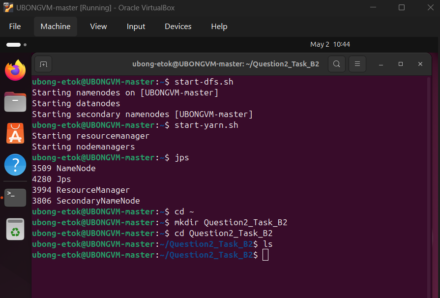

### Step 3: Copying Moby Dick Input File into Working Directory

“The Moby Dick or The Whale.txt” file was copied to the working directory from the Virtual Machine Download folder. This made the text file locally accessible and then uploaded into Hadoop. The ls command was utilized to confirm successful file upload.

**Bash Code used on Master:**

```bash
cp ~/Downloads/"Moby Dick or The Whale.txt" .
ls
```

**Visual evidence — `Q2_18_Copy_Moby_Dick_Dataset.png`:**

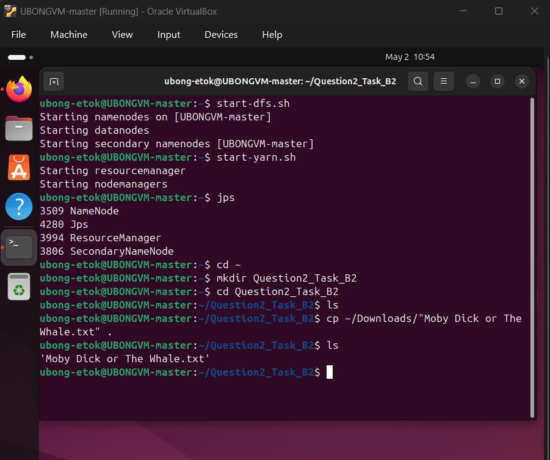

### Step 4: Creating Mapper Script

The mapper script was designed to read the text file line by line and recognise sentence-ending punctuation marks like full stops, question marks, and exclamation marks. A count value of “1” was given to each identified sentence as the first phase of the MapReduce process. As per the assessment brief, AI tools were utilized to help in the development of the “total_sentences_mapper.py” file for Task B2, assisting in the development of the sentence-counting logic utilized within the script.

**Bash Code used on Master:**

```bash
nano total_sentences_mapper.py
```

**Python code on Master:**

```python
#!/usr/bin/env python3
import sys
import re
for line in sys.stdin:
    sentences = re.findall(r'[.!?]+', line)
    for sentence in sentences:
        print("sentence\t1")
```

**Visual evidence — `Q2_19_Create_Sentence_Count_Mapper.png`:**

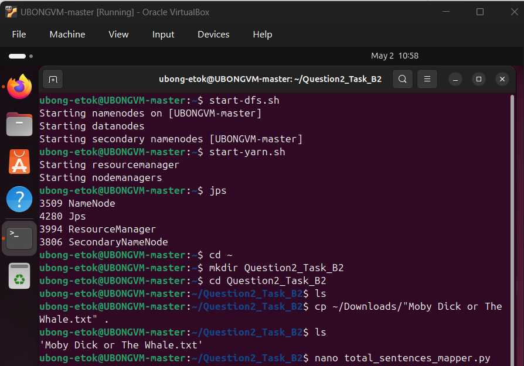

### Step 5: Creating Reducer Script

The reducer script was written to accept the counts of sentences generated by the mapper and add them together to come up with an end result aggregated total. This stage enabled Hadoop to calculate the total number of sentences within the book efficiently. As per the assessment brief, AI tools were utilized to help with the development of the “total_sentences_reducer.py” file in Task B2, which would help to structure the aggregation logic needed to obtain the final number of sentences.

**Bash Code used on Master:**

```bash
nano total_sentences_reducer.py
```

**Python code on Master:**

```python
#!/usr/bin/env python3
import sys
total_sentences = 0
for line in sys.stdin:
    line = line.strip()
    word, count = line.split('\t')
    total_sentences += int(count)
print("Total Sentences\t", total_sentences)
```

**Visual evidence — `Q2_20_Create_Sentence_Count_Reducer.png`:**

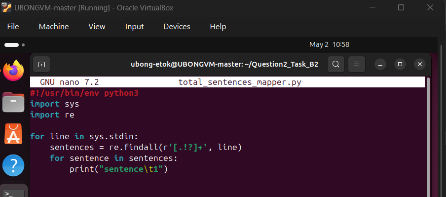

### Step 6: Making Scripts Executable

Both the mapper and reducer scripts were subjected to execution permissions. This enabled the Hadoop Streaming to identify and run the scripts during processing. The output verified that permissions were indeed granted.

**Bash Code used on Master:**

```bash
chmod +x total_sentences_mapper.py
chmod +x total_sentences_reducer.py
ls -l
```

**Visual evidence — `Q2_21_Sentence_Count_Scripts_and_Permissions.png`:**

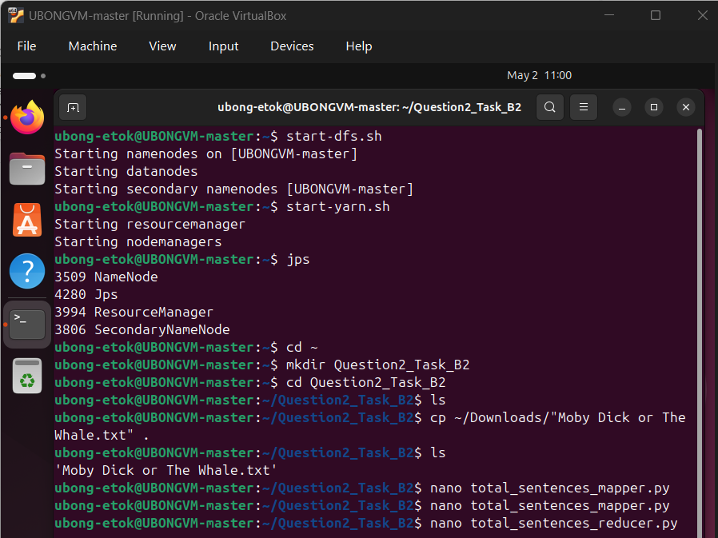

### Script Verification

Before running the local tests, the sentence-count scripts were verified in the terminal.

**Visual evidence — `Q2_22_Verify_Sentence_Count_Scripts.png`:**

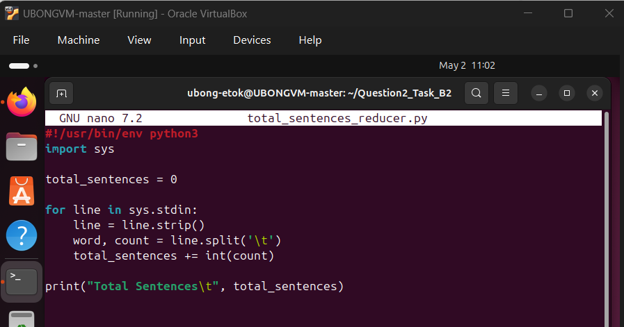

### Step 7: Using the “echo” Command in Testing Mapper and Reducer Function Before Uploading to the Hadoop Structure

As per the assessment brief, the “echo” command was used to test the mapper and reducer functions before uploading files to the Hadoop cluster. Sample sentences included in the assessment brief were put through the mapper and reducer pipeline to ensure that sentence detection and counting were functioning properly. This verification step ensured that the two scripts yielded the desired output before running the Hadoop streaming job, to help reduce errors during processing when the cluster is running. Local testing of the mapper and reducer with the help of the echo command minimized the risk of a failure in the execution of Hadoop due to the verification of the scripts that should have created expected output before the deployment of the mapper and reducer. This local validation procedure was to verify the logic in both scripts to make sure that before data is processed in the Hadoop system, the logic in the two scripts is correct.

**Bash Code used on Master:**

```bash
echo "Hello! Welcome to Page Turner Books Ltd." | ./total_sentences_mapper.py | ./total_sentences_reducer.py
echo "Page Turner Books? Well, we are a great company!" | ./total_sentences_mapper.py | ./total_sentences_reducer.py
```

**Visual evidence — `Q2_23_Local_Mapper_Reducer_Testing.png`:**

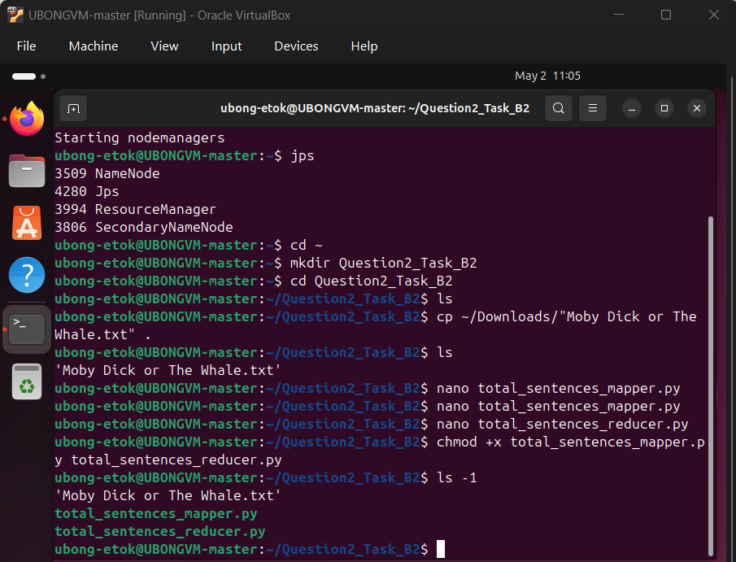

### Step 8: Creating HDFS Directory

A specific directory was created in HDFS to store the uploaded text file and the output generated. This gave a hierarchical framework to distributed storage in Hadoop.

**Bash Code used on Master:**

```bash
hdfs dfs -mkdir -p /user/ubong-etok
hadoop fs -mkdir MobyDick_Sentences
hadoop fs -ls
```

**Visual evidence — `Q2_24_Create_Sentence_Count_HDFS_Directory.png`:**

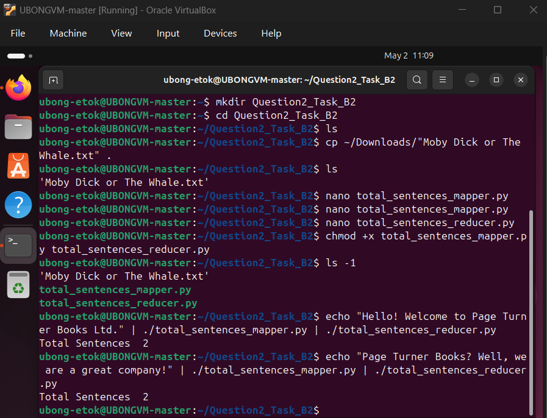

### Step 9: Uploading File to Hadoop

“The Moby Dick or The Whale.txt” was uploaded into HDFS so that Hadoop could access and process it across the cluster. This moved the local data to the distributed storage.

**Bash Code used on Master:**

```bash
mv *Whale* Moby_Dick_or_The_Whale.txt
hadoop fs -put Moby_Dick_or_The_Whale.txt /user/ubong-etok/MobyDick_Sentences/
```

**Visual evidence — `Q2_25_Upload_Moby_Dick_to_HDFS.png`:**

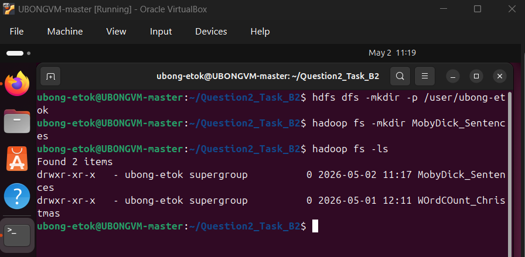

### Step 10: Confirming Upload of File to Hadoop

The files in the HDFS directory were enumerated to ensure that the text file were transferred successfully. This output confirms that the file can be accessed by Hadoop in order to be processed.

**Bash Code used on Master:**

```bash
hadoop fs -ls /user/ubong-etok/MobyDick_Sentences/
```

**Visual evidence — `Q2_26_Confirm_Moby_Dick_HDFS_Upload.png`:**

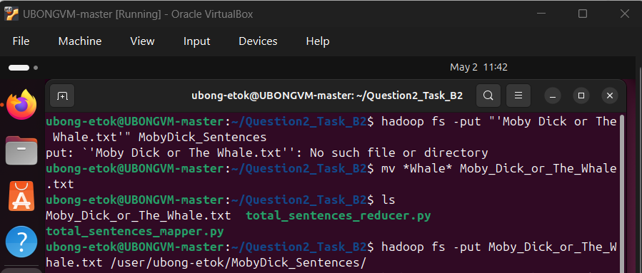

### Step 11: Running Hadoop Streaming

Hadoop streaming was implemented with the help of mapper and reducer scripts. At this point, Hadoop spread the processing job throughout the cluster and produced a final sentence count. The output is a confirmation that the MapReduce job was completed successfully. Sentence counts from mapper were merged into one total by reducer.

**Bash Code used on Master:**

```bash
yarn jar /usr/local/hadoop/share/hadoop/tools/lib/hadoop-streaming-3.4.1.jar -files /home/ubong-etok/Question2_Task_B2/total_sentences_mapper.py,/home/ubong-etok/Question2_Task_B2/total_sentences_reducer.py -mapper "python3 total_sentences_mapper.py" -reducer "python3 total_sentences_reducer.py" -input /user/ubong-etok/MobyDick_Sentences/Moby_Dick_or_The_Whale.txt -output /user/ubong-etok/MobyDick_Sentences/output
```

**Visual evidence — `Q2_27_Run_Sentence_Count_Hadoop_Streaming.png`:**

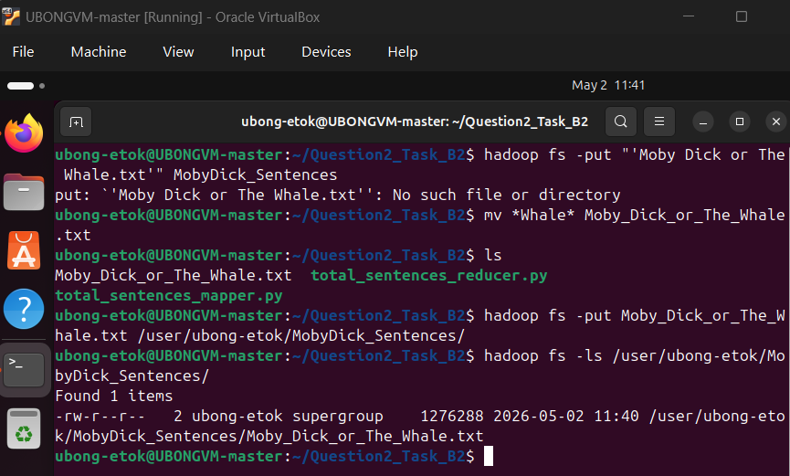

**Additional execution-output evidence — `Q2_28_Sentence_Count_Streaming_Output.png`:**

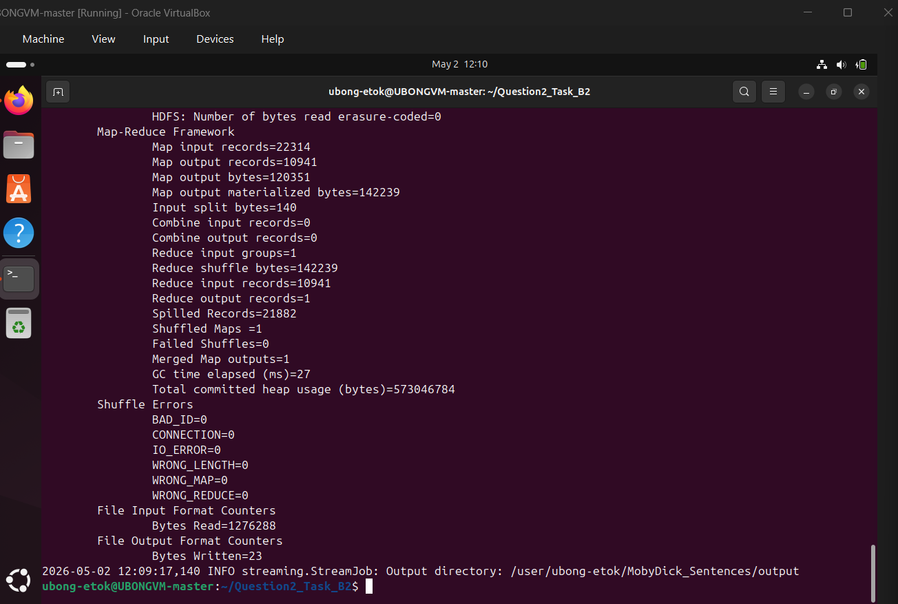

### Step 12: Copying Output to Local System

The Hadoop generated output was copied from HDFS back into the Ubuntu local directory. This enabled the results to be reviewed and included within the technical report.

**Bash Code used on Master:**

```bash
hdfs dfs -get /user/ubong-etok/MobyDick_Sentences/output ./output
```

**Visual evidence — `Q2_29_Retrieve_Sentence_Count_Output.png`:**

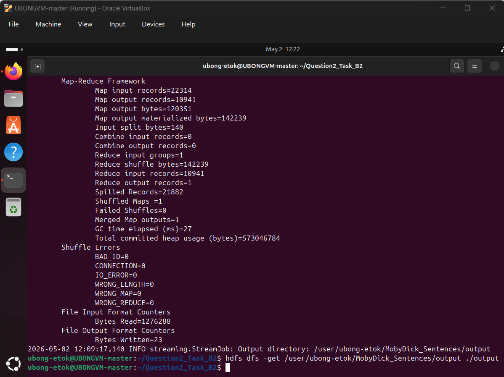

### Step 13: Checking Output Files

The output directory was inspected to ensure that Hadoop was able to produce the desired result files. The existence of part-000000 and _SUCCESS validated the successful completion of the job.

**Bash Code used on Master:**

```bash
ls output
```

**Visual evidence — `Q2_30_Verify_Sentence_Count_Output_Files.png`:**

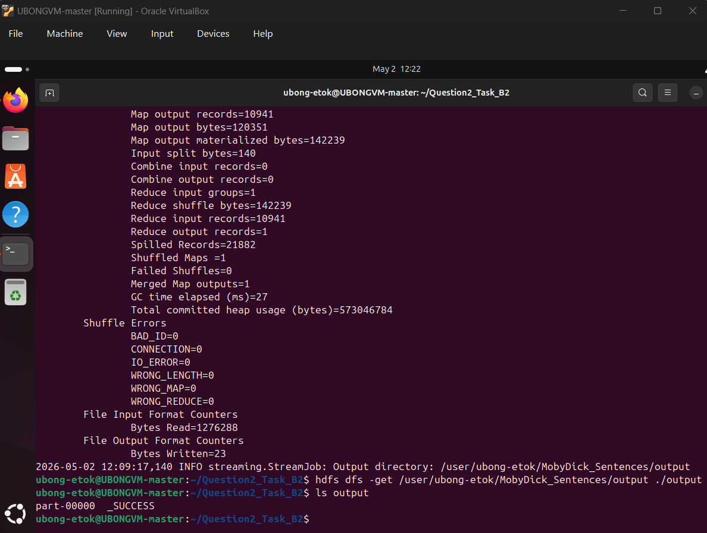

### Step 14: Viewing Output

The output file created was opened to look at the final output. This step confirmed that Hadoop was effective in computing the number of sentences in the text uploaded.

**Bash Code used on Master:**

```bash
cat output/part-00000
```

**Visual evidence — `Q2_31_Final_Sentence_Count_Output.png`:**

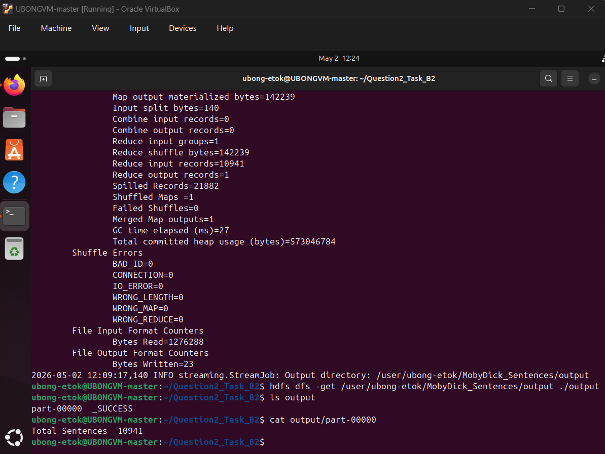

### Step 15: Identifying the Total Number of Sentences

This final step contained the total number of sentences that were identified within “The Moby Dick or The Whale.txt” file. This gave an understanding of the complexity of the text and showed how Hadoop can be utilized to efficiently process large literary datasets.

**Final result:**

```text
Total Sentences    10941
```

### Conclusion

This report demonstrates the Hadoop MapReduce sentence-count task on the novel “The Moby Dick or The Whale”. The workflow was to prepare mapper and reducer scripts, test them locally, upload the dataset to HDFS, and run the Hadoop Streaming job. The mapper recognized the sentence boundaries and the reducer summed up the counts to give a final total number of sentences.

The results confirm that Hadoop efficiently processed the unstructured text file and generated a structured output. The result of this analysis offers PageTurner Books Ltd. the potential to scale up its approach to assessing the complexity of the text in order to support reading-level classification, recommendation systems, and targeted marketing to advanced readers.

---

## Key Findings

### *A Christmas Carol* — Top 10 Word Frequencies

| Rank | Word | Frequency |
|---:|---|---:|
| 1 | `the` | 1,791 |
| 2 | `and` | 1,139 |
| 3 | `of` | 865 |
| 4 | `a` | 774 |
| 5 | `to` | 761 |
| 6 | `in` | 589 |
| 7 | `it` | 560 |
| 8 | `he` | 492 |
| 9 | `was` | 427 |
| 10 | `his` | 417 |

### *Moby Dick; Or, The Whale* — Sentence Count

**10,941 sentences**

The results demonstrate that Hadoop successfully transformed the unstructured literary inputs into structured outputs suitable for further analysis.

## Project Files

The complete datasets and Hadoop source code are available below.

### 📚 Datasets

The literary datasets used for the distributed text analytics workflows.

**[⬇️ Download A Christmas Carol Dataset](https://github.com/xzibitetok/xzibitetok.github.io/releases/latest/download/A.Christmas.Carol.txt)**

**[⬇️ Download Moby Dick; Or, The Whale Dataset](https://github.com/xzibitetok/xzibitetok.github.io/releases/latest/download/Moby.Dick.Or.The.Whale.txt)**

---

### 🐍 Hadoop Bash Commands

The Bash commands used throughout the Hadoop distributed text analytics workflow, including HDFS, YARN, Hadoop Streaming and MapReduce execution.

**[👁️ View Hadoop Bash Commands](https://github.com/xzibitetok/xzibitetok.github.io/blob/master/hadoop-distributed-text-analytics/code/batch%20commands%20used%20in%20hadoop%20distributed%20text%20analytics.txt)**

**[⬇️ Download Hadoop Bash Commands](https://github.com/xzibitetok/xzibitetok.github.io/releases/latest/download/batch.commands.used.in.hadoop.distributed.text.analytics.txt)**

---

## Repository Structure

```text
PageTurner-Books-Hadoop/
├── README.md
├── code/
│   ├── word_count_mapper.py
│   ├── word_count_reducer.py
│   ├── total_sentences_mapper.py
│   └── total_sentences_reducer.py
├── data/
│   ├── A Christmas Carol.txt
│   └── Moby Dick or The Whale.txt
├── visualizations/
│   ├── Q1_01_Create_PageTurnerBooks_Directory.png
│   ├── Q1_02_Create_Project_Subdirectories.png
│   ├── Q1_03_Create_Inventory_Files.png
│   ├── Q1_04_Copy_Bestsellers_to_Reviews.png
│   ├── Q1_05_Create_and_Populate_Store_Info.png
│   ├── Q2_01_Start_Hadoop_and_Verify_Cluster.png
│   ├── ...
│   └── Q2_31_Final_Sentence_Count_Output.png
└── batch commands used in hadoop distributed text analytics.txt
```

## Reproducibility

All implementation screenshots are stored in the `visualizations/` directory and are referenced using their **actual GitHub filenames**. Each implementation step follows the same sequence used in the technical reports:

**Step explanation → Bash command → visual evidence**

This structure makes the screenshots act as direct proof of the commands and operations described above.

The original implementation used the Ubuntu username `ubong-etok` and paths such as:

```text
/home/ubong-etok/
```

These paths should be changed to the appropriate username and Hadoop installation path when reproducing the project elsewhere.

## Limitations and Considerations

### Word frequency

The mapper converts text to lowercase and extracts alphabetic word sequences. Common grammatical words therefore dominate the ranking. A more advanced NLP workflow could introduce stop-word removal, stemming or lemmatisation.

### Sentence detection

The sentence mapper uses the rule `r'[.!?]+'`. This is a straightforward rule-based approach and may not perfectly handle abbreviations, quotations or other literary punctuation conventions.

### Environment

The Hadoop commands depend on the local Hadoop installation and Ubuntu username, so paths may need to be adjusted when reproducing the project elsewhere.

### Scope

The project demonstrates focused MapReduce workflows rather than a production recommendation or marketing platform.

## References

- Griffiths, I. (2026a) *MS4S21 Big Data Engineering and its Applications – Lecture 1*. University of South Wales.
- Griffiths, I. (2026b) *MS4S21 Big Data Engineering and its Applications – Lecture 2*. University of South Wales.
- Griffiths, I. (2026) *MS4S21 Big Data Engineering and its Applications – Lecture 3 & 4*. University of South Wales.
- Free Software Foundation (2025) *Bash Reference Manual*. GNU Operating System. Available at: https://www.gnu.org/software/bash/manual/bash.html
- Apache Hadoop (2025) *Hadoop Documentation*. Available at: https://hadoop.apache.org/docs/
- Dean, J. and Ghemawat, S. (2008) ‘MapReduce: Simplified Data Processing on Large Clusters’, *Communications of the ACM*, 51(1), pp. 107–113.
- OpenAI (2026) ChatGPT (GPT-5.3) used to support development of Python mapper and reducer scripts for Hadoop sentence counting. Available at: https://chat.openai.com/ (Accessed: 3 May 2026).

---

## Author

**Ubong Effiong Etok**  
MSc Data Science | Linux, Big Data Engineering & Machine Learning
