# 🗄️ University Computing Department Database


> A relational database design and SQL analysis project developed using Oracle SQL Developer to manage courses, modules, tutors and students.

---

## 📑 Table of Contents

1. [Project Overview](#project-overview)
2. [Project Objectives](#project-objectives)
3. [Database Structure](#database-structure)
4. [Entity Relationship Diagram](#entity-relationship-diagram)
5. [Database Implementation](#database-implementation)
6. [Table Results](#table-results)
7. [SQL Analysis](#sql-analysis)
   - [Query 1 — Tutors, Modules and Courses](#query-1--tutors-modules-and-courses)
   - [Query 2 — Students, Modules and Courses](#query-2--students-modules-and-courses)
   - [Query 3 — Student Enrolment by Course](#query-3--student-enrolment-by-course)
   - [Query 4 — Module Enrolment](#query-4--module-enrolment)
   - [Query 5 — Newest Tutor by Department](#query-5--newest-tutor-by-department)
8. [Technologies](#technologies)
9. [Repository Structure](#repository-structure)
10. [Key Skills Demonstrated](#key-skills-demonstrated)
11. [Project Context](#project-context)
12. [Author](#author)

---

## 📌 Project Overview

This project involved the design, implementation and interrogation of a relational database for a university Computing Department.

The database models the relationships between **courses, modules, tutors and students**, together with the relationships between courses and modules and between students and modules.

The project demonstrates the practical application of:

- Relational database design
- Entity Relationship Modelling
- Primary and foreign keys
- Table relationships
- Data population
- SQL querying
- Relational data analysis

The database was implemented using **Oracle SQL Developer** and populated with fictional data for the purposes of the project.

---

## 🎯 Project Objectives

The main objectives of the project were to:

1. Design a relational database for a university Computing Department.
2. Identify the entities, attributes and relationships required by the system.
3. Develop an Entity Relationship Diagram (ERD).
4. Implement the database using Oracle SQL Developer.
5. Create tables using primary and foreign key constraints.
6. Populate the database with fictional records.
7. Develop SQL queries to retrieve information from multiple related tables.
8. Analyse the resulting data to demonstrate practical use of the database.

---

## 🗂️ Database Structure

The database consists of four main entities and two relationship tables.

### Course

Stores information about university courses, including:

- Course ID
- Course name
- Course credits
- Course duration
- Course fee

### Tutor

Stores information about tutors, including:

- Tutor ID
- Tutor name
- Email address
- Telephone number
- Contract type
- Department
- Hire date

### Module

Stores information about modules, including:

- Module ID
- Module name
- Module credits
- Semester
- Assigned tutor

### Student

Stores information about students, including:

- Student ID
- Student name
- Gender
- Email address
- Telephone number
- Address
- Date of birth
- Date of enrolment
- Course
- Total grade

### Course_Module

A relationship table connecting courses with the modules associated with those courses.

### Student_Module

A relationship table connecting students with the modules they are registered to study.

---

## 🔗 Entity Relationship Diagram

The ERD illustrates the entities, attributes and relationships used in the database design.

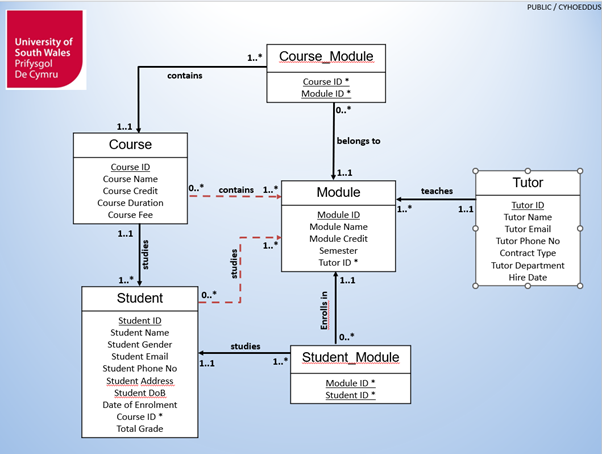

[**View ERD Image →**](assets/erd.png)

---

## ⚙️ Database Implementation

The database was implemented using **Oracle SQL Developer**.

The SQL script contains:

- Table creation
- Primary key definitions
- Foreign key definitions
- Relationship tables
- Data insertion
- SQL analysis queries

### 📄 Complete SQL Script

[**Open the SQL script →**](sql/oracle_sql_project.sql)

---

## 📊 Table Results

The following screenshots provide visual evidence of the tables created and populated during the database implementation.

### Course Table

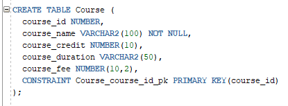

[**View Course Table Image →**](assets/course_table.png)

### Module Table

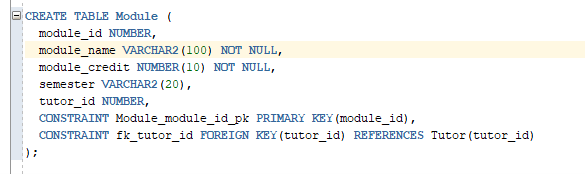

[**View Module Table Image →**](assets/module_table.png)

### Tutor Table

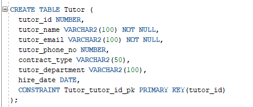

[**View Tutor Table Image →**](assets/tutor_table.png)

### Student Table

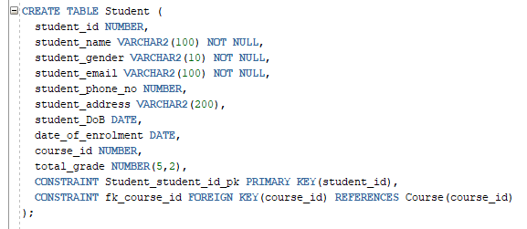

[**View Student Table Image →**](assets/student_table.png)

### Course-Module Relationship Table

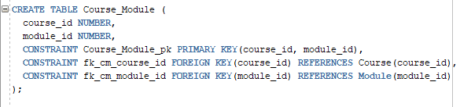

[**View Course-Module Table Image →**](assets/course_module_table.png)

### Student-Module Relationship Table

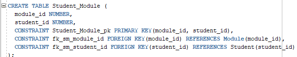

[**View Student-Module Table Image →**](assets/student_module_table.png)

---

# 🔎 SQL Analysis

Five SQL queries were developed to interrogate the database and demonstrate how information can be extracted from related tables.

---

## Query 1 — Tutors, Modules and Courses

**Objective:** Identify tutors, the modules they teach and the courses associated with those modules.

**SQL:**  
[**Open the SQL script →**](sql/oracle_sql_project.sql)

**Result:**

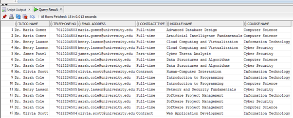

[**View Query 1 Result →**](assets/query_1_output.png)

---

## Query 2 — Students, Modules and Courses

**Objective:** Show students, the modules they are registered on and the courses to which they belong.

**SQL:**  
[**Open the SQL script →**](sql/oracle_sql_project.sql)

**Result:**

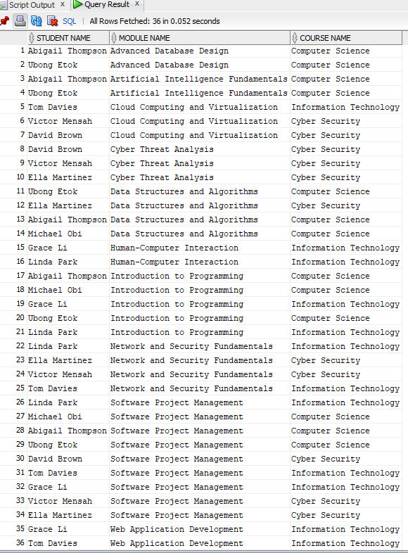

[**View Query 2 Result →**](assets/query_2_output.png)

---

## Query 3 — Student Enrolment by Course

**Objective:** Analyse student enrolment information in relation to their respective courses.

**SQL:**  
[**Open the SQL script →**](sql/oracle_sql_project.sql)

**Result:**

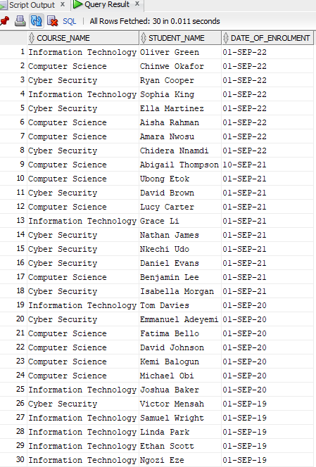

[**View Query 3 Result →**](assets/query_3_output.png)

---

## Query 4 — Module Enrolment

**Objective:** Measure student registrations across modules and courses.

**SQL:**  
[**Open the SQL script →**](sql/oracle_sql_project.sql)

**Result:**

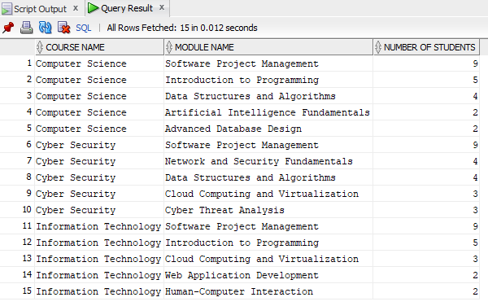

[**View Query 4 Result →**](assets/query_4_output.png)

---

## Query 5 — Newest Tutor by Department

**Objective:** Identify the most recently hired tutor within each department based on hire date.

**SQL:**  
[**Open the SQL script →**](sql/oracle_sql_project.sql)

**Result:**

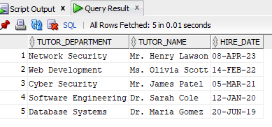

[**View Query 5 Result →**](assets/query_5_output.png)

---

## 🛠️ Technologies

The project was developed using the following technologies and concepts:

- **Oracle SQL**
- **Oracle SQL Developer**
- **Relational Database Design**
- **Entity Relationship Modelling**
- **SQL**
- **Primary and Foreign Keys**
- **Relational Data Analysis**

---

## 📁 Repository Structure

```text
university-computing-department-database/
│
├── README.md
│
├── assets/
│   ├── erd.png
│   ├── course_table.png
│   ├── module_table.png
│   ├── tutor_table.png
│   ├── student_table.png
│   ├── course_module_table.png
│   ├── student_module_table.png
│   ├── query_1_output.png
│   ├── query_2_output.png
│   ├── query_3_output.png
│   ├── query_4_output.png
│   └── query_5_output.png
│
└── sql/
    └── oracle_sql_project.sql
```

---

## 💡 Key Skills Demonstrated

This project demonstrates practical experience in:

- **Relational Database Design**
- **Entity Relationship Diagrams**
- **Database Implementation**
- **Primary and Foreign Key Relationships**
- **SQL Table Creation**
- **Data Insertion**
- **Multi-table Queries**
- **Filtering and Sorting**
- **Aggregation and Grouping**
- **Subqueries**
- **Relational Data Analysis**
- **Oracle SQL Developer**

---

## 🎓 Project Context

This was an academic database project completed as part of my postgraduate computing studies.

The project provided practical experience in designing and implementing a relational database and using SQL to retrieve and analyse information from related datasets.

The database uses **fictional data** created for the purposes of the project.

This repository presents the technical work as part of my professional portfolio, with emphasis on:

- **Database Design**
- **SQL Implementation**
- **Data Relationships**
- **Query Development**
- **Analytical Results**

The original university submission document is not included in this public repository.

---

## 👤 Author

### Ubong Etok

**MSc Data Science | Data Analytics | Business Intelligence | SQL**

GitHub: [**@xzibitetok**](https://github.com/xzibitetok)

Portfolio: [**xzibitetok.github.io**](https://xzibitetok.github.io)

---

⭐ **This project demonstrates the practical application of relational database design and SQL analysis using Oracle SQL Developer.**
